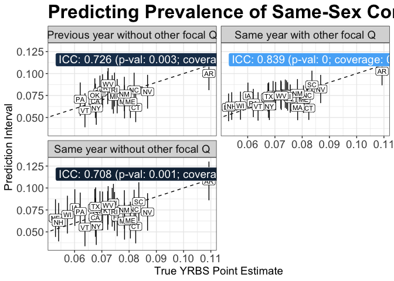
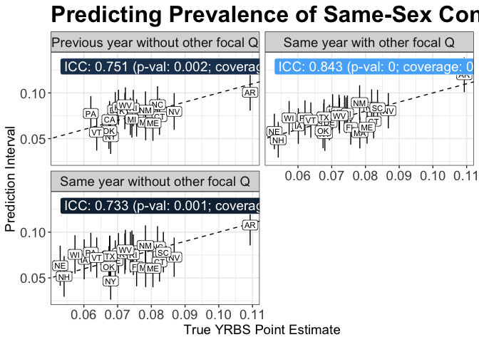
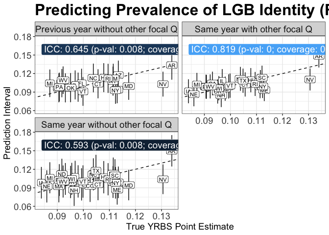

This notebook evaluates the leave-one-out (LOO) predictions for each
question and state to produce evaluation output.

    library(data.table)
    library(ggplot2)
    library(rpart)
    library(irr)
    library(Hmisc)
    library(knitr)

    q66_prevalence_preds = rbindlist(lapply(
      grep("q66_", list.files("data/yrbs_20220808", full.names=T), value=T), 
      fread))

    q67_prevalence_preds = rbindlist(lapply(
      grep("q67", list.files("data/yrbs_20220808", full.names=T), value=T), 
      fread))

    q66_male_prevalence_preds = rbindlist(lapply(
      grep("q66m", list.files("data/yrbs_20220808", full.names=T), value=T), 
      fread))

    print(nrow(q66_prevalence_preds[year == 2017]))

    ## [1] 416

    test_res = q66_male_prevalence_preds[pred_state == "NC" & model == "rf"]
    test_res

    ##     real_prop  pred_prop pred_prop_2017                      predset year
    ## 1: 0.02609921 0.04018571     0.04018442     Using Identity Responses 2013
    ## 2: 0.04672364 0.04824808     0.04852567     Using Identity Responses 2015
    ## 3: 0.05062416 0.05064547     0.05064547     Using Identity Responses 2017
    ## 4: 0.02609921 0.03530555     0.03532574 Not Using Identity Responses 2013
    ## 5: 0.04672364 0.04296324     0.04297026 Not Using Identity Responses 2015
    ## 6: 0.05062416 0.04112303     0.04112303 Not Using Identity Responses 2017
    ##    pred_state model    n
    ## 1:         NC    rf  902
    ## 2:         NC    rf 3066
    ## 3:         NC    rf 1484
    ## 4:         NC    rf  902
    ## 5:         NC    rf 3066
    ## 6:         NC    rf 1484

    cor(test_res[,real_prop], test_res[, pred_prop])

    ## [1] 0.7332689

    # Encode true prevalences (2017 YRBS estimates)
    q66_true_prevalences = q66_prevalence_preds[year == 2017, .(real_prev = mean(real_prop)),  by=c('pred_state')]
    q67_true_prevalences = q67_prevalence_preds[year == 2017, .(real_prev = mean(real_prop)),  by=c('pred_state')]
    q66_male_true_prevalences = q66_male_prevalence_preds[year == 2017, .(real_prev = mean(real_prop)),  by=c('pred_state')]
    kable(q66_male_true_prevalences)

<table>
<thead>
<tr class="header">
<th style="text-align: left;">pred_state</th>
<th style="text-align: right;">real_prev</th>
</tr>
</thead>
<tbody>
<tr class="odd">
<td style="text-align: left;">AR</td>
<td style="text-align: right;">0.0568099</td>
</tr>
<tr class="even">
<td style="text-align: left;">CA</td>
<td style="text-align: right;">0.0450760</td>
</tr>
<tr class="odd">
<td style="text-align: left;">CT</td>
<td style="text-align: right;">0.0574328</td>
</tr>
<tr class="even">
<td style="text-align: left;">DE</td>
<td style="text-align: right;">0.0418974</td>
</tr>
<tr class="odd">
<td style="text-align: left;">FL</td>
<td style="text-align: right;">0.0397741</td>
</tr>
<tr class="even">
<td style="text-align: left;">HI</td>
<td style="text-align: right;">0.0515936</td>
</tr>
<tr class="odd">
<td style="text-align: left;">IA</td>
<td style="text-align: right;">0.0328741</td>
</tr>
<tr class="even">
<td style="text-align: left;">IL</td>
<td style="text-align: right;">0.0474918</td>
</tr>
<tr class="odd">
<td style="text-align: left;">KY</td>
<td style="text-align: right;">0.0307738</td>
</tr>
<tr class="even">
<td style="text-align: left;">MA</td>
<td style="text-align: right;">0.0498932</td>
</tr>
<tr class="odd">
<td style="text-align: left;">ME</td>
<td style="text-align: right;">0.0558275</td>
</tr>
<tr class="even">
<td style="text-align: left;">MI</td>
<td style="text-align: right;">0.0535917</td>
</tr>
<tr class="odd">
<td style="text-align: left;">NC</td>
<td style="text-align: right;">0.0506242</td>
</tr>
<tr class="even">
<td style="text-align: left;">NE</td>
<td style="text-align: right;">0.0284472</td>
</tr>
<tr class="odd">
<td style="text-align: left;">NH</td>
<td style="text-align: right;">0.0326682</td>
</tr>
<tr class="even">
<td style="text-align: left;">NM</td>
<td style="text-align: right;">0.0547493</td>
</tr>
<tr class="odd">
<td style="text-align: left;">NV</td>
<td style="text-align: right;">0.0407495</td>
</tr>
<tr class="even">
<td style="text-align: left;">NY</td>
<td style="text-align: right;">0.0393245</td>
</tr>
<tr class="odd">
<td style="text-align: left;">OK</td>
<td style="text-align: right;">0.0287410</td>
</tr>
<tr class="even">
<td style="text-align: left;">PA</td>
<td style="text-align: right;">0.0324505</td>
</tr>
<tr class="odd">
<td style="text-align: left;">RI</td>
<td style="text-align: right;">0.0484679</td>
</tr>
<tr class="even">
<td style="text-align: left;">SC</td>
<td style="text-align: right;">0.0718210</td>
</tr>
<tr class="odd">
<td style="text-align: left;">TX</td>
<td style="text-align: right;">0.0451026</td>
</tr>
<tr class="even">
<td style="text-align: left;">VT</td>
<td style="text-align: right;">0.0371973</td>
</tr>
<tr class="odd">
<td style="text-align: left;">WI</td>
<td style="text-align: right;">0.0361089</td>
</tr>
<tr class="even">
<td style="text-align: left;">WV</td>
<td style="text-align: right;">0.0507547</td>
</tr>
</tbody>
</table>

    # For each model, prediction type, calculate ICC and coverage

    get_eval_stats = function(true_prevalences, prevalence_preds, pred_method, pred_model, pred_predset, pred_year, pred_col) {
      
      subset_dt = prevalence_preds[
        model == pred_model &
        predset == pred_predset &
        year == pred_year
      ]

      pred_prev_by_state = subset_dt[,.(
        pred_state,
        pred_prev = get(pred_col),
        n
      )]

      # add real prevs
      pred_prev_by_state = merge(pred_prev_by_state, true_prevalences, by = 'pred_state')

      # prediction intervals using empirical out-of-bag normal
      pred_prev_by_state = rbindlist(lapply(pred_prev_by_state[, unique(pred_state)], function(s) {

        oob_mean_bias = pred_prev_by_state[pred_state != s, mean(real_prev - pred_prev)]
        #message(paste("oob_mean_bias:", oob_mean_bias))
        oob_sd = pred_prev_by_state[pred_state != s, sd(real_prev - pred_prev)]
        oob_df = pred_prev_by_state[pred_state != s, .N] - 1
        
        real_prev_interval = binconf(pred_prev_by_state[pred_state == s, real_prev*n], 
                                     pred_prev_by_state[pred_state == s, n])

        return(data.table(
          pred_state = s,
          real_prev = pred_prev_by_state[pred_state == s, real_prev],
          real_prev_lb = real_prev_interval[,"Lower"],
          real_prev_ub = real_prev_interval[,"Upper"],
          # normal out-of-bag method
          norm_oob_pe = pred_prev_by_state[pred_state == s, pred_prev + oob_mean_bias],
          norm_oob_lb = pred_prev_by_state[pred_state == s, pred_prev + oob_mean_bias - qt(0.975, oob_df)*oob_sd],
          norm_oob_ub = pred_prev_by_state[pred_state == s, pred_prev + oob_mean_bias + qt(0.975, oob_df)*oob_sd]
        ))

      }))

      # add columns to state predictions dt
      pred_prev_by_state[,`:=`(
        pred_method = pred_method,
        pred_model = pred_model
      )]

      # summary result dt
      oob_icc_res = icc(pred_prev_by_state[, .(norm_oob_pe, real_prev)], model = "oneway", type = "agreement", unit = "average")
      summary_dt = data.table(
        pred_method,
        pred_model,
        oob_icc = round(oob_icc_res$value,3),
        oob_icc_pval = round(oob_icc_res$p.value,3),
        oob_coverage = mean(pred_prev_by_state[, norm_oob_lb < real_prev & norm_oob_ub > real_prev])
      )

      return(list(
        state_predictions = pred_prev_by_state,
        summary_stats = summary_dt
      ))
    }

    # TEST

    get_eval_stats(
      true_prevalences = q66_true_prevalences,
      prevalence_preds = q66_prevalence_preds, 
      pred_method = "Same year with other focal Q",
      pred_model = "rf", 
      pred_predset = "Using Identity Responses",
      pred_year = 2017, 
      pred_col = "pred_prop")$summary_stats

    ##                     pred_method pred_model oob_icc oob_icc_pval oob_coverage
    ## 1: Same year with other focal Q         rf   0.839            0    0.9230769

    MODEL = "rf"

    q66_state_preds = rbind(
      get_eval_stats(
        true_prevalences = q66_true_prevalences,
        prevalence_preds = q66_prevalence_preds, 
        pred_method = "Same year with other focal Q",
        pred_model = MODEL, 
        pred_predset = "Using Identity Responses",
        pred_year = 2017, 
        pred_col = "pred_prop")$state_predictions,
      get_eval_stats(
        true_prevalences = q66_true_prevalences,
        prevalence_preds = q66_prevalence_preds, 
        pred_method = "Same year without other focal Q",
        pred_model = MODEL, 
        pred_predset = "Not Using Identity Responses",
        pred_year = 2017, 
        pred_col = "pred_prop")$state_predictions,
      get_eval_stats(
        true_prevalences = q66_true_prevalences,
        prevalence_preds = q66_prevalence_preds, 
        pred_method = "Previous year without other focal Q",
        pred_model = MODEL, 
        pred_predset = "Not Using Identity Responses",
        pred_year = 2015, 
        pred_col = "pred_prop_2017")$state_predictions
    )

    q66_real_prevs_states = unique(q66_state_preds[pred_method == "Same year without other focal Q", .(pred_state, real_prev, real_prev_lb, real_prev_ub)])
    q66_real_prevs_states[, real_txt := paste0(
      base::format(real_prev*100 , digits=1, nsmall=1, trim=T), " (", 
      base::format(real_prev_lb*100 , digits=1, nsmall=1, trim=T), ", ", 
      base::format(real_prev_ub*100 , digits=1, nsmall=1, trim=T), ")")]
    q66_real_prevs_states = q66_real_prevs_states[, .(pred_state, real_txt)]
    #display(q66_real_prevs_states)

    q66_pred_prevs_states = q66_state_preds[, .(pred_state, norm_oob_pe, norm_oob_lb, norm_oob_ub, pred_method)]
    q66_pred_prevs_states[, pred_txt := paste0(
      base::format(norm_oob_pe*100 , digits=1, nsmall=1, trim=T), " (", 
      base::format(norm_oob_lb*100 , digits=1, nsmall=1, trim=T), ", ", 
      base::format(norm_oob_ub*100 , digits=1, nsmall=1, trim=T), ")")]
    q66_pred_prevs_states_cast = dcast(q66_pred_prevs_states, pred_state ~ pred_method, value.var=c('pred_txt'))
    #display(q66_pred_prevs_states_cast)

    q66_merged = merge(q66_real_prevs_states, q66_pred_prevs_states_cast, by='pred_state')
    q66_merged[is.na(q66_merged)] = ""
    q66_merged = q66_merged[,.(
        pred_state, real_txt, `Same year with other focal Q`, `Same year without other focal Q`, `Previous year without other focal Q`
    )]

    fwrite(unique(q66_state_preds[, .(pred_state, real_prev)]), 'data/q66_real_prevs.csv')
    fwrite(q66_merged, 'data/q66_merged_preds.csv')
    fwrite(merge(q66_pred_prevs_states, unique(q66_state_preds[, .(pred_state, real_prev)]), by='pred_state'), 'data/q66_raw_preds.csv')

    q66_merged

    ##     pred_state         real_txt Same year with other focal Q
    ##  1:         AR 10.9 (9.5, 12.5)             10.3 (8.7, 11.9)
    ##  2:         CA   6.8 (5.7, 8.0)               6.6 (5.0, 8.2)
    ##  3:         CT   8.2 (7.2, 9.4)               6.1 (4.7, 7.4)
    ##  4:         DE   6.9 (6.1, 7.9)               7.6 (6.0, 9.1)
    ##  5:         FL   7.6 (6.9, 8.3)               7.1 (5.5, 8.8)
    ##  6:         HI   7.0 (6.4, 7.7)               7.4 (5.8, 9.0)
    ##  7:         IA   6.0 (5.0, 7.2)               7.5 (6.0, 9.0)
    ##  8:         IL   7.4 (6.7, 8.1)               7.7 (6.1, 9.3)
    ##  9:         KY   7.2 (6.2, 8.4)               7.6 (6.0, 9.2)
    ## 10:         MA   7.8 (7.0, 8.8)               6.2 (4.7, 7.6)
    ## 11:         ME   8.0 (7.5, 8.6)               7.1 (5.5, 8.7)
    ## 12:         MI   7.4 (6.2, 8.8)               7.6 (6.0, 9.2)
    ## 13:         NC   8.2 (7.3, 9.2)               7.5 (5.9, 9.1)
    ## 14:         NE   5.3 (4.3, 6.6)               6.1 (4.6, 7.7)
    ## 15:         NH   5.4 (5.0, 5.8)               6.3 (4.7, 7.9)
    ## 16:         NM   7.8 (7.2, 8.5)               7.8 (6.1, 9.4)
    ## 17:         NV  8.7 (7.4, 10.1)               8.2 (6.6, 9.8)
    ## 18:         NY   6.8 (6.3, 7.3)               6.3 (4.7, 7.9)
    ## 19:         OK   6.7 (5.6, 8.1)               7.3 (5.7, 8.9)
    ## 20:         PA   6.2 (5.5, 7.0)               6.6 (5.0, 8.3)
    ## 21:         RI   7.5 (6.4, 8.6)               7.4 (5.8, 9.0)
    ## 22:         SC   8.4 (7.1, 9.9)              8.7 (7.1, 10.3)
    ## 23:         TX   6.8 (5.8, 7.9)               7.4 (5.8, 9.0)
    ## 24:         VT   6.4 (6.1, 6.7)               6.3 (4.6, 7.9)
    ## 25:         WI   5.7 (4.8, 6.8)               6.3 (4.7, 7.9)
    ## 26:         WV   7.2 (6.0, 8.6)               7.5 (5.9, 9.1)
    ##     pred_state         real_txt Same year with other focal Q
    ##     Same year without other focal Q Previous year without other focal Q
    ##  1:                10.8 (8.6, 13.0)                    10.0 (8.1, 11.9)
    ##  2:                  6.6 (4.4, 8.9)                      6.9 (4.9, 8.8)
    ##  3:                  5.6 (3.7, 7.5)                      6.1 (4.5, 7.8)
    ##  4:                  7.4 (5.2, 9.6)                      7.9 (6.0, 9.8)
    ##  5:                  6.7 (4.5, 8.9)                      7.4 (5.5, 9.4)
    ##  6:                  7.4 (5.2, 9.6)                      8.0 (6.1, 9.9)
    ##  7:                  7.8 (5.7, 9.9)                                    
    ##  8:                 7.8 (5.6, 10.0)                      7.9 (5.9, 9.8)
    ##  9:                  7.4 (5.2, 9.6)                     8.4 (6.5, 10.3)
    ## 10:                  6.2 (4.1, 8.3)                      6.8 (4.9, 8.7)
    ## 11:                  6.3 (4.2, 8.4)                      6.8 (4.9, 8.7)
    ## 12:                 8.3 (6.1, 10.5)                      7.4 (5.5, 9.4)
    ## 13:                  7.6 (5.4, 9.8)                     8.1 (6.2, 10.1)
    ## 14:                  6.6 (4.4, 8.7)                                    
    ## 15:                  6.1 (3.9, 8.3)                                    
    ## 16:                  7.5 (5.3, 9.7)                      7.7 (5.7, 9.6)
    ## 17:                  7.3 (5.1, 9.4)                      7.9 (6.0, 9.9)
    ## 18:                  5.7 (3.5, 7.8)                      6.1 (4.2, 8.0)
    ## 19:                  7.7 (5.5, 9.9)                      7.5 (5.6, 9.4)
    ## 20:                  7.3 (5.2, 9.5)                      7.1 (5.2, 9.0)
    ## 21:                  7.3 (5.1, 9.5)                     8.2 (6.2, 10.1)
    ## 22:                 8.4 (6.2, 10.7)                                    
    ## 23:                 7.9 (5.7, 10.1)                                    
    ## 24:                  5.5 (3.4, 7.7)                      5.8 (3.8, 7.7)
    ## 25:                  7.0 (4.8, 9.1)                                    
    ## 26:                 8.0 (5.8, 10.2)                     8.8 (7.0, 10.6)
    ##     Same year without other focal Q Previous year without other focal Q

    MODEL = "rf"

    q67_state_preds = rbind(
      get_eval_stats(
        true_prevalences = q67_true_prevalences,
        prevalence_preds = q67_prevalence_preds, 
        pred_method = "Same year with other focal Q",
        pred_model = MODEL, 
        pred_predset = "Using Contact Responses",
        pred_year = 2017, 
        pred_col = "pred_prop")$state_predictions,
      get_eval_stats(
        true_prevalences = q67_true_prevalences,
        prevalence_preds = q67_prevalence_preds, 
        pred_method = "Same year without other focal Q",
        pred_model = MODEL, 
        pred_predset = "Not Using Contact Responses",
        pred_year = 2017, 
        pred_col = "pred_prop")$state_predictions,
      get_eval_stats(
        true_prevalences = q67_true_prevalences,
        prevalence_preds = q67_prevalence_preds, 
        pred_method = "Previous year without other focal Q",
        pred_model = MODEL, 
        pred_predset = "Not Using Contact Responses",
        pred_year = 2015, 
        pred_col = "pred_prop_2017")$state_predictions
    )

    q67_real_prevs_states = q67_state_preds[pred_method == "Same year without other focal Q", .(pred_state, real_prev, real_prev_lb, real_prev_ub)]
    q67_real_prevs_states[, real_txt := paste0(
      format(real_prev*100 , digits=1, nsmall=1,trim=T), " (", 
      format(real_prev_lb*100 , digits=1, nsmall=1,trim=T), ", ", 
      format(real_prev_ub*100 , digits=1, nsmall=1,trim=T), ")")]
    q67_real_prevs_states = q67_real_prevs_states[, .(pred_state, real_txt)]

    q67_pred_prevs_states = q67_state_preds[, .(pred_state, norm_oob_pe, norm_oob_lb, norm_oob_ub, pred_method)]
    q67_pred_prevs_states[, pred_txt := paste0(
      format(norm_oob_pe*100 , digits=1, nsmall=1,trim=T), " (", 
      format(norm_oob_lb*100 , digits=1, nsmall=1,trim=T), ", ", 
      format(norm_oob_ub*100 , digits=1, nsmall=1,trim=T), ")")]

    q67_pred_prevs_states_cast = dcast(q67_pred_prevs_states, pred_state ~ pred_method, value.var=c('pred_txt'))

    q67_merged = merge(q67_real_prevs_states, q67_pred_prevs_states_cast, by='pred_state')
    q67_merged[is.na(q67_merged)] = ""
    q67_merged = q67_merged[,.(
        pred_state, real_txt, `Same year with other focal Q`, `Same year without other focal Q`, `Previous year without other focal Q`
    )]
    fwrite(q67_merged, 'data/q67_merged_preds.csv')
    fwrite(merge(q67_pred_prevs_states, unique(q67_state_preds[, .(pred_state, real_prev)]), by='pred_state'), 'data/q67_raw_preds.csv')
    fwrite(unique(q67_state_preds[, .(pred_state, real_prev)]), 'data/q67_real_prevs.csv')
     
    q67_merged

    ##     pred_state          real_txt Same year with other focal Q
    ##  1:         AR 13.4 (11.9, 15.1)            14.9 (13.0, 16.7)
    ##  2:         AZ 11.3 (10.1, 12.8)                             
    ##  3:         CA   9.3 (8.0, 10.7)             10.4 (8.5, 12.3)
    ##  4:         CO  10.3 (8.8, 11.9)                             
    ##  5:         CT  10.6 (9.4, 11.9)             10.2 (8.3, 12.2)
    ##  6:         DE   9.8 (8.8, 10.9)              9.6 (7.6, 11.5)
    ##  7:         FL   9.9 (9.2, 10.7)              9.9 (8.0, 11.9)
    ##  8:         HI 10.8 (10.0, 11.6)             10.9 (9.0, 12.9)
    ##  9:         IA    8.4 (7.2, 9.8)              9.1 (7.2, 11.1)
    ## 10:         IL   9.7 (8.9, 10.5)             10.8 (8.9, 12.7)
    ## 11:         KY  11.1 (9.8, 12.6)              9.9 (8.0, 11.8)
    ## 12:         MA   9.1 (8.1, 10.1)              9.9 (8.0, 11.8)
    ## 13:         MD 11.7 (11.5, 12.0)                             
    ## 14:         ME 11.3 (10.7, 12.0)              9.3 (7.5, 11.1)
    ## 15:         MI   8.7 (7.4, 10.2)             10.3 (8.4, 12.1)
    ## 16:         NC  10.4 (9.4, 11.5)             11.1 (9.2, 13.1)
    ## 17:         ND   9.2 (8.0, 10.5)                             
    ## 18:         NE   8.6 (7.3, 10.2)              8.7 (6.7, 10.6)
    ## 19:         NH   9.6 (9.1, 10.2)              8.5 (6.6, 10.4)
    ## 20:         NM 11.1 (10.4, 12.0)             10.6 (8.7, 12.6)
    ## 21:         NV 13.1 (11.5, 14.8)             11.0 (9.3, 12.8)
    ## 22:         NY 11.2 (10.7, 11.8)              9.9 (8.0, 11.8)
    ## 23:         OK   9.5 (8.2, 11.0)              9.1 (7.1, 11.1)
    ## 24:         PA   9.1 (8.2, 10.0)              9.9 (7.9, 11.8)
    ## 25:         RI  10.9 (9.7, 12.3)             10.3 (8.4, 12.3)
    ## 26:         SC  11.2 (9.7, 12.9)             11.3 (9.4, 13.3)
    ## 27:         TX  10.5 (9.2, 11.9)             10.8 (8.9, 12.8)
    ## 28:         VT  10.0 (9.6, 10.4)             10.0 (8.1, 12.0)
    ## 29:         WI   9.6 (8.4, 10.9)              9.6 (7.7, 11.6)
    ## 30:         WV   9.2 (7.9, 10.8)              9.9 (8.0, 11.9)
    ##     pred_state          real_txt Same year with other focal Q
    ##     Same year without other focal Q Previous year without other focal Q
    ##  1:               15.0 (12.4, 17.5)                   13.0 (10.7, 15.3)
    ##  2:                 9.9 (7.3, 12.4)                    12.1 (9.8, 14.3)
    ##  3:                10.4 (7.9, 13.0)                     9.8 (7.5, 12.1)
    ##  4:                 9.3 (6.7, 11.9)                                    
    ##  5:                 9.6 (7.0, 12.2)                    10.4 (8.1, 12.8)
    ##  6:                10.0 (7.4, 12.7)                     9.8 (7.5, 12.1)
    ##  7:                 9.6 (6.9, 12.2)                    10.3 (8.0, 12.6)
    ##  8:                10.7 (8.1, 13.3)                    11.3 (9.0, 13.6)
    ##  9:                 9.8 (7.3, 12.4)                                    
    ## 10:                10.8 (8.2, 13.4)                    10.0 (7.7, 12.3)
    ## 11:                 9.9 (7.4, 12.5)                    10.6 (8.3, 12.9)
    ## 12:                 9.3 (6.6, 11.9)                     9.6 (7.3, 11.9)
    ## 13:                 9.4 (7.0, 11.9)                     9.8 (7.7, 12.0)
    ## 14:                 8.7 (6.3, 11.1)                     9.2 (7.1, 11.3)
    ## 15:                10.6 (8.1, 13.1)                    10.5 (8.3, 12.7)
    ## 16:                11.2 (8.6, 13.8)                    11.2 (8.9, 13.5)
    ## 17:                11.2 (8.7, 13.7)                    10.3 (8.0, 12.6)
    ## 18:                 9.2 (6.6, 11.8)                                    
    ## 19:                 8.6 (6.1, 11.2)                                    
    ## 20:                11.3 (8.7, 13.9)                    11.4 (9.1, 13.7)
    ## 21:                10.4 (8.0, 12.8)                    10.4 (8.4, 12.3)
    ## 22:                 9.8 (7.2, 12.4)                    10.0 (7.8, 12.3)
    ## 23:                 9.9 (7.3, 12.6)                     9.7 (7.4, 12.0)
    ## 24:                10.3 (7.7, 12.8)                     9.9 (7.6, 12.2)
    ## 25:                10.4 (7.8, 13.0)                    11.0 (8.7, 13.3)
    ## 26:                11.0 (8.4, 13.6)                                    
    ## 27:                11.8 (9.2, 14.3)                                    
    ## 28:                10.0 (7.4, 12.6)                     9.2 (6.9, 11.5)
    ## 29:                10.4 (7.9, 13.0)                                    
    ## 30:                10.0 (7.4, 12.6)                    10.9 (8.7, 13.1)
    ##     Same year without other focal Q Previous year without other focal Q

    MODEL = "rf"

    q66_male_state_preds = rbind(
      get_eval_stats(
        true_prevalences = q66_male_true_prevalences,
        prevalence_preds = q66_male_prevalence_preds, 
        pred_method = "Same year with other focal Q",
        pred_model = MODEL, 
        pred_predset = "Using Identity Responses",
        pred_year = 2017, 
        pred_col = "pred_prop")$state_predictions,
      get_eval_stats(
        true_prevalences = q66_male_true_prevalences,
        prevalence_preds = q66_male_prevalence_preds, 
        pred_method = "Same year without other focal Q",
        pred_model = MODEL, 
        pred_predset = "Not Using Identity Responses",
        pred_year = 2017, 
        pred_col = "pred_prop")$state_predictions,
      get_eval_stats(
        true_prevalences = q66_male_true_prevalences,
        prevalence_preds = q66_male_prevalence_preds, 
        pred_method = "Previous year without other focal Q",
        pred_model = MODEL, 
        pred_predset = "Not Using Identity Responses",
        pred_year = 2015, 
        pred_col = "pred_prop_2017")$state_predictions
    )

    q66_male_real_prevs_states = unique(q66_male_state_preds[pred_method == "Same year without other focal Q", .(pred_state, real_prev, real_prev_lb, real_prev_ub)])
    q66_male_real_prevs_states[, real_txt := paste0(
      format(real_prev*100 , digits=1, nsmall=1, trim=T), " (", 
      format(real_prev_lb*100 , digits=1, nsmall=1, trim=T), ", ", 
      format(real_prev_ub*100 , digits=1, nsmall=1, trim=T), ")")]
    q66_male_real_prevs_states = q66_male_real_prevs_states[, .(pred_state, real_txt)]
    #display(q66_real_prevs_states)

    q66_male_pred_prevs_states = q66_male_state_preds[, .(pred_state, norm_oob_pe, norm_oob_lb, norm_oob_ub, pred_method)]
    q66_male_pred_prevs_states[, pred_txt := paste0(
      format(norm_oob_pe*100 , digits=1, nsmall=1, trim=T), " (", 
      format(norm_oob_lb*100 , digits=1, nsmall=1, trim=T), ", ", 
      format(norm_oob_ub*100 , digits=1, nsmall=1, trim=T), ")")]
    q66_male_pred_prevs_states_cast = dcast(q66_male_pred_prevs_states, pred_state ~ pred_method, value.var=c('pred_txt'))

    q66_male_merged = merge(q66_male_real_prevs_states, q66_male_pred_prevs_states_cast, by='pred_state')
    q66_male_merged[is.na(q66_male_merged)] = ""
    q66_male_merged = q66_male_merged[,.(
        pred_state, real_txt, `Same year with other focal Q`, `Same year without other focal Q`, `Previous year without other focal Q`
    )]

    fwrite(unique(q66_male_state_preds[, .(pred_state, real_prev)]), 'data/q66_male_real_prevs.csv')
    fwrite(q66_male_merged, 'data/q66_male_merged_preds.csv')
    fwrite(merge(q66_male_pred_prevs_states, unique(q66_male_state_preds[, .(pred_state, real_prev)]), by='pred_state'), 'data/q66_male_raw_preds.csv')

    q66_male_merged

    ##     pred_state       real_txt Same year with other focal Q
    ##  1:         AR 5.7 (4.3, 7.5)               7.7 (5.9, 9.5)
    ##  2:         CA 4.5 (3.3, 6.1)               4.3 (2.3, 6.3)
    ##  3:         CT 5.7 (4.6, 7.2)               3.9 (2.0, 5.7)
    ##  4:         DE 4.2 (3.3, 5.4)               4.0 (2.0, 6.0)
    ##  5:         FL 4.0 (3.3, 4.7)               4.2 (2.2, 6.2)
    ##  6:         HI 5.2 (4.4, 6.0)               5.9 (3.9, 7.9)
    ##  7:         IA 3.3 (2.3, 4.7)               4.4 (2.4, 6.3)
    ##  8:         IL 4.7 (4.0, 5.7)               4.8 (2.8, 6.8)
    ##  9:         KY 3.1 (2.2, 4.4)               4.4 (2.5, 6.4)
    ## 10:         MA 5.0 (4.0, 6.2)               3.8 (1.8, 5.7)
    ## 11:         ME 5.6 (5.0, 6.3)               4.1 (2.2, 6.1)
    ## 12:         MI 5.4 (4.0, 7.1)               5.1 (3.1, 7.1)
    ## 13:         NC 5.1 (4.1, 6.3)               4.3 (2.3, 6.3)
    ## 14:         NE 2.8 (1.9, 4.3)               3.7 (1.8, 5.7)
    ## 15:         NH 3.3 (2.8, 3.7)               3.6 (1.6, 5.6)
    ## 16:         NM 5.5 (4.7, 6.4)               3.9 (2.0, 5.8)
    ## 17:         NV 4.1 (2.9, 5.6)               3.9 (1.9, 5.9)
    ## 18:         NY 3.9 (3.4, 4.5)               4.2 (2.3, 6.2)
    ## 19:         OK 2.9 (1.9, 4.3)               3.3 (1.3, 5.3)
    ## 20:         PA 3.2 (2.5, 4.1)               4.2 (2.2, 6.1)
    ## 21:         RI 4.8 (3.7, 6.3)               4.6 (2.6, 6.6)
    ## 22:         SC 7.2 (5.5, 9.4)               5.5 (3.6, 7.3)
    ## 23:         TX 4.5 (3.4, 6.0)               4.6 (2.6, 6.6)
    ## 24:         VT 3.7 (3.4, 4.1)               4.7 (2.7, 6.7)
    ## 25:         WI 3.6 (2.6, 4.9)               4.0 (2.1, 6.0)
    ## 26:         WV 5.1 (3.7, 6.8)               4.9 (2.9, 6.8)
    ##     pred_state       real_txt Same year with other focal Q
    ##     Same year without other focal Q Previous year without other focal Q
    ##  1:                  7.6 (5.5, 9.6)                      6.5 (4.4, 8.6)
    ##  2:                  4.3 (2.1, 6.5)                      3.6 (1.6, 5.7)
    ##  3:                  3.6 (1.6, 5.7)                      3.7 (1.9, 5.6)
    ##  4:                  4.0 (1.9, 6.2)                      4.6 (2.5, 6.7)
    ##  5:                  4.2 (2.0, 6.4)                      4.6 (2.5, 6.7)
    ##  6:                  5.5 (3.3, 7.7)                      5.6 (3.5, 7.7)
    ##  7:                  4.6 (2.5, 6.7)                                    
    ##  8:                  4.7 (2.5, 6.9)                      5.3 (3.2, 7.4)
    ##  9:                  4.4 (2.3, 6.5)                      4.9 (3.0, 6.8)
    ## 10:                  3.8 (1.7, 6.0)                      3.9 (1.9, 6.0)
    ## 11:                  3.6 (1.6, 5.6)                      3.6 (1.7, 5.5)
    ## 12:                  4.9 (2.7, 7.1)                      4.7 (2.6, 6.8)
    ## 13:                  4.4 (2.2, 6.5)                      4.8 (2.7, 6.9)
    ## 14:                  4.0 (1.9, 6.2)                                    
    ## 15:                  3.5 (1.3, 5.7)                                    
    ## 16:                  4.0 (1.9, 6.1)                      4.0 (2.0, 6.0)
    ## 17:                  4.1 (1.9, 6.3)                      4.6 (2.5, 6.7)
    ## 18:                  4.2 (2.0, 6.4)                      4.6 (2.5, 6.7)
    ## 19:                  3.7 (1.5, 5.8)                      3.9 (1.8, 6.0)
    ## 20:                  4.5 (2.4, 6.7)                      4.1 (2.1, 6.2)
    ## 21:                  5.0 (2.9, 7.2)                      5.0 (2.9, 7.1)
    ## 22:                  5.1 (3.1, 7.1)                                    
    ## 23:                  4.6 (2.4, 6.7)                                    
    ## 24:                  4.5 (2.4, 6.7)                      3.9 (1.8, 6.0)
    ## 25:                  4.1 (1.9, 6.3)                                    
    ## 26:                  5.1 (2.9, 7.2)                      5.2 (3.1, 7.3)
    ##     Same year without other focal Q Previous year without other focal Q

    # Q67

    q67_all_model_summaries = rbind(
      rbindlist(lapply(q67_prevalence_preds[, unique(model)], function(m) {
        get_eval_stats(
        true_prevalences = q67_true_prevalences,
        prevalence_preds = q67_prevalence_preds, 
        pred_method = "Same year with other focal Q",
        pred_model = m, 
        pred_predset = "Using Contact Responses",
        pred_year = 2017, 
        pred_col = "pred_prop")$summary_stats
        })),
      rbindlist(lapply(q67_prevalence_preds[, unique(model)], function(m) {
        get_eval_stats(
        true_prevalences = q67_true_prevalences,
        prevalence_preds = q67_prevalence_preds, 
        pred_method = "Same year without other focal Q",
        pred_model = m, 
        pred_predset = "Not Using Contact Responses",
        pred_year = 2017, 
        pred_col = "pred_prop")$summary_stats
        })),
      rbindlist(lapply(q67_prevalence_preds[, unique(model)], function(m) {
        get_eval_stats(
        true_prevalences = q67_true_prevalences,
        prevalence_preds = q67_prevalence_preds, 
        pred_method = "Previous year without other focal Q",
        pred_model = m, 
        pred_predset = "Not Using Contact Responses",
        pred_year = 2015, 
        pred_col = "pred_prop_2017")$summary_stats
        }))
    )

    q67_long_version = q67_all_model_summaries[,.(
        pred_method, pred_model,
        label = paste0("ICC: ", oob_icc, " (p-val: ", oob_icc_pval,"); Coverage: ", round(oob_coverage,2)))]

    q67_long_version[, pred_model := factor(pred_model, levels = c("ols", "logit", "lasso", "lassolog", "ridge", "ridgelog", "rf", "gbrt"))]
    q67_long_version[, pred_method := factor(pred_method, levels = c("Same year with other focal Q", "Same year without other focal Q", "Previous year without other focal Q"))]

    q67_eval_wide_dt = dcast(q67_long_version, pred_model ~ pred_method, value.var = "label")

    fwrite(q67_eval_wide_dt, '~/YRBS_predictions/data/paper_tables/t2.csv')

    q67_eval_wide_dt

    ##    pred_model              Same year with other focal Q
    ## 1:        ols ICC: 0.026 (p-val: 0.472); Coverage: 0.88
    ## 2:      logit ICC: 0.059 (p-val: 0.438); Coverage: 0.92
    ## 3:      lasso    ICC: 0.341 (p-val: 0.149); Coverage: 1
    ## 4:   lassolog ICC: 0.341 (p-val: 0.149); Coverage: 0.96
    ## 5:      ridge ICC: 0.282 (p-val: 0.203); Coverage: 0.96
    ## 6:   ridgelog  ICC: 0.351 (p-val: 0.14); Coverage: 0.88
    ## 7:         rf     ICC: 0.819 (p-val: 0); Coverage: 0.92
    ## 8:       gbrt ICC: 0.674 (p-val: 0.003); Coverage: 0.96
    ##              Same year without other focal Q
    ## 1:  ICC: 0.013 (p-val: 0.485); Coverage: 0.9
    ## 2: ICC: 0.013 (p-val: 0.485); Coverage: 0.93
    ## 3:    ICC: 0.201 (p-val: 0.273); Coverage: 1
    ## 4: ICC: 0.196 (p-val: 0.278); Coverage: 0.97
    ## 5:  ICC: 0.141 (p-val: 0.34); Coverage: 0.97
    ## 6: ICC: 0.186 (p-val: 0.289); Coverage: 0.93
    ## 7: ICC: 0.593 (p-val: 0.008); Coverage: 0.93
    ## 8: ICC: 0.547 (p-val: 0.017); Coverage: 0.97
    ##          Previous year without other focal Q
    ## 1: ICC: 0.068 (p-val: 0.433); Coverage: 0.96
    ## 2: ICC: 0.038 (p-val: 0.463); Coverage: 0.91
    ## 3: ICC: 0.446 (p-val: 0.084); Coverage: 0.91
    ## 4: ICC: 0.394 (p-val: 0.121); Coverage: 0.91
    ## 5: ICC: 0.299 (p-val: 0.202); Coverage: 0.91
    ## 6: ICC: 0.352 (p-val: 0.155); Coverage: 0.96
    ## 7: ICC: 0.643 (p-val: 0.009); Coverage: 0.91
    ## 8:  ICC: 0.587 (p-val: 0.02); Coverage: 0.87

    # Q66 summaries

    q66_all_model_summaries = rbind(
      rbindlist(lapply(q66_prevalence_preds[, unique(model)], function(m) {
        get_eval_stats(
        true_prevalences = q66_true_prevalences,
        prevalence_preds = q66_prevalence_preds, 
        pred_method = "Same year with other focal Q",
        pred_model = m, 
        pred_predset = "Using Identity Responses",
        pred_year = 2017, 
        pred_col = "pred_prop")$summary_stats
        })),
      rbindlist(lapply(q66_prevalence_preds[, unique(model)], function(m) {
        get_eval_stats(
        true_prevalences = q66_true_prevalences,
        prevalence_preds = q66_prevalence_preds, 
        pred_method = "Same year without other focal Q",
        pred_model = m, 
        pred_predset = "Not Using Identity Responses",
        pred_year = 2017, 
        pred_col = "pred_prop")$summary_stats
        })),
      rbindlist(lapply(q66_prevalence_preds[, unique(model)], function(m) {
        get_eval_stats(
        true_prevalences = q66_true_prevalences,
        prevalence_preds = q66_prevalence_preds, 
        pred_method = "Previous year without other focal Q",
        pred_model = m, 
        pred_predset = "Not Using Identity Responses",
        pred_year = 2015, 
        pred_col = "pred_prop_2017")$summary_stats
        }))
    )

    q66_long_version = q66_all_model_summaries[,.(
        pred_method, pred_model,
        label = paste0("ICC: ", oob_icc, " (p-val: ", oob_icc_pval,"); Coverage: ", round(oob_coverage,2)))]

    q66_long_version[, pred_model := factor(pred_model, levels = c("ols", "logit", "lasso", "lassolog", "ridge", "ridgelog", "rf", "gbrt"))]
    q66_long_version[, pred_method := factor(pred_method, levels = c("Same year with other focal Q", "Same year without other focal Q", "Previous year without other focal Q"))]

    q67_eval_wide_dt = dcast(q66_long_version, pred_model ~ pred_method, value.var = "label")

    fwrite(q67_eval_wide_dt, '~/YRBS_predictions/data/paper_tables/t3.csv')

    q67_eval_wide_dt

    ##    pred_model              Same year with other focal Q
    ## 1:        ols ICC: 0.428 (p-val: 0.082); Coverage: 0.96
    ## 2:      logit ICC: 0.585 (p-val: 0.015); Coverage: 0.88
    ## 3:      lasso     ICC: 0.843 (p-val: 0); Coverage: 0.96
    ## 4:   lassolog     ICC: 0.835 (p-val: 0); Coverage: 0.92
    ## 5:      ridge ICC: 0.721 (p-val: 0.001); Coverage: 0.92
    ## 6:   ridgelog ICC: 0.709 (p-val: 0.001); Coverage: 0.88
    ## 7:         rf     ICC: 0.839 (p-val: 0); Coverage: 0.92
    ## 8:       gbrt     ICC: 0.814 (p-val: 0); Coverage: 0.92
    ##              Same year without other focal Q
    ## 1: ICC: 0.372 (p-val: 0.123); Coverage: 0.96
    ## 2: ICC: 0.461 (p-val: 0.062); Coverage: 0.88
    ## 3: ICC: 0.733 (p-val: 0.001); Coverage: 0.96
    ## 4:    ICC: 0.687 (p-val: 0.002); Coverage: 1
    ## 5: ICC: 0.625 (p-val: 0.008); Coverage: 0.88
    ## 6: ICC: 0.589 (p-val: 0.014); Coverage: 0.88
    ## 7: ICC: 0.708 (p-val: 0.001); Coverage: 0.96
    ## 8:  ICC: 0.69 (p-val: 0.002); Coverage: 0.92
    ##          Previous year without other focal Q
    ## 1:  ICC: 0.25 (p-val: 0.264); Coverage: 0.95
    ## 2: ICC: 0.384 (p-val: 0.145); Coverage: 0.95
    ## 3:    ICC: 0.745 (p-val: 0.002); Coverage: 1
    ## 4:     ICC: 0.75 (p-val: 0.002); Coverage: 1
    ## 5: ICC: 0.482 (p-val: 0.077); Coverage: 0.95
    ## 6: ICC: 0.489 (p-val: 0.072); Coverage: 0.95
    ## 7: ICC: 0.725 (p-val: 0.003); Coverage: 0.95
    ## 8:    ICC: 0.726 (p-val: 0.003); Coverage: 1

    # Q66 male summaries

    q66_male_all_model_summaries = rbind(
      rbindlist(lapply(q66_male_prevalence_preds[, unique(model)], function(m) {
        get_eval_stats(
        true_prevalences = q66_male_true_prevalences,
        prevalence_preds = q66_male_prevalence_preds, 
        pred_method = "Same year with other focal Q",
        pred_model = m, 
        pred_predset = "Using Identity Responses",
        pred_year = 2017, 
        pred_col = "pred_prop")$summary_stats
        })),
      rbindlist(lapply(q66_male_prevalence_preds[, unique(model)], function(m) {
        get_eval_stats(
        true_prevalences = q66_male_true_prevalences,
        prevalence_preds = q66_male_prevalence_preds, 
        pred_method = "Same year without other focal Q",
        pred_model = m, 
        pred_predset = "Not Using Identity Responses",
        pred_year = 2017, 
        pred_col = "pred_prop")$summary_stats
        })),
      rbindlist(lapply(q66_male_prevalence_preds[, unique(model)], function(m) {
        get_eval_stats(
        true_prevalences = q66_male_true_prevalences,
        prevalence_preds = q66_male_prevalence_preds, 
        pred_method = "Previous year without other focal Q",
        pred_model = m, 
        pred_predset = "Not Using Identity Responses",
        pred_year = 2015, 
        pred_col = "pred_prop_2017")$summary_stats
        }))
    )

    q66_male_long_version = q66_male_all_model_summaries[,.(
        pred_method, pred_model,
        label = paste0("ICC: ", oob_icc, " (p-val: ", oob_icc_pval,"); Coverage: ", round(oob_coverage,2)))]

    q66_male_long_version[, pred_model := factor(pred_model, levels = c("ols", "logit", "lasso", "lassolog", "ridge", "ridgelog", "rf", "gbrt"))]
    q66_male_long_version[, pred_method := factor(pred_method, levels = c("Same year with other focal Q", "Same year without other focal Q", "Previous year without other focal Q"))]

    q66_male_eval_wide_dt = dcast(q66_male_long_version, pred_model ~ pred_method, value.var = "label")

    fwrite(q66_male_eval_wide_dt, '~/YRBS_predictions/data/paper_tables/t4.csv')

    q66_male_eval_wide_dt

    ##    pred_model              Same year with other focal Q
    ## 1:        ols ICC: 0.365 (p-val: 0.128); Coverage: 0.92
    ## 2:      logit  ICC: 0.56 (p-val: 0.021); Coverage: 0.92
    ## 3:      lasso  ICC: 0.563 (p-val: 0.02); Coverage: 0.96
    ## 4:   lassolog ICC: 0.589 (p-val: 0.014); Coverage: 0.96
    ## 5:      ridge ICC: 0.528 (p-val: 0.031); Coverage: 0.96
    ## 6:   ridgelog  ICC: 0.62 (p-val: 0.009); Coverage: 0.92
    ## 7:         rf ICC: 0.673 (p-val: 0.003); Coverage: 0.92
    ## 8:       gbrt    ICC: 0.661 (p-val: 0.004); Coverage: 1
    ##              Same year without other focal Q
    ## 1: ICC: 0.325 (p-val: 0.163); Coverage: 0.92
    ## 2: ICC: 0.422 (p-val: 0.086); Coverage: 0.96
    ## 3: ICC: 0.417 (p-val: 0.089); Coverage: 0.92
    ## 4:  ICC: 0.275 (p-val: 0.21); Coverage: 0.92
    ## 5: ICC: 0.438 (p-val: 0.075); Coverage: 0.96
    ## 6: ICC: 0.488 (p-val: 0.048); Coverage: 0.92
    ## 7: ICC: 0.541 (p-val: 0.027); Coverage: 0.92
    ## 8: ICC: 0.587 (p-val: 0.014); Coverage: 0.96
    ##          Previous year without other focal Q
    ## 1: ICC: 0.163 (p-val: 0.348); Coverage: 0.95
    ## 2:  ICC: 0.265 (p-val: 0.25); Coverage: 0.95
    ## 3: ICC: 0.469 (p-val: 0.084); Coverage: 0.95
    ## 4: ICC: 0.424 (p-val: 0.115); Coverage: 0.95
    ## 5:  ICC: 0.383 (p-val: 0.146); Coverage: 0.9
    ## 6:  ICC: 0.56 (p-val: 0.038); Coverage: 0.95
    ## 7:  ICC: 0.368 (p-val: 0.158); Coverage: 0.9
    ## 8: ICC: 0.596 (p-val: 0.025); Coverage: 0.95

Get error by prediction method

    str(q67_prevalence_preds)

    ## Classes 'data.table' and 'data.frame':   1008 obs. of  8 variables:
    ##  $ real_prop     : num  0.094 0.134 0.094 0.134 0.0794 ...
    ##  $ pred_prop     : num  0.1112 0.1559 0.1162 0.1514 0.0822 ...
    ##  $ pred_prop_2017: num  0.1187 0.1559 0.1252 0.1514 0.0949 ...
    ##  $ predset       : chr  "Using Contact Responses" "Using Contact Responses" "Not Using Contact Responses" "Not Using Contact Responses" ...
    ##  $ year          : int  2015 2017 2015 2017 2013 2015 2017 2015 2017 2015 ...
    ##  $ pred_state    : chr  "AR" "AR" "AR" "AR" ...
    ##  $ model         : chr  "gbrt" "gbrt" "gbrt" "gbrt" ...
    ##  $ n             : int  2880 1682 2880 1682 1623 2582 2139 1943 1778 1943 ...
    ##  - attr(*, ".internal.selfref")=<externalptr> 
    ##  - attr(*, "index")= int(0) 
    ##   ..- attr(*, "__year")= int [1:1008] 5 17 20 23 26 29 32 37 40 56 ...
    ##   ..- attr(*, "__year__predset__model")= int [1:1008] 5 20 26 32 40 59 65 71 74 81 ...

    get_errors = function(q, true_prevalences, prevalence_preds, pred_method, pred_model, pred_predset, pred_year, pred_col) {
      
      subset_dt = prevalence_preds[
        model == pred_model &
        predset == pred_predset &
        year == pred_year
      ]

      pred_prev_by_state = subset_dt[,.(
        pred_state,
        pred_prev = get(pred_col),
        n
      )]

      pred_prev_by_state = merge(pred_prev_by_state, true_prevalences, by = 'pred_state')
      return(data.table(
        q = q,
        pred_method = pred_method, 
        pred_model = pred_model,
        pred_predset = pred_predset,
        oob_mean_bias = pred_prev_by_state[, mean(real_prev - pred_prev)],
        oob_sd = pred_prev_by_state[, sd(real_prev - pred_prev)],
        t_dist_df = pred_prev_by_state[, .N]-1))
    }

    error_dt = rbind(
      get_errors(
        q = "q67",
        true_prevalences = q67_true_prevalences,
        prevalence_preds = q67_prevalence_preds, 
        pred_method = "Same year with other focal Q",
        pred_model = "rf", 
        pred_predset = "Using Contact Responses",
        pred_year = 2017, 
        pred_col = "pred_prop"),
      get_errors(
        q = "q67",
        true_prevalences = q67_true_prevalences,
        prevalence_preds = q67_prevalence_preds, 
        pred_method = "Same year without other focal Q",
        pred_model = "rf", 
        pred_predset = "Not Using Contact Responses",
        pred_year = 2017, 
        pred_col = "pred_prop"),
      get_errors(
        q = "q67",
        true_prevalences = q67_true_prevalences,
        prevalence_preds = q67_prevalence_preds, 
        pred_method = "Previous year without other focal Q",
        pred_model = "rf", 
        pred_predset = "Not Using Contact Responses",
        pred_year = 2015, 
        pred_col = "pred_prop_2017"),
      get_errors(
        q = "q66",
        true_prevalences = q66_true_prevalences,
        prevalence_preds = q66_prevalence_preds, 
        pred_method = "Same year with other focal Q",
        pred_model = "rf", 
        pred_predset = "Using Identity Responses",
        pred_year = 2017, 
        pred_col = "pred_prop"),
      get_errors(
        q = "q66",
        true_prevalences = q66_true_prevalences,
        prevalence_preds = q66_prevalence_preds, 
        pred_method = "Same year without other focal Q",
        pred_model = "rf", 
        pred_predset = "Not Using Identity Responses",
        pred_year = 2017, 
        pred_col = "pred_prop"),
      get_errors(
        q = "q66",
        true_prevalences = q66_true_prevalences,
        prevalence_preds = q66_prevalence_preds, 
        pred_method = "Previous year without other focal Q",
        pred_model = "rf", 
        pred_predset = "Not Using Identity Responses",
        pred_year = 2015, 
        pred_col = "pred_prop_2017"),
      get_errors(
        q = "q66_male",
        true_prevalences = q66_male_true_prevalences,
        prevalence_preds = q66_male_prevalence_preds, 
        pred_method = "Same year with other focal Q",
        pred_model = "rf", 
        pred_predset = "Using Identity Responses",
        pred_year = 2017, 
        pred_col = "pred_prop"),
      get_errors(
        q = "q66_male",
        true_prevalences = q66_male_true_prevalences,
        prevalence_preds = q66_male_prevalence_preds, 
        pred_method = "Same year without other focal Q",
        pred_model = "rf", 
        pred_predset = "Not Using Identity Responses",
        pred_year = 2017, 
        pred_col = "pred_prop"),
      get_errors(
        q = "q66_male",
        true_prevalences = q66_male_true_prevalences,
        prevalence_preds = q66_male_prevalence_preds, 
        pred_method = "Previous year without other focal Q",
        pred_model = "rf", 
        pred_predset = "Not Using Identity Responses",
        pred_year = 2015, 
        pred_col = "pred_prop_2017")
    )

    fwrite(error_dt, 'data/error_dt.csv')

    error_dt

    ##           q                         pred_method pred_model
    ## 1:      q67        Same year with other focal Q         rf
    ## 2:      q67     Same year without other focal Q         rf
    ## 3:      q67 Previous year without other focal Q         rf
    ## 4:      q66        Same year with other focal Q         rf
    ## 5:      q66     Same year without other focal Q         rf
    ## 6:      q66 Previous year without other focal Q         rf
    ## 7: q66_male        Same year with other focal Q         rf
    ## 8: q66_male     Same year without other focal Q         rf
    ## 9: q66_male Previous year without other focal Q         rf
    ##                    pred_predset oob_mean_bias      oob_sd t_dist_df
    ## 1:      Using Contact Responses  -0.005923551 0.009334142        25
    ## 2:  Not Using Contact Responses   0.002839615 0.012550503        29
    ## 3:  Not Using Contact Responses   0.011060530 0.010889537        22
    ## 4:     Using Identity Responses  -0.007571930 0.007678216        25
    ## 5: Not Using Identity Responses   0.004074188 0.010482679        25
    ## 6: Not Using Identity Responses   0.008948929 0.009076675        19
    ## 7:     Using Identity Responses  -0.007377306 0.009479846        25
    ## 8: Not Using Identity Responses   0.002672679 0.010378452        25
    ## 9: Not Using Identity Responses   0.005404082 0.009822830        19

# Visualization of given model and question

    rbind(
      get_eval_stats(
        true_prevalences = q66_true_prevalences,
        prevalence_preds = q66_prevalence_preds, 
        pred_method = "Same year with other focal Q",
        pred_predset = "Using Identity Responses",
        pred_year = 2017, 
        pred_model = "rf",
        pred_col = "pred_prop")$state_predictions,
      get_eval_stats(
        true_prevalences = q66_true_prevalences,
        prevalence_preds = q66_prevalence_preds, 
        pred_method = "Same year without other focal Q",
        pred_predset = "Not Using Identity Responses",
        pred_year = 2017,
        pred_model = "rf", 
        pred_col = "pred_prop")$state_predictions,
      get_eval_stats(
        true_prevalences = q66_true_prevalences,
        prevalence_preds = q66_prevalence_preds, 
        pred_method = "Previous year without other focal Q",
        pred_predset = "Not Using Identity Responses",
        pred_year = 2015,
        pred_model = "rf", 
        pred_col = "pred_prop")$state_predictions)

    ##     pred_state  real_prev real_prev_lb real_prev_ub norm_oob_pe norm_oob_lb
    ##  1:         AR 0.10930561   0.09527481   0.12511693  0.10256938  0.08663674
    ##  2:         CA 0.06762911   0.05686469   0.08025782  0.06568572  0.04953182
    ##  3:         CT 0.08242939   0.07213262   0.09404702  0.06065371  0.04721238
    ##  4:         DE 0.06930966   0.06063263   0.07912385  0.07552445  0.05955569
    ##  5:         FL 0.07563638   0.06929999   0.08250078  0.07146902  0.05538707
    ##  6:         HI 0.07026988   0.06408884   0.07699801  0.07437915  0.05829465
    ##  7:         IA 0.06009128   0.04973009   0.07244662  0.07465602  0.05964300
    ##  8:         IL 0.07379811   0.06688062   0.08136867  0.07701024  0.06089093
    ##  9:         KY 0.07215305   0.06160752   0.08434144  0.07609537  0.06000374
    ## 10:         MA 0.07833091   0.06962856   0.08801799  0.06151824  0.04691163
    ## 11:         ME 0.08047648   0.07517461   0.08611745  0.07084864  0.05517147
    ## 12:         MI 0.07425037   0.06248601   0.08802166  0.07596652  0.05980823
    ## 13:         NC 0.08184053   0.07277077   0.09192863  0.07542212  0.05946711
    ## 14:         NE 0.05298650   0.04251793   0.06585531  0.06149397  0.04570660
    ## 15:         NH 0.05413995   0.05023977   0.05832432  0.06297930  0.04722307
    ## 16:         NM 0.07826562   0.07161866   0.08547268  0.07751260  0.06134175
    ## 17:         NV 0.08677706   0.07419566   0.10125856  0.08240031  0.06632786
    ## 18:         NY 0.06795586   0.06348213   0.07272039  0.06310432  0.04705514
    ## 19:         OK 0.06742855   0.05630304   0.08056479  0.07291795  0.05690388
    ## 20:         PA 0.06206865   0.05479535   0.07023563  0.06645692  0.05038500
    ## 21:         RI 0.07465776   0.06444587   0.08633845  0.07397570  0.05780431
    ## 22:         SC 0.08357502   0.07061504   0.09866104  0.08719043  0.07108570
    ## 23:         TX 0.06771929   0.05777136   0.07923616  0.07403034  0.05806802
    ## 24:         VT 0.06380544   0.06055263   0.06722049  0.06255192  0.04638637
    ## 25:         WI 0.05736422   0.04813634   0.06823429  0.06338537  0.04740395
    ## 26:         WV 0.07231462   0.06049564   0.08623073  0.07478158  0.05863988
    ## 27:         AR 0.10930561   0.09527481   0.12511693  0.10804761  0.08597240
    ## 28:         CA 0.06762911   0.05686469   0.08025782  0.06646303  0.04438697
    ## 29:         CT 0.08242939   0.07213262   0.09404702  0.05620144  0.03696120
    ## 30:         DE 0.06930966   0.06063263   0.07912385  0.07439172  0.05241043
    ## 31:         FL 0.07563638   0.06929999   0.08250078  0.06692129  0.04513546
    ## 32:         HI 0.07026988   0.06408884   0.07699801  0.07391211  0.05188211
    ## 33:         IA 0.06009128   0.04973009   0.07244662  0.07767863  0.05682685
    ## 34:         IL 0.07379811   0.06688062   0.08136867  0.07802085  0.05600855
    ## 35:         KY 0.07215305   0.06160752   0.08434144  0.07434816  0.05228547
    ## 36:         MA 0.07833091   0.06962856   0.08801799  0.06220808  0.04115523
    ## 37:         ME 0.08047648   0.07517461   0.08611745  0.06342028  0.04249333
    ## 38:         MI 0.07425037   0.06248601   0.08802166  0.08286493  0.06107227
    ## 39:         NC 0.08184053   0.07277077   0.09192863  0.07595218  0.05400526
    ## 40:         NE 0.05298650   0.04251793   0.06585531  0.06569825  0.04425045
    ## 41:         NH 0.05413995   0.05023977   0.05832432  0.06105896  0.03916341
    ## 42:         NM 0.07826562   0.07161866   0.08547268  0.07541550  0.05336559
    ## 43:         NV 0.08677706   0.07419566   0.10125856  0.07274317  0.05143653
    ## 44:         NY 0.06795586   0.06348213   0.07272039  0.05675057  0.03515991
    ## 45:         OK 0.06742855   0.05630304   0.08056479  0.07712507  0.05541012
    ## 46:         PA 0.06206865   0.05479535   0.07023563  0.07318033  0.05158140
    ## 47:         RI 0.07465776   0.06444587   0.08633845  0.07331368  0.05123934
    ## 48:         SC 0.08357502   0.07061504   0.09866104  0.08443018  0.06235169
    ## 49:         TX 0.06771929   0.05777136   0.07923616  0.07907647  0.05749936
    ## 50:         VT 0.06380544   0.06055263   0.06722049  0.05543329  0.03362452
    ## 51:         WI 0.05736422   0.04813634   0.06823429  0.06967824  0.04819089
    ## 52:         WV 0.07231462   0.06049564   0.08623073  0.08024526  0.05840834
    ## 53:         AR 0.10930561   0.09842614   0.12122594  0.10012739  0.08107126
    ## 54:         CA 0.06762911   0.05729533   0.07966918  0.06891261  0.04935817
    ## 55:         CT 0.08242939   0.07207840   0.09411608  0.06143504  0.04469938
    ## 56:         DE 0.06930966   0.06044616   0.07936307  0.07863595  0.05959658
    ## 57:         FL 0.07563638   0.06939059   0.08239458  0.07424509  0.05469237
    ## 58:         HI 0.07026988   0.06411708   0.07696456  0.08025448  0.06129304
    ## 59:         IL 0.07379811   0.06534327   0.08324948  0.07865947  0.05923643
    ## 60:         KY 0.07215305   0.06278723   0.08279252  0.08387273  0.06514405
    ## 61:         MA 0.07833091   0.06941287   0.08828602  0.06781329  0.04891910
    ## 62:         ME 0.08047648   0.07520249   0.08608590  0.06798163  0.04937005
    ## 63:         MI 0.07425037   0.06718028   0.08199910  0.07400518  0.05444129
    ## 64:         NC 0.08184053   0.07526211   0.08893865  0.08136066  0.06179778
    ## 65:         NM 0.07826562   0.07268179   0.08423945  0.07672349  0.05717341
    ## 66:         NV 0.08677706   0.07336591   0.10236892  0.07929752  0.06006922
    ## 67:         NY 0.06795586   0.06336838   0.07284962  0.06091619  0.04164924
    ## 68:         OK 0.06742855   0.05618381   0.08073134  0.07535758  0.05617128
    ## 69:         PA 0.06206865   0.05385183   0.07144454  0.07074368  0.05163273
    ## 70:         RI 0.07465776   0.06636602   0.08389238  0.08177065  0.06250997
    ## 71:         VT 0.06380544   0.06057994   0.06719041  0.05820409  0.03882753
    ## 72:         WV 0.07231462   0.06069474   0.08595552  0.08838629  0.07042555
    ##     pred_state  real_prev real_prev_lb real_prev_ub norm_oob_pe norm_oob_lb
    ##     norm_oob_ub                         pred_method pred_model
    ##  1:  0.11850202        Same year with other focal Q         rf
    ##  2:  0.08183962        Same year with other focal Q         rf
    ##  3:  0.07409504        Same year with other focal Q         rf
    ##  4:  0.09149322        Same year with other focal Q         rf
    ##  5:  0.08755097        Same year with other focal Q         rf
    ##  6:  0.09046365        Same year with other focal Q         rf
    ##  7:  0.08966903        Same year with other focal Q         rf
    ##  8:  0.09312955        Same year with other focal Q         rf
    ##  9:  0.09218700        Same year with other focal Q         rf
    ## 10:  0.07612486        Same year with other focal Q         rf
    ## 11:  0.08652581        Same year with other focal Q         rf
    ## 12:  0.09212481        Same year with other focal Q         rf
    ## 13:  0.09137713        Same year with other focal Q         rf
    ## 14:  0.07728134        Same year with other focal Q         rf
    ## 15:  0.07873552        Same year with other focal Q         rf
    ## 16:  0.09368344        Same year with other focal Q         rf
    ## 17:  0.09847277        Same year with other focal Q         rf
    ## 18:  0.07915350        Same year with other focal Q         rf
    ## 19:  0.08893201        Same year with other focal Q         rf
    ## 20:  0.08252884        Same year with other focal Q         rf
    ## 21:  0.09014708        Same year with other focal Q         rf
    ## 22:  0.10329516        Same year with other focal Q         rf
    ## 23:  0.08999266        Same year with other focal Q         rf
    ## 24:  0.07871746        Same year with other focal Q         rf
    ## 25:  0.07936680        Same year with other focal Q         rf
    ## 26:  0.09092328        Same year with other focal Q         rf
    ## 27:  0.13012281     Same year without other focal Q         rf
    ## 28:  0.08853910     Same year without other focal Q         rf
    ## 29:  0.07544168     Same year without other focal Q         rf
    ## 30:  0.09637301     Same year without other focal Q         rf
    ## 31:  0.08870713     Same year without other focal Q         rf
    ## 32:  0.09594210     Same year without other focal Q         rf
    ## 33:  0.09853042     Same year without other focal Q         rf
    ## 34:  0.10003315     Same year without other focal Q         rf
    ## 35:  0.09641085     Same year without other focal Q         rf
    ## 36:  0.08326093     Same year without other focal Q         rf
    ## 37:  0.08434723     Same year without other focal Q         rf
    ## 38:  0.10465759     Same year without other focal Q         rf
    ## 39:  0.09789911     Same year without other focal Q         rf
    ## 40:  0.08714604     Same year without other focal Q         rf
    ## 41:  0.08295450     Same year without other focal Q         rf
    ## 42:  0.09746540     Same year without other focal Q         rf
    ## 43:  0.09404982     Same year without other focal Q         rf
    ## 44:  0.07834124     Same year without other focal Q         rf
    ## 45:  0.09884001     Same year without other focal Q         rf
    ## 46:  0.09477925     Same year without other focal Q         rf
    ## 47:  0.09538801     Same year without other focal Q         rf
    ## 48:  0.10650868     Same year without other focal Q         rf
    ## 49:  0.10065359     Same year without other focal Q         rf
    ## 50:  0.07724207     Same year without other focal Q         rf
    ## 51:  0.09116560     Same year without other focal Q         rf
    ## 52:  0.10208218     Same year without other focal Q         rf
    ## 53:  0.11918351 Previous year without other focal Q         rf
    ## 54:  0.08846705 Previous year without other focal Q         rf
    ## 55:  0.07817070 Previous year without other focal Q         rf
    ## 56:  0.09767532 Previous year without other focal Q         rf
    ## 57:  0.09379782 Previous year without other focal Q         rf
    ## 58:  0.09921592 Previous year without other focal Q         rf
    ## 59:  0.09808251 Previous year without other focal Q         rf
    ## 60:  0.10260141 Previous year without other focal Q         rf
    ## 61:  0.08670748 Previous year without other focal Q         rf
    ## 62:  0.08659320 Previous year without other focal Q         rf
    ## 63:  0.09356907 Previous year without other focal Q         rf
    ## 64:  0.10092354 Previous year without other focal Q         rf
    ## 65:  0.09627358 Previous year without other focal Q         rf
    ## 66:  0.09852582 Previous year without other focal Q         rf
    ## 67:  0.08018314 Previous year without other focal Q         rf
    ## 68:  0.09454388 Previous year without other focal Q         rf
    ## 69:  0.08985464 Previous year without other focal Q         rf
    ## 70:  0.10103134 Previous year without other focal Q         rf
    ## 71:  0.07758065 Previous year without other focal Q         rf
    ## 72:  0.10634703 Previous year without other focal Q         rf
    ##     norm_oob_ub                         pred_method pred_model

    vis_dt_rf_q66 = rbind(
      get_eval_stats(
        true_prevalences = q66_true_prevalences,
        prevalence_preds = q66_prevalence_preds, 
        pred_method = "Same year with other focal Q",
        pred_predset = "Using Identity Responses",
        pred_year = 2017, 
        pred_model = "rf",
        pred_col = "pred_prop")$state_predictions,
      get_eval_stats(
        true_prevalences = q66_true_prevalences,
        prevalence_preds = q66_prevalence_preds, 
        pred_method = "Same year without other focal Q",
        pred_predset = "Not Using Identity Responses",
        pred_year = 2017,
        pred_model = "rf", 
        pred_col = "pred_prop")$state_predictions,
      get_eval_stats(
        true_prevalences = q66_true_prevalences,
        prevalence_preds = q66_prevalence_preds, 
        pred_method = "Previous year without other focal Q",
        pred_predset = "Not Using Identity Responses",
        pred_year = 2015,
        pred_model = "rf", 
        pred_col = "pred_prop")$state_predictions)

    vis_dt_rf_q66_summmary_stats = rbind(
      get_eval_stats(
        true_prevalences = q66_true_prevalences,
        prevalence_preds = q66_prevalence_preds, 
        pred_method = "Same year with other focal Q",
        pred_predset = "Using Identity Responses",
        pred_year = 2017,
        pred_model = "rf", 
        pred_col = "pred_prop")$summary_stats,
      get_eval_stats(
        true_prevalences = q66_true_prevalences,
        prevalence_preds = q66_prevalence_preds, 
        pred_method = "Same year without other focal Q",
        pred_predset = "Not Using Identity Responses",
        pred_year = 2017,
        pred_model = "rf", 
        pred_col = "pred_prop")$summary_stats,
      get_eval_stats(
        true_prevalences = q66_true_prevalences,
        prevalence_preds = q66_prevalence_preds, 
        pred_method = "Previous year without other focal Q",
        pred_predset = "Not Using Identity Responses",
        pred_year = 2015,
        pred_model = "rf", 
        pred_col = "pred_prop")$summary_stats)

    vis_dt_rf_q66_summmary_stats[, `:=`(
      label = paste0("ICC: ", oob_icc, " (p-val: ", oob_icc_pval,"; coverage: ", round(oob_coverage,2), ")"),
      x = vis_dt_rf_q66[,min(real_prev)],
      y = vis_dt_rf_q66[,max(norm_oob_pe)]
      )]
      

    ggplot(vis_dt_rf_q66, aes(x=real_prev, ymin=norm_oob_lb, y=norm_oob_pe, ymax=norm_oob_ub, label=pred_state)) + 
      geom_pointrange() + geom_abline(intercept=0, slope=1, linetype = "dashed") + facet_wrap(~pred_method, ncol=2) + theme_bw() + 
      geom_label(size=3, color = "black", face="bold", label.padding = unit(0.15, "lines")) +
      geom_label(data=vis_dt_rf_q66_summmary_stats, aes(label=label, x=x, y=y, fill=oob_icc), 
                 vjust=0, hjust=0, inherit.aes=FALSE, color = "white", size=5) +
      ggtitle("Predicting Prevalence of Same-Sex Contact given Any Contact (Random Forest)") +
      xlab("True YRBS Point Estimate") +
      ylab("Prediction Interval") +
      theme(strip.text=element_text(size=14)) +
      theme(plot.title=element_text(face="bold", hjust=0, size=24)) +
      theme(axis.text=element_text(size=14),
            axis.title=element_text(size=14)) +
      guides(fill=FALSE)

    ## Warning: Ignoring unknown parameters: face

    ## Warning: `guides(<scale> = FALSE)` is deprecated. Please use `guides(<scale> =
    ## "none")` instead.

    vis_dt_rf_q66 = rbind(
      get_eval_stats(
        true_prevalences = q66_true_prevalences,
        prevalence_preds = q66_prevalence_preds, 
        pred_method = "Same year with other focal Q",
        pred_predset = "Using Identity Responses",
        pred_year = 2017, 
        pred_model = "lasso",
        pred_col = "pred_prop")$state_predictions,
      get_eval_stats(
        true_prevalences = q66_true_prevalences,
        prevalence_preds = q66_prevalence_preds, 
        pred_method = "Same year without other focal Q",
        pred_predset = "Not Using Identity Responses",
        pred_year = 2017,
        pred_model = "lasso", 
        pred_col = "pred_prop")$state_predictions,
      get_eval_stats(
        true_prevalences = q66_true_prevalences,
        prevalence_preds = q66_prevalence_preds, 
        pred_method = "Previous year without other focal Q",
        pred_predset = "Not Using Identity Responses",
        pred_year = 2015,
        pred_model = "lasso", 
        pred_col = "pred_prop")$state_predictions)

    vis_dt_rf_q66_summmary_stats = rbind(
      get_eval_stats(
        true_prevalences = q66_true_prevalences,
        prevalence_preds = q66_prevalence_preds, 
        pred_method = "Same year with other focal Q",
        pred_predset = "Using Identity Responses",
        pred_year = 2017,
        pred_model = "lasso", 
        pred_col = "pred_prop")$summary_stats,
      get_eval_stats(
        true_prevalences = q66_true_prevalences,
        prevalence_preds = q66_prevalence_preds, 
        pred_method = "Same year without other focal Q",
        pred_predset = "Not Using Identity Responses",
        pred_year = 2017,
        pred_model = "lasso", 
        pred_col = "pred_prop")$summary_stats,
      get_eval_stats(
        true_prevalences = q66_true_prevalences,
        prevalence_preds = q66_prevalence_preds, 
        pred_method = "Previous year without other focal Q",
        pred_predset = "Not Using Identity Responses",
        pred_year = 2015,
        pred_model = "lasso", 
        pred_col = "pred_prop")$summary_stats)

    vis_dt_rf_q66_summmary_stats[, `:=`(
      label = paste0("ICC: ", oob_icc, " (p-val: ", oob_icc_pval,"; coverage: ", round(oob_coverage,2), ")"),
      x = vis_dt_rf_q66[,min(real_prev)],
      y = vis_dt_rf_q66[,max(norm_oob_pe)]
      )]
      

    ggplot(vis_dt_rf_q66, aes(x=real_prev, ymin=norm_oob_lb, y=norm_oob_pe, ymax=norm_oob_ub, label=pred_state)) + 
      geom_pointrange() + geom_abline(intercept=0, slope=1, linetype = "dashed") + facet_wrap(~pred_method, ncol=2) + theme_bw() + 
      geom_label(size=3, color = "black", face="bold", label.padding = unit(0.15, "lines")) +
      geom_label(data=vis_dt_rf_q66_summmary_stats, aes(label=label, x=x, y=y, fill=oob_icc), 
                 vjust=0, hjust=0, inherit.aes=FALSE, color = "white", size=5) +
      ggtitle("Predicting Prevalence of Same-Sex Contact given Any Contact (LASSO)") +
      xlab("True YRBS Point Estimate") +
      ylab("Prediction Interval") +
      theme(strip.text=element_text(size=14)) +
      theme(plot.title=element_text(face="bold", hjust=0, size=24)) +
      theme(axis.text=element_text(size=14),
            axis.title=element_text(size=14)) +
      guides(fill=FALSE)

    ## Warning: Ignoring unknown parameters: face

    ## Warning: `guides(<scale> = FALSE)` is deprecated. Please use `guides(<scale> =
    ## "none")` instead.

    vis_dt_rf_q67 = rbind(
      get_eval_stats(
        true_prevalences = q67_true_prevalences,
        prevalence_preds = q67_prevalence_preds, 
        pred_method = "Same year with other focal Q",
        pred_predset = "Using Contact Responses",
        pred_year = 2017, 
        pred_model = "rf",
        pred_col = "pred_prop")$state_predictions,
      get_eval_stats(
        true_prevalences = q67_true_prevalences,
        prevalence_preds = q67_prevalence_preds, 
        pred_method = "Same year without other focal Q",
        pred_predset = "Not Using Contact Responses",
        pred_year = 2017,
        pred_model = "rf", 
        pred_col = "pred_prop")$state_predictions,
      get_eval_stats(
        true_prevalences = q67_true_prevalences,
        prevalence_preds = q67_prevalence_preds, 
        pred_method = "Previous year without other focal Q",
        pred_predset = "Not Using Contact Responses",
        pred_year = 2015,
        pred_model = "rf", 
        pred_col = "pred_prop")$state_predictions)

    vis_dt_rf_q67_summmary_stats = rbind(
      get_eval_stats(
        true_prevalences = q67_true_prevalences,
        prevalence_preds = q67_prevalence_preds, 
        pred_method = "Same year with other focal Q",
        pred_predset = "Using Contact Responses",
        pred_year = 2017,
        pred_model = "rf", 
        pred_col = "pred_prop")$summary_stats,
      get_eval_stats(
        true_prevalences = q67_true_prevalences,
        prevalence_preds = q67_prevalence_preds, 
        pred_method = "Same year without other focal Q",
        pred_predset = "Not Using Contact Responses",
        pred_year = 2017,
        pred_model = "rf", 
        pred_col = "pred_prop")$summary_stats,
      get_eval_stats(
        true_prevalences = q67_true_prevalences,
        prevalence_preds = q67_prevalence_preds, 
        pred_method = "Previous year without other focal Q",
        pred_predset = "Not Using Contact Responses",
        pred_year = 2015,
        pred_model = "rf", 
        pred_col = "pred_prop")$summary_stats)

    vis_dt_rf_q67_summmary_stats[, `:=`(
      label = paste0("ICC: ", oob_icc, " (p-val: ", oob_icc_pval,"; coverage: ", round(oob_coverage,2), ")"),
      x = vis_dt_rf_q67[,min(real_prev)],
      y = vis_dt_rf_q67[,max(norm_oob_pe)]
      )]
      

    ggplot(vis_dt_rf_q67, aes(x=real_prev, ymin=norm_oob_lb, y=norm_oob_pe, ymax=norm_oob_ub, label=pred_state)) + 
    geom_pointrange() + geom_abline(intercept=0, slope=1, linetype = "dashed") + facet_wrap(~pred_method, ncol=2) + theme_bw() + 
    geom_label(size=3, color = "black", face="bold", label.padding = unit(0.15, "lines")) +
    geom_label(data=vis_dt_rf_q67_summmary_stats, aes(label=label, x=x, y=y, fill=oob_icc), 
               vjust=0, hjust=0, inherit.aes=FALSE, color = "white", size=5) +
    ggtitle("Predicting Prevalence of LGB Identity (Random Forest)") +
    xlab("True YRBS Point Estimate") +
    ylab("Prediction Interval") +
    theme(strip.text=element_text(size=14)) +
    theme(plot.title=element_text(face="bold", hjust=0, size=24)) +
    theme(axis.text=element_text(size=14),
          axis.title=element_text(size=14)) +
    guides(fill=FALSE)

    ## Warning: Ignoring unknown parameters: face

    ## Warning: `guides(<scale> = FALSE)` is deprecated. Please use `guides(<scale> =
    ## "none")` instead.

