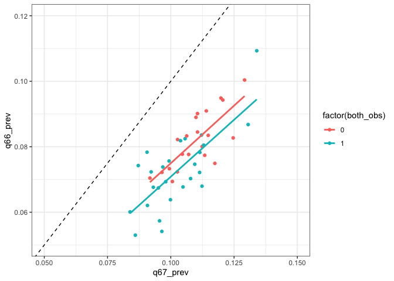

This notebook generates state-level predictions for all states with YRBS
data. It combined the previously generated hold-out predictions for
states with the focal questions with new predictions generated for
states without the focal questions.

    N_CORES = 8
    library(data.table)
    library(Matrix)
    library(parallel)
    library(ranger)
    library(printr)
    library(knitr)

    states_combined_dt = fread('~/YRBS_predictions/data/combined_pred_data_all.csv', showProgress=TRUE)

    subset_dt = copy(states_combined_dt)[year >= 2013]

    id_vars = c('sitecode', 'census_region', 'census_division', 'year', 'weight')
    varimp_inds = fread('~/YRBS_predictions/data/varimp_v1.csv')
    modeling_vars = varimp_inds[, var]
    ss_vars = c(id_vars, modeling_vars)
    ss_vars = intersect(ss_vars, colnames(subset_dt))
    subset_dt = subset_dt[, ..ss_vars]

    # Add indicator for whether q66 and/or q67 answer are present
    subset_dt[, have_q67 := max(ifelse(!is.na(q67), 1, 0)), by = .(sitecode, year)]
    subset_dt[, have_q66 := max(ifelse(!is.na(q66), 1, 0)), by = .(sitecode, year)]

    # Add indicator for whether to predict each question (if they dont have the outcome in 2017)
    subset_dt[, predict_q67 := min(ifelse(!is.na(q67) & year==2017, 0, 1)), by = 'sitecode']
    subset_dt[, predict_q66 := min(ifelse(!is.na(q66) & year==2017, 0, 1)), by = 'sitecode']

    print(subset_dt[,table(have_q67)])
    print(subset_dt[have_q67==1,uniqueN(sitecode)])
    print(subset_dt[,table(have_q66)])
    print(subset_dt[have_q66==1,uniqueN(sitecode)])

    print(subset_dt[predict_q67 == 1, unique(sitecode)])
    print(subset_dt[predict_q67 == 0, unique(sitecode)])
    print(subset_dt[predict_q66 == 1, unique(sitecode)])
    print(subset_dt[predict_q66 == 0, unique(sitecode)])

    preds = intersect(varimp_inds[pred == "y", var], colnames(subset_dt))

    # Remove preds without variation
    preds = Filter(function(p) { length(unique(subset_dt[, get(p)])) > 1 }, preds)

    getmode <- function(v) {
       uniqv <- unique(v)
       uniqv[which.max(tabulate(match(v, uniqv)))]
    }

    # Fill nulls
    # Deal with missing values
    # Fill nulls with mode and add a separate is_missing indicator
    preds_to_fill = c(preds, 'q66', 'q67')

    for(p in preds_to_fill) {
      subset_dt[, (paste0(p,"_is_missing")) := ifelse(is.na(get(p)),1,0)]
      subset_dt[get(paste0(p,"_is_missing")) == 1, (p) := getmode(subset_dt[!is.na(get(p)),get(p)])]
      
      # make all predictors factors
      subset_dt[, (p) := as.factor(get(p))]
    }

    # make sure continuous predictors are numeric
    subset_dt[, bmipct := as.numeric(bmipct)]
    subset_dt[, bmi := as.numeric(bmi)]
    subset_dt[, stheight := as.numeric(stheight)]
    subset_dt[, stweight := as.numeric(stweight)]

    # Make year a factor for FEs
    subset_dt[, year := as.factor(year)]

    # Code outcomes

    # Same sex contacts 
    subset_dt[have_q66 == 1, Y_q66 := 0]
    subset_dt[q66 == 4, Y_q66 := 1]
    subset_dt[sex == 1 & q66 == 2, Y_q66 := 1]
    subset_dt[sex == 2 & q66 == 3, Y_q66 := 1]

    print(subset_dt[, table(Y_q66, useNA="always")])
    print(subset_dt[!is.na(Y_q66), unique(sitecode)])

    # Encode outcome
    subset_dt[have_q67==1, Y_q67 := 0]
    subset_dt[q67 == 2, Y_q67 := 1]
    subset_dt[q67 == 3, Y_q67 := 1]

    print(subset_dt[, table(Y_q67, useNA="always")])
    print(subset_dt[!is.na(Y_q67), unique(sitecode)])

    # Q66 Training Data
    q66_dt = copy(subset_dt)[!is.na(Y_q66)]

    q66_wo_q67 = q66_dt[have_q67 == 0]
    q66_wo_q67[, predset := "Not Using Identity Responses"]

    # Duplicate states that have q67 answer as well
    q66_w_q67 = q66_dt[have_q67 == 1]
    q66_w_q67_null_q67 = copy(q66_w_q67)
    q66_w_q67_null_q67[, q67 := getmode(q66_w_q67_null_q67[!is.na(q67), q67])]
    q66_w_q67_null_q67[, q67_is_missing := 1]

    q66_w_q67[, predset := "Using Identity Responses"]
    q66_w_q67_null_q67[, predset := "Not Using Identity Responses"]

    q66_dup_dt = rbind(q66_wo_q67, q66_w_q67, q66_w_q67_null_q67)

    # prepare model matrix
    q66_preds = setdiff(
      unique(unlist(sapply(c(preds,'q67'), function(x) grep(x, colnames(subset_dt), value=T), simplify=T))),
      c('have_q67', 'Y_q67'))
                    
    q66_simp_formula_str = paste(" ~ -1 + census_region + census_division + year +",
                             paste(q66_preds, collapse = " + "))

    X_q66 = sparse.model.matrix(as.formula(q66_simp_formula_str), data=q66_dup_dt)
    Y_q66 = q66_dup_dt[, Y_q66]
    w_q66 = q66_dup_dt[, weight]
                    
    print(nrow(X_q66))
    print(nrow(q66_dup_dt))

    # Q66 Prediction Data 

    q66_dt_pred = copy(subset_dt)

    q66_dt_pred = q66_dt_pred[predict_q66==1] 
    X_q66_pred = sparse.model.matrix(as.formula(q66_simp_formula_str), data=q66_dt_pred)

    print(nrow(X_q66_pred))
    print(nrow(q66_dt_pred))
    print(q66_dt_pred[,unique(sitecode)])

    # Q66 Male Training Data
    q66_male_dt = copy(subset_dt)[!is.na(Y_q66) & sex==2]

    q66_male_wo_q67 = q66_male_dt[have_q67 == 0]
    q66_male_wo_q67[, predset := "Not Using Identity Responses"]

    # Duplicate states that have q67 answer as well
    q66_male_w_q67 = q66_male_dt[have_q67 == 1]
    q66_male_w_q67_null_q67 = copy(q66_male_w_q67)
    q66_male_w_q67_null_q67[, q67 := getmode(q66_male_w_q67_null_q67[!is.na(q67), q67])]
    q66_male_w_q67_null_q67[, q67_is_missing := 1]

    q66_male_w_q67[, predset := "Using Identity Responses"]
    q66_male_w_q67_null_q67[, predset := "Not Using Identity Responses"]

    q66_male_dup_dt = rbind(q66_male_wo_q67, q66_male_w_q67, q66_male_w_q67_null_q67)

    # prepare model matrix
    q66_male_preds = setdiff(
      unique(unlist(sapply(c(preds,'q67'), function(x) grep(x, colnames(subset_dt), value=T), simplify=T))),
      c('have_q67', 'Y_q67'))
                    
    q66_male_simp_formula_str = paste(" ~ -1 + census_region + census_division + year +",
                             paste(q66_male_preds, collapse = " + "))

    X_male_q66 = sparse.model.matrix(as.formula(q66_male_simp_formula_str), data=q66_male_dup_dt)
    Y_male_q66 = q66_male_dup_dt[, Y_q66]
    w_male_q66 = q66_male_dup_dt[, weight]
                    
    print(nrow(X_male_q66))
    print(nrow(q66_male_dup_dt))

    # Q66 Male Prediction Data 

    q66_male_dt_pred = copy(subset_dt)

    q66_male_dt_pred = q66_male_dt_pred[predict_q66==1 & sex==2] 
    X_male_q66_pred = sparse.model.matrix(as.formula(q66_male_simp_formula_str), data=q66_male_dt_pred)

    print(nrow(X_male_q66_pred))
    print(nrow(q66_male_dt_pred))
    print(q66_male_dt_pred[,unique(sitecode)])

    # Q67 Training Data
    q67_dt = copy(subset_dt)[!is.na(Y_q67)]

    q67_wo_q66 = q67_dt[have_q66 == 0]
    q67_wo_q66[, predset := "Not Using Contact Responses"]

    # Duplicate states that have q66 answer as well
    q67_w_q66 = q67_dt[have_q66 == 1]
    q67_w_q66_null_q67 = copy(q67_w_q66)
    q67_w_q66_null_q67[, q66 := getmode(q66_w_q67_null_q67[!is.na(q67), q67])]
    q67_w_q66_null_q67[, q66_is_missing := 1]

    q67_w_q66[, predset := "Using Contact Responses"]
    q67_w_q66_null_q67[, predset := "Not Using Contact Responses"]

    q67_dup_dt = rbind(q67_wo_q66, q67_w_q66, q67_w_q66_null_q67)

    # prepare model matrix
    q67_preds = setdiff(
      unique(unlist(sapply(c(preds,'q66'), function(x) grep(x, colnames(subset_dt), value=T), simplify=T))),
      c('have_q66', 'Y_q66'))

    # Remove preds without variation
    q67_preds = Filter(function(p) { length(unique(subset_dt[, get(p)])) > 1 }, q67_preds)
                    
    q67_simp_formula_str = paste(" ~ -1 + census_region + census_division + year +",
                             paste(q67_preds, collapse = " + "))

    X_q67 = sparse.model.matrix(as.formula(q67_simp_formula_str), data=q67_dup_dt)
    Y_q67 = q67_dup_dt[, Y_q67]
    w_q67 = q67_dup_dt[, weight]
                    
    print(nrow(X_q67))
    print(nrow(q67_dup_dt))

    # Q67 Prediction Data 

    q67_dt_pred = copy(subset_dt)

    q67_dt_pred = q67_dt_pred[predict_q67==1] 
    X_q67_pred = sparse.model.matrix(as.formula(q67_simp_formula_str), data=q67_dt_pred)

    print(nrow(X_q67_pred))
    print(nrow(q67_dt_pred))
    print(q67_dt_pred[, unique(sitecode)])

    # Save stuff to save time later
    save(
      list = c(
         "X_q66", "Y_q66", "w_q66", "X_q66_pred", "q66_dt_pred",
         "X_male_q66", "Y_male_q66", "w_male_q66", "X_male_q66_pred", "q66_male_dt_pred",
         "X_q67", "Y_q67", "w_q67", "X_q67_pred", "q67_dt_pred"
      ),
      file = "~/YRBS_predictions/data/yrbs_pred_image_20220808.RData", compress=F)

## Train models

    N_CORES = 6

    rm(list = ls())
    gc()

    library(data.table)
    library(Matrix)
    library(parallel)
    library(ranger)

    load("~/YRBS_predictions/data/yrbs_pred_image_20220808.RData")

    region_feat_names = grep("census_region", colnames(X_q66), value = T)
    year_feat_names = grep("year", colnames(X_q66), value = T)
    m_q66 = ranger(
      num.trees = 90,
      mtry = round(ncol(X_q66)/3),
      min.node.size = 10,
      max.depth = 14,
      oob.error = TRUE,
      num.threads = N_CORES,
      verbose = F,
      seed = 13,
      classification = F,
      x = X_q66,
      y = Y_q66,
      always.split.variables = c(region_feat_names, year_feat_names)
    )

    region_feat_names = grep("census_region", colnames(X_male_q66), value = T)
    year_feat_names = grep("year", colnames(X_male_q66), value = T)
    m_q66_male = ranger(
      num.trees = 90,
      mtry = round(ncol(X_male_q66)/3),
      min.node.size = 10,
      max.depth = 14,
      oob.error = TRUE,
      num.threads = N_CORES,
      verbose = F,
      seed = 13,
      classification = F,
      x = X_male_q66,
      y = Y_male_q66,
      always.split.variables = c(region_feat_names, year_feat_names)
    )

    region_feat_names = grep("census_region", colnames(X_q67), value = T)
    year_feat_names = grep("year", colnames(X_q67), value = T)
    m_q67 = ranger(
      num.trees = 90,
      mtry = round(ncol(X_q67)/3),
      min.node.size = 10,
      max.depth = 14,
      oob.error = TRUE,
      num.threads = N_CORES,
      verbose = F,
      seed = 13,
      classification = F,
      x = X_q67,
      y = Y_q67,
      always.split.variables = c(region_feat_names, year_feat_names)
    )

    # Save stuff to save time later
    save(
      list = c(
         "X_q66", "Y_q66", "w_q66", "X_q66_pred", "q66_dt_pred", "m_q66",
         "X_male_q66", "Y_male_q66", "w_male_q66", "X_male_q66_pred", "q66_male_dt_pred", "m_q66_male",
         "X_q67", "Y_q67", "w_q67", "X_q67_pred", "q67_dt_pred", "m_q67"
      ),
      file = "~/YRBS_predictions/data/yrbs_pred_image_20220808.RData", compress=F)

## Make predictions

    rm(list = ls())
    gc()

    N_CORES = 8

    library(data.table)
    library(Matrix)
    library(parallel)
    library(ranger)
    library(knitr)
    library(ggplot2)

    load("~/YRBS_predictions/data/yrbs_pred_image_20220808.RData")

    # Q66 predictions

    # Change year FE to 2017
    X_q66_pred = as.matrix(X_q66_pred)
    X_q66_pred[, "year2017"] = 1

    # Add missing col
    X_q66_pred_t = cbind(X_q66_pred, `census_divisionNew England` = 0)

    # Make predictions
    q66_preds = predict(m_q66, data = X_q66_pred_t, num.threads = N_CORES)$predictions

    # Weighted prevalence predictions by state year
    q66_dt_pred[, pred := q66_preds]
    q66_state_year_preds = q66_dt_pred[, .(
      real_prev = weighted.mean(Y_q66, weight),
      pred_prev_2017 = weighted.mean(pred, weight),
      any_q67_data = max(have_q67)),
      by = .(sitecode, year)]

    setorder(q66_state_year_preds, -year)
    q66_state_year_preds[year!=2017, year_rank := seq_len(.N), by='sitecode']
    q66_state_year_preds = q66_state_year_preds[year==2017 | year_rank==1]

    # Q66 male predictions
    # Change year FE to 2017
    X_male_q66_pred = as.matrix(X_male_q66_pred)
    X_male_q66_pred[, "year2017"] = 1

    # Add missing col
    X_male_q66_pred_t = cbind(X_male_q66_pred, `census_divisionNew England` = 0)

    # Make predictions
    q66_male_preds = predict(m_q66_male, data = X_male_q66_pred_t, num.threads = N_CORES)$predictions

    # Weighted prevalence predictions by state year
    q66_male_dt_pred[, pred := q66_male_preds]
    q66_male_state_year_preds = q66_male_dt_pred[, .(
      real_prev = weighted.mean(Y_q66, weight),
      pred_prev_2017 = weighted.mean(pred, weight),
      any_q67_data = max(have_q67)),
      by = .(sitecode, year)]

    setorder(q66_male_state_year_preds, -year)
    q66_male_state_year_preds[year!=2017, year_rank := seq_len(.N), by='sitecode']
    q66_male_state_year_preds = q66_male_state_year_preds[year==2017 | year_rank==1]

    # Q67 predictions
    # Change year FE to 2017
    X_q67_pred = as.matrix(X_q67_pred)
    X_q67_pred[, "year2017"] = 1

    # Add missing col
    X_q67_pred_t = cbind(X_q67_pred, `census_divisionNew England` = 0)

    q67_preds = predict(m_q67, data = X_q67_pred_t, num.threads = N_CORES)$predictions

    # Weighted prevalence predictions by state year
    q67_dt_pred[, pred := q67_preds]
    q67_state_year_preds = q67_dt_pred[, .(
      real_prev = weighted.mean(Y_q67, weight),
      pred_prev_2017 = weighted.mean(pred, weight),
      any_q66_data = max(have_q66)),
      by = .(sitecode, year)]

    setorder(q67_state_year_preds, -year)
    q67_state_year_preds[year!=2017, year_rank := seq_len(.N), by='sitecode']
    q67_state_year_preds = q67_state_year_preds[year==2017 | year_rank==1]

Load errors and create prediction intervals

    error_dt = fread('~/YRBS_predictions/data/error_dt.csv')

    q66_state_year_preds[, pred_method := "Error"]
    q66_state_year_preds[year!=2017, pred_method := "Previous year without other focal Q"]
    q66_state_year_preds[any_q67_data==1 & year==2017, pred_method := "Same year with other focal Q"]
    q66_state_year_preds[any_q67_data==0 & year==2017, pred_method := "Same year without other focal Q"]
    print(q66_state_year_preds[, table(pred_method)])

    ## pred_method
    ## Previous year without other focal Q        Same year with other focal Q 
    ##                                  20                                   4 
    ##     Same year without other focal Q 
    ##                                   9

    q66_male_state_year_preds[, pred_method := "Error"]
    q66_male_state_year_preds[year!=2017, pred_method := "Previous year without other focal Q"]
    q66_male_state_year_preds[any_q67_data==1 & year==2017, pred_method := "Same year with other focal Q"]
    q66_male_state_year_preds[any_q67_data==0 & year==2017, pred_method := "Same year without other focal Q"]
    print(q66_male_state_year_preds[, table(pred_method)])

    ## pred_method
    ## Previous year without other focal Q        Same year with other focal Q 
    ##                                  20                                   4 
    ##     Same year without other focal Q 
    ##                                   9

    q67_state_year_preds[, pred_method := "Error"]
    q67_state_year_preds[year!=2017, pred_method := "Previous year without other focal Q"]
    q67_state_year_preds[any_q66_data==1 & year==2017, pred_method := "Same year with other focal Q"]
    q67_state_year_preds[any_q66_data==0 & year==2017, pred_method := "Same year without other focal Q"]
    print(q67_state_year_preds[, table(pred_method)])

    ## pred_method
    ## Previous year without other focal Q     Same year without other focal Q 
    ##                                  17                                   9

    q66_preds = merge(q66_state_year_preds, error_dt[q=='q66'], by=c('pred_method'))[,.(
        sitecode,
        pred_method,
        real_prev,
        pred_prev_2017 = pred_prev_2017 + oob_mean_bias,
        pred_prev_2017_lb = pred_prev_2017 + oob_mean_bias - qt(0.975, t_dist_df)*oob_sd,
        pred_prev_2017_ub = pred_prev_2017 + oob_mean_bias + qt(0.975, t_dist_df)*oob_sd
      )]

    q66_preds[pred_method == "Previous year without other focal Q", real_prev := NA]

    q66_male_preds = merge(q66_male_state_year_preds, error_dt[q=='q66_male'], by=c('pred_method'))[,.(
        sitecode,
        pred_method,
        real_prev,
        pred_prev_2017 = pred_prev_2017 + oob_mean_bias,
        pred_prev_2017_lb = pred_prev_2017 + oob_mean_bias - qt(0.975, t_dist_df)*oob_sd,
        pred_prev_2017_ub = pred_prev_2017 + oob_mean_bias + qt(0.975, t_dist_df)*oob_sd
      )]

    q66_male_preds[pred_method == "Previous year without other focal Q", real_prev := NA]

    q67_preds = merge(q67_state_year_preds, error_dt[q=='q67'], by=c('pred_method'))[,.(
        sitecode,
        pred_method,
        real_prev,
        pred_prev_2017 = pred_prev_2017 + oob_mean_bias,
        pred_prev_2017_lb = pred_prev_2017 + oob_mean_bias - qt(0.975, t_dist_df)*oob_sd,
        pred_prev_2017_ub = pred_prev_2017 + oob_mean_bias + qt(0.975, t_dist_df)*oob_sd
      )]

    q67_preds[pred_method == "Previous year without other focal Q", real_prev := NA]

    # dcast
    q67_preds[,pred_txt := paste0(
      format(pred_prev_2017*100, digits=1, nsmall=1,trim=T), " (", 
      format(pred_prev_2017_lb*100, digits=1, nsmall=1,trim=T), ", ", 
      format(pred_prev_2017_ub*100, digits=1, nsmall=1,trim=T), ")")]
    q67_preds_wide = dcast(q67_preds, sitecode ~ pred_method, value.var = c('pred_txt'))
    q67_preds_wide[is.na(q67_preds_wide)] = ''
    setnames(q67_preds_wide, 'sitecode', 'pred_state')
    kable(q67_preds_wide)

<table>
<colgroup>
<col style="width: 13%" />
<col style="width: 45%" />
<col style="width: 40%" />
</colgroup>
<thead>
<tr class="header">
<th style="text-align: left;">pred_state</th>
<th style="text-align: left;">Previous year without other focal Q</th>
<th style="text-align: left;">Same year without other focal Q</th>
</tr>
</thead>
<tbody>
<tr class="odd">
<td style="text-align: left;">AK</td>
<td style="text-align: left;">11.0 (8.7, 13.2)</td>
<td style="text-align: left;">11.5 (8.9, 14.0)</td>
</tr>
<tr class="even">
<td style="text-align: left;">AL</td>
<td style="text-align: left;">11.4 (9.1, 13.7)</td>
<td style="text-align: left;"></td>
</tr>
<tr class="odd">
<td style="text-align: left;">GA</td>
<td style="text-align: left;">12.5 (10.2, 14.7)</td>
<td style="text-align: left;"></td>
</tr>
<tr class="even">
<td style="text-align: left;">ID</td>
<td style="text-align: left;">11.2 (8.9, 13.4)</td>
<td style="text-align: left;">11.2 (8.7, 13.8)</td>
</tr>
<tr class="odd">
<td style="text-align: left;">IN</td>
<td style="text-align: left;">12.1 (9.8, 14.3)</td>
<td style="text-align: left;"></td>
</tr>
<tr class="even">
<td style="text-align: left;">KS</td>
<td style="text-align: left;">9.4 (7.2, 11.7)</td>
<td style="text-align: left;">10.1 (7.5, 12.6)</td>
</tr>
<tr class="odd">
<td style="text-align: left;">LA</td>
<td style="text-align: left;">10.8 (8.5, 13.0)</td>
<td style="text-align: left;">12.9 (10.4, 15.5)</td>
</tr>
<tr class="even">
<td style="text-align: left;">MO</td>
<td style="text-align: left;">9.7 (7.5, 12.0)</td>
<td style="text-align: left;">10.3 (7.7, 12.8)</td>
</tr>
<tr class="odd">
<td style="text-align: left;">MS</td>
<td style="text-align: left;">12.0 (9.7, 14.2)</td>
<td style="text-align: left;"></td>
</tr>
<tr class="even">
<td style="text-align: left;">MT</td>
<td style="text-align: left;">10.1 (7.8, 12.4)</td>
<td style="text-align: left;">11.1 (8.5, 13.6)</td>
</tr>
<tr class="odd">
<td style="text-align: left;">NJ</td>
<td style="text-align: left;">10.7 (8.4, 13.0)</td>
<td style="text-align: left;"></td>
</tr>
<tr class="even">
<td style="text-align: left;">OH</td>
<td style="text-align: left;">9.9 (7.7, 12.2)</td>
<td style="text-align: left;"></td>
</tr>
<tr class="odd">
<td style="text-align: left;">SD</td>
<td style="text-align: left;">9.7 (7.4, 11.9)</td>
<td style="text-align: left;"></td>
</tr>
<tr class="even">
<td style="text-align: left;">TN</td>
<td style="text-align: left;">11.4 (9.1, 13.6)</td>
<td style="text-align: left;">10.6 (8.1, 13.2)</td>
</tr>
<tr class="odd">
<td style="text-align: left;">UT</td>
<td style="text-align: left;">10.4 (8.2, 12.7)</td>
<td style="text-align: left;">11.0 (8.4, 13.6)</td>
</tr>
<tr class="even">
<td style="text-align: left;">VA</td>
<td style="text-align: left;">10.5 (8.3, 12.8)</td>
<td style="text-align: left;">10.5 (7.9, 13.0)</td>
</tr>
<tr class="odd">
<td style="text-align: left;">WY</td>
<td style="text-align: left;">11.1 (8.8, 13.3)</td>
<td style="text-align: left;"></td>
</tr>
</tbody>
</table>

    # dcast
    q66_preds[,pred_txt := paste0(
      format(pred_prev_2017*100, digits=1, nsmall=1,trim=T), " (", 
      format(pred_prev_2017_lb*100, digits=1, nsmall=1,trim=T), ", ", 
      format(pred_prev_2017_ub*100, digits=1, nsmall=1,trim=T), ")")]
    q66_preds_wide = dcast(q66_preds, sitecode ~ pred_method, value.var = c('pred_txt'))
    q66_preds_wide[is.na(q66_preds_wide)] = ''
    setnames(q66_preds_wide, 'sitecode', 'pred_state')
    kable(q66_preds_wide)

<table>
<colgroup>
<col style="width: 10%" />
<col style="width: 33%" />
<col style="width: 26%" />
<col style="width: 29%" />
</colgroup>
<thead>
<tr class="header">
<th style="text-align: left;">pred_state</th>
<th style="text-align: left;">Previous year without other focal Q</th>
<th style="text-align: left;">Same year with other focal Q</th>
<th style="text-align: left;">Same year without other focal Q</th>
</tr>
</thead>
<tbody>
<tr class="odd">
<td style="text-align: left;">AK</td>
<td style="text-align: left;">7.8 (5.9, 9.7)</td>
<td style="text-align: left;"></td>
<td style="text-align: left;">8.3 (6.2, 10.5)</td>
</tr>
<tr class="even">
<td style="text-align: left;">AL</td>
<td style="text-align: left;">9.1 (7.2, 11.0)</td>
<td style="text-align: left;"></td>
<td style="text-align: left;"></td>
</tr>
<tr class="odd">
<td style="text-align: left;">AZ</td>
<td style="text-align: left;">10.4 (8.5, 12.3)</td>
<td style="text-align: left;">7.7 (6.2, 9.3)</td>
<td style="text-align: left;"></td>
</tr>
<tr class="even">
<td style="text-align: left;">CO</td>
<td style="text-align: left;"></td>
<td style="text-align: left;">7.2 (5.6, 8.8)</td>
<td style="text-align: left;"></td>
</tr>
<tr class="odd">
<td style="text-align: left;">GA</td>
<td style="text-align: left;">8.3 (6.4, 10.2)</td>
<td style="text-align: left;"></td>
<td style="text-align: left;"></td>
</tr>
<tr class="even">
<td style="text-align: left;">ID</td>
<td style="text-align: left;">8.0 (6.1, 9.9)</td>
<td style="text-align: left;"></td>
<td style="text-align: left;">8.0 (5.8, 10.2)</td>
</tr>
<tr class="odd">
<td style="text-align: left;">IN</td>
<td style="text-align: left;">9.4 (7.5, 11.3)</td>
<td style="text-align: left;"></td>
<td style="text-align: left;"></td>
</tr>
<tr class="even">
<td style="text-align: left;">KS</td>
<td style="text-align: left;">7.1 (5.2, 9.0)</td>
<td style="text-align: left;"></td>
<td style="text-align: left;">6.9 (4.8, 9.1)</td>
</tr>
<tr class="odd">
<td style="text-align: left;">LA</td>
<td style="text-align: left;">7.5 (5.6, 9.4)</td>
<td style="text-align: left;"></td>
<td style="text-align: left;">10.0 (7.9, 12.2)</td>
</tr>
<tr class="even">
<td style="text-align: left;">MD</td>
<td style="text-align: left;">8.8 (6.9, 10.7)</td>
<td style="text-align: left;">7.5 (5.9, 9.1)</td>
<td style="text-align: left;"></td>
</tr>
<tr class="odd">
<td style="text-align: left;">MO</td>
<td style="text-align: left;">7.5 (5.6, 9.4)</td>
<td style="text-align: left;"></td>
<td style="text-align: left;">8.2 (6.1, 10.4)</td>
</tr>
<tr class="even">
<td style="text-align: left;">MS</td>
<td style="text-align: left;">9.5 (7.6, 11.4)</td>
<td style="text-align: left;"></td>
<td style="text-align: left;"></td>
</tr>
<tr class="odd">
<td style="text-align: left;">MT</td>
<td style="text-align: left;">8.1 (6.2, 10.0)</td>
<td style="text-align: left;"></td>
<td style="text-align: left;">8.4 (6.3, 10.6)</td>
</tr>
<tr class="even">
<td style="text-align: left;">ND</td>
<td style="text-align: left;">7.7 (5.8, 9.6)</td>
<td style="text-align: left;">7.0 (5.5, 8.6)</td>
<td style="text-align: left;"></td>
</tr>
<tr class="odd">
<td style="text-align: left;">NJ</td>
<td style="text-align: left;">7.8 (5.9, 9.7)</td>
<td style="text-align: left;"></td>
<td style="text-align: left;"></td>
</tr>
<tr class="even">
<td style="text-align: left;">OH</td>
<td style="text-align: left;">7.3 (5.4, 9.2)</td>
<td style="text-align: left;"></td>
<td style="text-align: left;"></td>
</tr>
<tr class="odd">
<td style="text-align: left;">SD</td>
<td style="text-align: left;">7.2 (5.3, 9.1)</td>
<td style="text-align: left;"></td>
<td style="text-align: left;"></td>
</tr>
<tr class="even">
<td style="text-align: left;">TN</td>
<td style="text-align: left;">9.4 (7.5, 11.3)</td>
<td style="text-align: left;"></td>
<td style="text-align: left;">8.3 (6.2, 10.5)</td>
</tr>
<tr class="odd">
<td style="text-align: left;">UT</td>
<td style="text-align: left;">8.7 (6.8, 10.6)</td>
<td style="text-align: left;"></td>
<td style="text-align: left;">8.9 (6.7, 11.1)</td>
</tr>
<tr class="even">
<td style="text-align: left;">VA</td>
<td style="text-align: left;">8.4 (6.5, 10.3)</td>
<td style="text-align: left;"></td>
<td style="text-align: left;">7.8 (5.6, 9.9)</td>
</tr>
<tr class="odd">
<td style="text-align: left;">WY</td>
<td style="text-align: left;">9.0 (7.1, 10.9)</td>
<td style="text-align: left;"></td>
<td style="text-align: left;"></td>
</tr>
</tbody>
</table>

    # dcast
    q66_male_preds[,pred_txt := paste0(
      format(pred_prev_2017*100, digits=1, nsmall=1, trim=T), " (", 
      format(pred_prev_2017_lb*100, digits=1, nsmall=1,trim=T), ", ", 
      format(pred_prev_2017_ub*100, digits=1, nsmall=1,trim=T), ")")]
    q66_male_preds_wide = dcast(q66_male_preds, sitecode ~ pred_method, value.var = c('pred_txt'))
    q66_male_preds_wide[is.na(q66_male_preds_wide)] = ''
    setnames(q66_male_preds_wide, 'sitecode', 'pred_state')
    kable(q66_male_preds_wide)

<table>
<colgroup>
<col style="width: 10%" />
<col style="width: 33%" />
<col style="width: 26%" />
<col style="width: 29%" />
</colgroup>
<thead>
<tr class="header">
<th style="text-align: left;">pred_state</th>
<th style="text-align: left;">Previous year without other focal Q</th>
<th style="text-align: left;">Same year with other focal Q</th>
<th style="text-align: left;">Same year without other focal Q</th>
</tr>
</thead>
<tbody>
<tr class="odd">
<td style="text-align: left;">AK</td>
<td style="text-align: left;">5.1 (3.0, 7.1)</td>
<td style="text-align: left;"></td>
<td style="text-align: left;">5.1 (3.0, 7.2)</td>
</tr>
<tr class="even">
<td style="text-align: left;">AL</td>
<td style="text-align: left;">5.6 (3.6, 7.7)</td>
<td style="text-align: left;"></td>
<td style="text-align: left;"></td>
</tr>
<tr class="odd">
<td style="text-align: left;">AZ</td>
<td style="text-align: left;">8.0 (5.9, 10.1)</td>
<td style="text-align: left;">4.4 (2.5, 6.4)</td>
<td style="text-align: left;"></td>
</tr>
<tr class="even">
<td style="text-align: left;">CO</td>
<td style="text-align: left;"></td>
<td style="text-align: left;">3.9 (1.9, 5.8)</td>
<td style="text-align: left;"></td>
</tr>
<tr class="odd">
<td style="text-align: left;">GA</td>
<td style="text-align: left;">5.0 (3.0, 7.1)</td>
<td style="text-align: left;"></td>
<td style="text-align: left;"></td>
</tr>
<tr class="even">
<td style="text-align: left;">ID</td>
<td style="text-align: left;">4.1 (2.1, 6.2)</td>
<td style="text-align: left;"></td>
<td style="text-align: left;">4.1 (1.9, 6.2)</td>
</tr>
<tr class="odd">
<td style="text-align: left;">IN</td>
<td style="text-align: left;">6.6 (4.5, 8.6)</td>
<td style="text-align: left;"></td>
<td style="text-align: left;"></td>
</tr>
<tr class="even">
<td style="text-align: left;">KS</td>
<td style="text-align: left;">4.2 (2.2, 6.3)</td>
<td style="text-align: left;"></td>
<td style="text-align: left;">4.0 (1.9, 6.2)</td>
</tr>
<tr class="odd">
<td style="text-align: left;">LA</td>
<td style="text-align: left;">5.1 (3.0, 7.1)</td>
<td style="text-align: left;"></td>
<td style="text-align: left;">7.8 (5.6, 9.9)</td>
</tr>
<tr class="even">
<td style="text-align: left;">MD</td>
<td style="text-align: left;">5.3 (3.3, 7.4)</td>
<td style="text-align: left;">4.3 (2.3, 6.3)</td>
<td style="text-align: left;"></td>
</tr>
<tr class="odd">
<td style="text-align: left;">MO</td>
<td style="text-align: left;">4.5 (2.4, 6.5)</td>
<td style="text-align: left;"></td>
<td style="text-align: left;">4.8 (2.7, 7.0)</td>
</tr>
<tr class="even">
<td style="text-align: left;">MS</td>
<td style="text-align: left;">6.7 (4.7, 8.8)</td>
<td style="text-align: left;"></td>
<td style="text-align: left;"></td>
</tr>
<tr class="odd">
<td style="text-align: left;">MT</td>
<td style="text-align: left;">4.6 (2.5, 6.7)</td>
<td style="text-align: left;"></td>
<td style="text-align: left;">4.6 (2.5, 6.7)</td>
</tr>
<tr class="even">
<td style="text-align: left;">ND</td>
<td style="text-align: left;">5.3 (3.3, 7.4)</td>
<td style="text-align: left;">4.3 (2.4, 6.3)</td>
<td style="text-align: left;"></td>
</tr>
<tr class="odd">
<td style="text-align: left;">NJ</td>
<td style="text-align: left;">4.6 (2.5, 6.7)</td>
<td style="text-align: left;"></td>
<td style="text-align: left;"></td>
</tr>
<tr class="even">
<td style="text-align: left;">OH</td>
<td style="text-align: left;">3.8 (1.8, 5.9)</td>
<td style="text-align: left;"></td>
<td style="text-align: left;"></td>
</tr>
<tr class="odd">
<td style="text-align: left;">SD</td>
<td style="text-align: left;">4.4 (2.3, 6.5)</td>
<td style="text-align: left;"></td>
<td style="text-align: left;"></td>
</tr>
<tr class="even">
<td style="text-align: left;">TN</td>
<td style="text-align: left;">5.2 (3.2, 7.3)</td>
<td style="text-align: left;"></td>
<td style="text-align: left;">5.3 (3.1, 7.4)</td>
</tr>
<tr class="odd">
<td style="text-align: left;">UT</td>
<td style="text-align: left;">5.5 (3.4, 7.6)</td>
<td style="text-align: left;"></td>
<td style="text-align: left;">5.5 (3.3, 7.6)</td>
</tr>
<tr class="even">
<td style="text-align: left;">VA</td>
<td style="text-align: left;">5.4 (3.3, 7.4)</td>
<td style="text-align: left;"></td>
<td style="text-align: left;">4.7 (2.6, 6.9)</td>
</tr>
<tr class="odd">
<td style="text-align: left;">WY</td>
<td style="text-align: left;">6.0 (3.9, 8.1)</td>
<td style="text-align: left;"></td>
<td style="text-align: left;"></td>
</tr>
</tbody>
</table>

Combine OOB training predictions with these predictions

    q67_oob_preds = fread('~/YRBS_predictions/data/q67_merged_preds.csv')
    q67_combo_preds = rbind(q67_oob_preds, q67_preds_wide[!(pred_state %in% q67_oob_preds$pred_state)], fill=T)
    q67_combo_preds[is.na(q67_combo_preds)] = ''
    fwrite(q67_combo_preds, '~/YRBS_predictions/data/paper_tables/a2.csv')
    kable(q67_combo_preds)

<table style="width:100%;">
<colgroup>
<col style="width: 8%" />
<col style="width: 14%" />
<col style="width: 23%" />
<col style="width: 25%" />
<col style="width: 28%" />
</colgroup>
<thead>
<tr class="header">
<th style="text-align: left;">pred_state</th>
<th style="text-align: left;">real_txt</th>
<th style="text-align: left;">Same year with other focal Q</th>
<th style="text-align: left;">Same year without other focal Q</th>
<th style="text-align: left;">Previous year without other focal Q</th>
</tr>
</thead>
<tbody>
<tr class="odd">
<td style="text-align: left;">AR</td>
<td style="text-align: left;">13.4 (11.9, 15.1)</td>
<td style="text-align: left;">14.9 (13.0, 16.7)</td>
<td style="text-align: left;">15.0 (12.4, 17.5)</td>
<td style="text-align: left;">13.0 (10.7, 15.3)</td>
</tr>
<tr class="even">
<td style="text-align: left;">AZ</td>
<td style="text-align: left;">11.3 (10.1, 12.8)</td>
<td style="text-align: left;"></td>
<td style="text-align: left;">9.9 (7.3, 12.4)</td>
<td style="text-align: left;">12.1 (9.8, 14.3)</td>
</tr>
<tr class="odd">
<td style="text-align: left;">CA</td>
<td style="text-align: left;">9.3 (8.0, 10.7)</td>
<td style="text-align: left;">10.4 (8.5, 12.3)</td>
<td style="text-align: left;">10.4 (7.9, 13.0)</td>
<td style="text-align: left;">9.8 (7.5, 12.1)</td>
</tr>
<tr class="even">
<td style="text-align: left;">CO</td>
<td style="text-align: left;">10.3 (8.8, 11.9)</td>
<td style="text-align: left;"></td>
<td style="text-align: left;">9.3 (6.7, 11.9)</td>
<td style="text-align: left;"></td>
</tr>
<tr class="odd">
<td style="text-align: left;">CT</td>
<td style="text-align: left;">10.6 (9.4, 11.9)</td>
<td style="text-align: left;">10.2 (8.3, 12.2)</td>
<td style="text-align: left;">9.6 (7.0, 12.2)</td>
<td style="text-align: left;">10.4 (8.1, 12.8)</td>
</tr>
<tr class="even">
<td style="text-align: left;">DE</td>
<td style="text-align: left;">9.8 (8.8, 10.9)</td>
<td style="text-align: left;">9.6 (7.6, 11.5)</td>
<td style="text-align: left;">10.0 (7.4, 12.7)</td>
<td style="text-align: left;">9.8 (7.5, 12.1)</td>
</tr>
<tr class="odd">
<td style="text-align: left;">FL</td>
<td style="text-align: left;">9.9 (9.2, 10.7)</td>
<td style="text-align: left;">9.9 (8.0, 11.9)</td>
<td style="text-align: left;">9.6 (6.9, 12.2)</td>
<td style="text-align: left;">10.3 (8.0, 12.6)</td>
</tr>
<tr class="even">
<td style="text-align: left;">HI</td>
<td style="text-align: left;">10.8 (10.0, 11.6)</td>
<td style="text-align: left;">10.9 (9.0, 12.9)</td>
<td style="text-align: left;">10.7 (8.1, 13.3)</td>
<td style="text-align: left;">11.3 (9.0, 13.6)</td>
</tr>
<tr class="odd">
<td style="text-align: left;">IA</td>
<td style="text-align: left;">8.4 (7.2, 9.8)</td>
<td style="text-align: left;">9.1 (7.2, 11.1)</td>
<td style="text-align: left;">9.8 (7.3, 12.4)</td>
<td style="text-align: left;"></td>
</tr>
<tr class="even">
<td style="text-align: left;">IL</td>
<td style="text-align: left;">9.7 (8.9, 10.5)</td>
<td style="text-align: left;">10.8 (8.9, 12.7)</td>
<td style="text-align: left;">10.8 (8.2, 13.4)</td>
<td style="text-align: left;">10.0 (7.7, 12.3)</td>
</tr>
<tr class="odd">
<td style="text-align: left;">KY</td>
<td style="text-align: left;">11.1 (9.8, 12.6)</td>
<td style="text-align: left;">9.9 (8.0, 11.8)</td>
<td style="text-align: left;">9.9 (7.4, 12.5)</td>
<td style="text-align: left;">10.6 (8.3, 12.9)</td>
</tr>
<tr class="even">
<td style="text-align: left;">MA</td>
<td style="text-align: left;">9.1 (8.1, 10.1)</td>
<td style="text-align: left;">9.9 (8.0, 11.8)</td>
<td style="text-align: left;">9.3 (6.6, 11.9)</td>
<td style="text-align: left;">9.6 (7.3, 11.9)</td>
</tr>
<tr class="odd">
<td style="text-align: left;">MD</td>
<td style="text-align: left;">11.7 (11.5, 12.0)</td>
<td style="text-align: left;"></td>
<td style="text-align: left;">9.4 (7.0, 11.9)</td>
<td style="text-align: left;">9.8 (7.7, 12.0)</td>
</tr>
<tr class="even">
<td style="text-align: left;">ME</td>
<td style="text-align: left;">11.3 (10.7, 12.0)</td>
<td style="text-align: left;">9.3 (7.5, 11.1)</td>
<td style="text-align: left;">8.7 (6.3, 11.1)</td>
<td style="text-align: left;">9.2 (7.1, 11.3)</td>
</tr>
<tr class="odd">
<td style="text-align: left;">MI</td>
<td style="text-align: left;">8.7 (7.4, 10.2)</td>
<td style="text-align: left;">10.3 (8.4, 12.1)</td>
<td style="text-align: left;">10.6 (8.1, 13.1)</td>
<td style="text-align: left;">10.5 (8.3, 12.7)</td>
</tr>
<tr class="even">
<td style="text-align: left;">NC</td>
<td style="text-align: left;">10.4 (9.4, 11.5)</td>
<td style="text-align: left;">11.1 (9.2, 13.1)</td>
<td style="text-align: left;">11.2 (8.6, 13.8)</td>
<td style="text-align: left;">11.2 (8.9, 13.5)</td>
</tr>
<tr class="odd">
<td style="text-align: left;">ND</td>
<td style="text-align: left;">9.2 (8.0, 10.5)</td>
<td style="text-align: left;"></td>
<td style="text-align: left;">11.2 (8.7, 13.7)</td>
<td style="text-align: left;">10.3 (8.0, 12.6)</td>
</tr>
<tr class="even">
<td style="text-align: left;">NE</td>
<td style="text-align: left;">8.6 (7.3, 10.2)</td>
<td style="text-align: left;">8.7 (6.7, 10.6)</td>
<td style="text-align: left;">9.2 (6.6, 11.8)</td>
<td style="text-align: left;"></td>
</tr>
<tr class="odd">
<td style="text-align: left;">NH</td>
<td style="text-align: left;">9.6 (9.1, 10.2)</td>
<td style="text-align: left;">8.5 (6.6, 10.4)</td>
<td style="text-align: left;">8.6 (6.1, 11.2)</td>
<td style="text-align: left;"></td>
</tr>
<tr class="even">
<td style="text-align: left;">NM</td>
<td style="text-align: left;">11.1 (10.4, 12.0)</td>
<td style="text-align: left;">10.6 (8.7, 12.6)</td>
<td style="text-align: left;">11.3 (8.7, 13.9)</td>
<td style="text-align: left;">11.4 (9.1, 13.7)</td>
</tr>
<tr class="odd">
<td style="text-align: left;">NV</td>
<td style="text-align: left;">13.1 (11.5, 14.8)</td>
<td style="text-align: left;">11.0 (9.3, 12.8)</td>
<td style="text-align: left;">10.4 (8.0, 12.8)</td>
<td style="text-align: left;">10.4 (8.4, 12.3)</td>
</tr>
<tr class="even">
<td style="text-align: left;">NY</td>
<td style="text-align: left;">11.2 (10.7, 11.8)</td>
<td style="text-align: left;">9.9 (8.0, 11.8)</td>
<td style="text-align: left;">9.8 (7.2, 12.4)</td>
<td style="text-align: left;">10.0 (7.8, 12.3)</td>
</tr>
<tr class="odd">
<td style="text-align: left;">OK</td>
<td style="text-align: left;">9.5 (8.2, 11.0)</td>
<td style="text-align: left;">9.1 (7.1, 11.1)</td>
<td style="text-align: left;">9.9 (7.3, 12.6)</td>
<td style="text-align: left;">9.7 (7.4, 12.0)</td>
</tr>
<tr class="even">
<td style="text-align: left;">PA</td>
<td style="text-align: left;">9.1 (8.2, 10.0)</td>
<td style="text-align: left;">9.9 (7.9, 11.8)</td>
<td style="text-align: left;">10.3 (7.7, 12.8)</td>
<td style="text-align: left;">9.9 (7.6, 12.2)</td>
</tr>
<tr class="odd">
<td style="text-align: left;">RI</td>
<td style="text-align: left;">10.9 (9.7, 12.3)</td>
<td style="text-align: left;">10.3 (8.4, 12.3)</td>
<td style="text-align: left;">10.4 (7.8, 13.0)</td>
<td style="text-align: left;">11.0 (8.7, 13.3)</td>
</tr>
<tr class="even">
<td style="text-align: left;">SC</td>
<td style="text-align: left;">11.2 (9.7, 12.9)</td>
<td style="text-align: left;">11.3 (9.4, 13.3)</td>
<td style="text-align: left;">11.0 (8.4, 13.6)</td>
<td style="text-align: left;"></td>
</tr>
<tr class="odd">
<td style="text-align: left;">TX</td>
<td style="text-align: left;">10.5 (9.2, 11.9)</td>
<td style="text-align: left;">10.8 (8.9, 12.8)</td>
<td style="text-align: left;">11.8 (9.2, 14.3)</td>
<td style="text-align: left;"></td>
</tr>
<tr class="even">
<td style="text-align: left;">VT</td>
<td style="text-align: left;">10.0 (9.6, 10.4)</td>
<td style="text-align: left;">10.0 (8.1, 12.0)</td>
<td style="text-align: left;">10.0 (7.4, 12.6)</td>
<td style="text-align: left;">9.2 (6.9, 11.5)</td>
</tr>
<tr class="odd">
<td style="text-align: left;">WI</td>
<td style="text-align: left;">9.6 (8.4, 10.9)</td>
<td style="text-align: left;">9.6 (7.7, 11.6)</td>
<td style="text-align: left;">10.4 (7.9, 13.0)</td>
<td style="text-align: left;"></td>
</tr>
<tr class="even">
<td style="text-align: left;">WV</td>
<td style="text-align: left;">9.2 (7.9, 10.8)</td>
<td style="text-align: left;">9.9 (8.0, 11.9)</td>
<td style="text-align: left;">10.0 (7.4, 12.6)</td>
<td style="text-align: left;">10.9 (8.7, 13.1)</td>
</tr>
<tr class="odd">
<td style="text-align: left;">AK</td>
<td style="text-align: left;"></td>
<td style="text-align: left;"></td>
<td style="text-align: left;">11.5 (8.9, 14.0)</td>
<td style="text-align: left;">11.0 (8.7, 13.2)</td>
</tr>
<tr class="even">
<td style="text-align: left;">AL</td>
<td style="text-align: left;"></td>
<td style="text-align: left;"></td>
<td style="text-align: left;"></td>
<td style="text-align: left;">11.4 (9.1, 13.7)</td>
</tr>
<tr class="odd">
<td style="text-align: left;">GA</td>
<td style="text-align: left;"></td>
<td style="text-align: left;"></td>
<td style="text-align: left;"></td>
<td style="text-align: left;">12.5 (10.2, 14.7)</td>
</tr>
<tr class="even">
<td style="text-align: left;">ID</td>
<td style="text-align: left;"></td>
<td style="text-align: left;"></td>
<td style="text-align: left;">11.2 (8.7, 13.8)</td>
<td style="text-align: left;">11.2 (8.9, 13.4)</td>
</tr>
<tr class="odd">
<td style="text-align: left;">IN</td>
<td style="text-align: left;"></td>
<td style="text-align: left;"></td>
<td style="text-align: left;"></td>
<td style="text-align: left;">12.1 (9.8, 14.3)</td>
</tr>
<tr class="even">
<td style="text-align: left;">KS</td>
<td style="text-align: left;"></td>
<td style="text-align: left;"></td>
<td style="text-align: left;">10.1 (7.5, 12.6)</td>
<td style="text-align: left;">9.4 (7.2, 11.7)</td>
</tr>
<tr class="odd">
<td style="text-align: left;">LA</td>
<td style="text-align: left;"></td>
<td style="text-align: left;"></td>
<td style="text-align: left;">12.9 (10.4, 15.5)</td>
<td style="text-align: left;">10.8 (8.5, 13.0)</td>
</tr>
<tr class="even">
<td style="text-align: left;">MO</td>
<td style="text-align: left;"></td>
<td style="text-align: left;"></td>
<td style="text-align: left;">10.3 (7.7, 12.8)</td>
<td style="text-align: left;">9.7 (7.5, 12.0)</td>
</tr>
<tr class="odd">
<td style="text-align: left;">MS</td>
<td style="text-align: left;"></td>
<td style="text-align: left;"></td>
<td style="text-align: left;"></td>
<td style="text-align: left;">12.0 (9.7, 14.2)</td>
</tr>
<tr class="even">
<td style="text-align: left;">MT</td>
<td style="text-align: left;"></td>
<td style="text-align: left;"></td>
<td style="text-align: left;">11.1 (8.5, 13.6)</td>
<td style="text-align: left;">10.1 (7.8, 12.4)</td>
</tr>
<tr class="odd">
<td style="text-align: left;">NJ</td>
<td style="text-align: left;"></td>
<td style="text-align: left;"></td>
<td style="text-align: left;"></td>
<td style="text-align: left;">10.7 (8.4, 13.0)</td>
</tr>
<tr class="even">
<td style="text-align: left;">OH</td>
<td style="text-align: left;"></td>
<td style="text-align: left;"></td>
<td style="text-align: left;"></td>
<td style="text-align: left;">9.9 (7.7, 12.2)</td>
</tr>
<tr class="odd">
<td style="text-align: left;">SD</td>
<td style="text-align: left;"></td>
<td style="text-align: left;"></td>
<td style="text-align: left;"></td>
<td style="text-align: left;">9.7 (7.4, 11.9)</td>
</tr>
<tr class="even">
<td style="text-align: left;">TN</td>
<td style="text-align: left;"></td>
<td style="text-align: left;"></td>
<td style="text-align: left;">10.6 (8.1, 13.2)</td>
<td style="text-align: left;">11.4 (9.1, 13.6)</td>
</tr>
<tr class="odd">
<td style="text-align: left;">UT</td>
<td style="text-align: left;"></td>
<td style="text-align: left;"></td>
<td style="text-align: left;">11.0 (8.4, 13.6)</td>
<td style="text-align: left;">10.4 (8.2, 12.7)</td>
</tr>
<tr class="even">
<td style="text-align: left;">VA</td>
<td style="text-align: left;"></td>
<td style="text-align: left;"></td>
<td style="text-align: left;">10.5 (7.9, 13.0)</td>
<td style="text-align: left;">10.5 (8.3, 12.8)</td>
</tr>
<tr class="odd">
<td style="text-align: left;">WY</td>
<td style="text-align: left;"></td>
<td style="text-align: left;"></td>
<td style="text-align: left;"></td>
<td style="text-align: left;">11.1 (8.8, 13.3)</td>
</tr>
</tbody>
</table>

    q66_oob_preds = fread('~/YRBS_predictions/data/q66_merged_preds.csv')
    q66_combo_preds = rbind(q66_oob_preds, q66_preds_wide[!(pred_state %in% q66_oob_preds$pred_state)], fill=T)
    q66_combo_preds[is.na(q66_combo_preds)] = ''
    fwrite(q66_combo_preds, '~/YRBS_predictions/data/paper_tables/a3.csv')
    kable(q66_combo_preds)

<table>
<colgroup>
<col style="width: 8%" />
<col style="width: 13%" />
<col style="width: 23%" />
<col style="width: 25%" />
<col style="width: 28%" />
</colgroup>
<thead>
<tr class="header">
<th style="text-align: left;">pred_state</th>
<th style="text-align: left;">real_txt</th>
<th style="text-align: left;">Same year with other focal Q</th>
<th style="text-align: left;">Same year without other focal Q</th>
<th style="text-align: left;">Previous year without other focal Q</th>
</tr>
</thead>
<tbody>
<tr class="odd">
<td style="text-align: left;">AR</td>
<td style="text-align: left;">10.9 (9.5, 12.5)</td>
<td style="text-align: left;">10.3 (8.7, 11.9)</td>
<td style="text-align: left;">10.8 (8.6, 13.0)</td>
<td style="text-align: left;">10.0 (8.1, 11.9)</td>
</tr>
<tr class="even">
<td style="text-align: left;">CA</td>
<td style="text-align: left;">6.8 (5.7, 8.0)</td>
<td style="text-align: left;">6.6 (5.0, 8.2)</td>
<td style="text-align: left;">6.6 (4.4, 8.9)</td>
<td style="text-align: left;">6.9 (4.9, 8.8)</td>
</tr>
<tr class="odd">
<td style="text-align: left;">CT</td>
<td style="text-align: left;">8.2 (7.2, 9.4)</td>
<td style="text-align: left;">6.1 (4.7, 7.4)</td>
<td style="text-align: left;">5.6 (3.7, 7.5)</td>
<td style="text-align: left;">6.1 (4.5, 7.8)</td>
</tr>
<tr class="even">
<td style="text-align: left;">DE</td>
<td style="text-align: left;">6.9 (6.1, 7.9)</td>
<td style="text-align: left;">7.6 (6.0, 9.1)</td>
<td style="text-align: left;">7.4 (5.2, 9.6)</td>
<td style="text-align: left;">7.9 (6.0, 9.8)</td>
</tr>
<tr class="odd">
<td style="text-align: left;">FL</td>
<td style="text-align: left;">7.6 (6.9, 8.3)</td>
<td style="text-align: left;">7.1 (5.5, 8.8)</td>
<td style="text-align: left;">6.7 (4.5, 8.9)</td>
<td style="text-align: left;">7.4 (5.5, 9.4)</td>
</tr>
<tr class="even">
<td style="text-align: left;">HI</td>
<td style="text-align: left;">7.0 (6.4, 7.7)</td>
<td style="text-align: left;">7.4 (5.8, 9.0)</td>
<td style="text-align: left;">7.4 (5.2, 9.6)</td>
<td style="text-align: left;">8.0 (6.1, 9.9)</td>
</tr>
<tr class="odd">
<td style="text-align: left;">IA</td>
<td style="text-align: left;">6.0 (5.0, 7.2)</td>
<td style="text-align: left;">7.5 (6.0, 9.0)</td>
<td style="text-align: left;">7.8 (5.7, 9.9)</td>
<td style="text-align: left;"></td>
</tr>
<tr class="even">
<td style="text-align: left;">IL</td>
<td style="text-align: left;">7.4 (6.7, 8.1)</td>
<td style="text-align: left;">7.7 (6.1, 9.3)</td>
<td style="text-align: left;">7.8 (5.6, 10.0)</td>
<td style="text-align: left;">7.9 (5.9, 9.8)</td>
</tr>
<tr class="odd">
<td style="text-align: left;">KY</td>
<td style="text-align: left;">7.2 (6.2, 8.4)</td>
<td style="text-align: left;">7.6 (6.0, 9.2)</td>
<td style="text-align: left;">7.4 (5.2, 9.6)</td>
<td style="text-align: left;">8.4 (6.5, 10.3)</td>
</tr>
<tr class="even">
<td style="text-align: left;">MA</td>
<td style="text-align: left;">7.8 (7.0, 8.8)</td>
<td style="text-align: left;">6.2 (4.7, 7.6)</td>
<td style="text-align: left;">6.2 (4.1, 8.3)</td>
<td style="text-align: left;">6.8 (4.9, 8.7)</td>
</tr>
<tr class="odd">
<td style="text-align: left;">ME</td>
<td style="text-align: left;">8.0 (7.5, 8.6)</td>
<td style="text-align: left;">7.1 (5.5, 8.7)</td>
<td style="text-align: left;">6.3 (4.2, 8.4)</td>
<td style="text-align: left;">6.8 (4.9, 8.7)</td>
</tr>
<tr class="even">
<td style="text-align: left;">MI</td>
<td style="text-align: left;">7.4 (6.2, 8.8)</td>
<td style="text-align: left;">7.6 (6.0, 9.2)</td>
<td style="text-align: left;">8.3 (6.1, 10.5)</td>
<td style="text-align: left;">7.4 (5.5, 9.4)</td>
</tr>
<tr class="odd">
<td style="text-align: left;">NC</td>
<td style="text-align: left;">8.2 (7.3, 9.2)</td>
<td style="text-align: left;">7.5 (5.9, 9.1)</td>
<td style="text-align: left;">7.6 (5.4, 9.8)</td>
<td style="text-align: left;">8.1 (6.2, 10.1)</td>
</tr>
<tr class="even">
<td style="text-align: left;">NE</td>
<td style="text-align: left;">5.3 (4.3, 6.6)</td>
<td style="text-align: left;">6.1 (4.6, 7.7)</td>
<td style="text-align: left;">6.6 (4.4, 8.7)</td>
<td style="text-align: left;"></td>
</tr>
<tr class="odd">
<td style="text-align: left;">NH</td>
<td style="text-align: left;">5.4 (5.0, 5.8)</td>
<td style="text-align: left;">6.3 (4.7, 7.9)</td>
<td style="text-align: left;">6.1 (3.9, 8.3)</td>
<td style="text-align: left;"></td>
</tr>
<tr class="even">
<td style="text-align: left;">NM</td>
<td style="text-align: left;">7.8 (7.2, 8.5)</td>
<td style="text-align: left;">7.8 (6.1, 9.4)</td>
<td style="text-align: left;">7.5 (5.3, 9.7)</td>
<td style="text-align: left;">7.7 (5.7, 9.6)</td>
</tr>
<tr class="odd">
<td style="text-align: left;">NV</td>
<td style="text-align: left;">8.7 (7.4, 10.1)</td>
<td style="text-align: left;">8.2 (6.6, 9.8)</td>
<td style="text-align: left;">7.3 (5.1, 9.4)</td>
<td style="text-align: left;">7.9 (6.0, 9.9)</td>
</tr>
<tr class="even">
<td style="text-align: left;">NY</td>
<td style="text-align: left;">6.8 (6.3, 7.3)</td>
<td style="text-align: left;">6.3 (4.7, 7.9)</td>
<td style="text-align: left;">5.7 (3.5, 7.8)</td>
<td style="text-align: left;">6.1 (4.2, 8.0)</td>
</tr>
<tr class="odd">
<td style="text-align: left;">OK</td>
<td style="text-align: left;">6.7 (5.6, 8.1)</td>
<td style="text-align: left;">7.3 (5.7, 8.9)</td>
<td style="text-align: left;">7.7 (5.5, 9.9)</td>
<td style="text-align: left;">7.5 (5.6, 9.4)</td>
</tr>
<tr class="even">
<td style="text-align: left;">PA</td>
<td style="text-align: left;">6.2 (5.5, 7.0)</td>
<td style="text-align: left;">6.6 (5.0, 8.3)</td>
<td style="text-align: left;">7.3 (5.2, 9.5)</td>
<td style="text-align: left;">7.1 (5.2, 9.0)</td>
</tr>
<tr class="odd">
<td style="text-align: left;">RI</td>
<td style="text-align: left;">7.5 (6.4, 8.6)</td>
<td style="text-align: left;">7.4 (5.8, 9.0)</td>
<td style="text-align: left;">7.3 (5.1, 9.5)</td>
<td style="text-align: left;">8.2 (6.2, 10.1)</td>
</tr>
<tr class="even">
<td style="text-align: left;">SC</td>
<td style="text-align: left;">8.4 (7.1, 9.9)</td>
<td style="text-align: left;">8.7 (7.1, 10.3)</td>
<td style="text-align: left;">8.4 (6.2, 10.7)</td>
<td style="text-align: left;"></td>
</tr>
<tr class="odd">
<td style="text-align: left;">TX</td>
<td style="text-align: left;">6.8 (5.8, 7.9)</td>
<td style="text-align: left;">7.4 (5.8, 9.0)</td>
<td style="text-align: left;">7.9 (5.7, 10.1)</td>
<td style="text-align: left;"></td>
</tr>
<tr class="even">
<td style="text-align: left;">VT</td>
<td style="text-align: left;">6.4 (6.1, 6.7)</td>
<td style="text-align: left;">6.3 (4.6, 7.9)</td>
<td style="text-align: left;">5.5 (3.4, 7.7)</td>
<td style="text-align: left;">5.8 (3.8, 7.7)</td>
</tr>
<tr class="odd">
<td style="text-align: left;">WI</td>
<td style="text-align: left;">5.7 (4.8, 6.8)</td>
<td style="text-align: left;">6.3 (4.7, 7.9)</td>
<td style="text-align: left;">7.0 (4.8, 9.1)</td>
<td style="text-align: left;"></td>
</tr>
<tr class="even">
<td style="text-align: left;">WV</td>
<td style="text-align: left;">7.2 (6.0, 8.6)</td>
<td style="text-align: left;">7.5 (5.9, 9.1)</td>
<td style="text-align: left;">8.0 (5.8, 10.2)</td>
<td style="text-align: left;">8.8 (7.0, 10.6)</td>
</tr>
<tr class="odd">
<td style="text-align: left;">AK</td>
<td style="text-align: left;"></td>
<td style="text-align: left;"></td>
<td style="text-align: left;">8.3 (6.2, 10.5)</td>
<td style="text-align: left;">7.8 (5.9, 9.7)</td>
</tr>
<tr class="even">
<td style="text-align: left;">AL</td>
<td style="text-align: left;"></td>
<td style="text-align: left;"></td>
<td style="text-align: left;"></td>
<td style="text-align: left;">9.1 (7.2, 11.0)</td>
</tr>
<tr class="odd">
<td style="text-align: left;">AZ</td>
<td style="text-align: left;"></td>
<td style="text-align: left;">7.7 (6.2, 9.3)</td>
<td style="text-align: left;"></td>
<td style="text-align: left;">10.4 (8.5, 12.3)</td>
</tr>
<tr class="even">
<td style="text-align: left;">CO</td>
<td style="text-align: left;"></td>
<td style="text-align: left;">7.2 (5.6, 8.8)</td>
<td style="text-align: left;"></td>
<td style="text-align: left;"></td>
</tr>
<tr class="odd">
<td style="text-align: left;">GA</td>
<td style="text-align: left;"></td>
<td style="text-align: left;"></td>
<td style="text-align: left;"></td>
<td style="text-align: left;">8.3 (6.4, 10.2)</td>
</tr>
<tr class="even">
<td style="text-align: left;">ID</td>
<td style="text-align: left;"></td>
<td style="text-align: left;"></td>
<td style="text-align: left;">8.0 (5.8, 10.2)</td>
<td style="text-align: left;">8.0 (6.1, 9.9)</td>
</tr>
<tr class="odd">
<td style="text-align: left;">IN</td>
<td style="text-align: left;"></td>
<td style="text-align: left;"></td>
<td style="text-align: left;"></td>
<td style="text-align: left;">9.4 (7.5, 11.3)</td>
</tr>
<tr class="even">
<td style="text-align: left;">KS</td>
<td style="text-align: left;"></td>
<td style="text-align: left;"></td>
<td style="text-align: left;">6.9 (4.8, 9.1)</td>
<td style="text-align: left;">7.1 (5.2, 9.0)</td>
</tr>
<tr class="odd">
<td style="text-align: left;">LA</td>
<td style="text-align: left;"></td>
<td style="text-align: left;"></td>
<td style="text-align: left;">10.0 (7.9, 12.2)</td>
<td style="text-align: left;">7.5 (5.6, 9.4)</td>
</tr>
<tr class="even">
<td style="text-align: left;">MD</td>
<td style="text-align: left;"></td>
<td style="text-align: left;">7.5 (5.9, 9.1)</td>
<td style="text-align: left;"></td>
<td style="text-align: left;">8.8 (6.9, 10.7)</td>
</tr>
<tr class="odd">
<td style="text-align: left;">MO</td>
<td style="text-align: left;"></td>
<td style="text-align: left;"></td>
<td style="text-align: left;">8.2 (6.1, 10.4)</td>
<td style="text-align: left;">7.5 (5.6, 9.4)</td>
</tr>
<tr class="even">
<td style="text-align: left;">MS</td>
<td style="text-align: left;"></td>
<td style="text-align: left;"></td>
<td style="text-align: left;"></td>
<td style="text-align: left;">9.5 (7.6, 11.4)</td>
</tr>
<tr class="odd">
<td style="text-align: left;">MT</td>
<td style="text-align: left;"></td>
<td style="text-align: left;"></td>
<td style="text-align: left;">8.4 (6.3, 10.6)</td>
<td style="text-align: left;">8.1 (6.2, 10.0)</td>
</tr>
<tr class="even">
<td style="text-align: left;">ND</td>
<td style="text-align: left;"></td>
<td style="text-align: left;">7.0 (5.5, 8.6)</td>
<td style="text-align: left;"></td>
<td style="text-align: left;">7.7 (5.8, 9.6)</td>
</tr>
<tr class="odd">
<td style="text-align: left;">NJ</td>
<td style="text-align: left;"></td>
<td style="text-align: left;"></td>
<td style="text-align: left;"></td>
<td style="text-align: left;">7.8 (5.9, 9.7)</td>
</tr>
<tr class="even">
<td style="text-align: left;">OH</td>
<td style="text-align: left;"></td>
<td style="text-align: left;"></td>
<td style="text-align: left;"></td>
<td style="text-align: left;">7.3 (5.4, 9.2)</td>
</tr>
<tr class="odd">
<td style="text-align: left;">SD</td>
<td style="text-align: left;"></td>
<td style="text-align: left;"></td>
<td style="text-align: left;"></td>
<td style="text-align: left;">7.2 (5.3, 9.1)</td>
</tr>
<tr class="even">
<td style="text-align: left;">TN</td>
<td style="text-align: left;"></td>
<td style="text-align: left;"></td>
<td style="text-align: left;">8.3 (6.2, 10.5)</td>
<td style="text-align: left;">9.4 (7.5, 11.3)</td>
</tr>
<tr class="odd">
<td style="text-align: left;">UT</td>
<td style="text-align: left;"></td>
<td style="text-align: left;"></td>
<td style="text-align: left;">8.9 (6.7, 11.1)</td>
<td style="text-align: left;">8.7 (6.8, 10.6)</td>
</tr>
<tr class="even">
<td style="text-align: left;">VA</td>
<td style="text-align: left;"></td>
<td style="text-align: left;"></td>
<td style="text-align: left;">7.8 (5.6, 9.9)</td>
<td style="text-align: left;">8.4 (6.5, 10.3)</td>
</tr>
<tr class="odd">
<td style="text-align: left;">WY</td>
<td style="text-align: left;"></td>
<td style="text-align: left;"></td>
<td style="text-align: left;"></td>
<td style="text-align: left;">9.0 (7.1, 10.9)</td>
</tr>
</tbody>
</table>

    q66_male_oob_preds = fread('~/YRBS_predictions/data/q66_male_merged_preds.csv')
    q66_male_combo_preds = rbind(q66_male_oob_preds, q66_male_preds_wide[!(pred_state %in% q66_male_oob_preds$pred_state)], fill=T)
    q66_male_combo_preds[is.na(q66_male_combo_preds)] = ''
    fwrite(q66_male_combo_preds, '~/YRBS_predictions/data/paper_tables/a4.csv')
    kable(q66_male_combo_preds)

<table>
<colgroup>
<col style="width: 8%" />
<col style="width: 12%" />
<col style="width: 23%" />
<col style="width: 26%" />
<col style="width: 29%" />
</colgroup>
<thead>
<tr class="header">
<th style="text-align: left;">pred_state</th>
<th style="text-align: left;">real_txt</th>
<th style="text-align: left;">Same year with other focal Q</th>
<th style="text-align: left;">Same year without other focal Q</th>
<th style="text-align: left;">Previous year without other focal Q</th>
</tr>
</thead>
<tbody>
<tr class="odd">
<td style="text-align: left;">AR</td>
<td style="text-align: left;">5.7 (4.3, 7.5)</td>
<td style="text-align: left;">7.7 (5.9, 9.5)</td>
<td style="text-align: left;">7.6 (5.5, 9.6)</td>
<td style="text-align: left;">6.5 (4.4, 8.6)</td>
</tr>
<tr class="even">
<td style="text-align: left;">CA</td>
<td style="text-align: left;">4.5 (3.3, 6.1)</td>
<td style="text-align: left;">4.3 (2.3, 6.3)</td>
<td style="text-align: left;">4.3 (2.1, 6.5)</td>
<td style="text-align: left;">3.6 (1.6, 5.7)</td>
</tr>
<tr class="odd">
<td style="text-align: left;">CT</td>
<td style="text-align: left;">5.7 (4.6, 7.2)</td>
<td style="text-align: left;">3.9 (2.0, 5.7)</td>
<td style="text-align: left;">3.6 (1.6, 5.7)</td>
<td style="text-align: left;">3.7 (1.9, 5.6)</td>
</tr>
<tr class="even">
<td style="text-align: left;">DE</td>
<td style="text-align: left;">4.2 (3.3, 5.4)</td>
<td style="text-align: left;">4.0 (2.0, 6.0)</td>
<td style="text-align: left;">4.0 (1.9, 6.2)</td>
<td style="text-align: left;">4.6 (2.5, 6.7)</td>
</tr>
<tr class="odd">
<td style="text-align: left;">FL</td>
<td style="text-align: left;">4.0 (3.3, 4.7)</td>
<td style="text-align: left;">4.2 (2.2, 6.2)</td>
<td style="text-align: left;">4.2 (2.0, 6.4)</td>
<td style="text-align: left;">4.6 (2.5, 6.7)</td>
</tr>
<tr class="even">
<td style="text-align: left;">HI</td>
<td style="text-align: left;">5.2 (4.4, 6.0)</td>
<td style="text-align: left;">5.9 (3.9, 7.9)</td>
<td style="text-align: left;">5.5 (3.3, 7.7)</td>
<td style="text-align: left;">5.6 (3.5, 7.7)</td>
</tr>
<tr class="odd">
<td style="text-align: left;">IA</td>
<td style="text-align: left;">3.3 (2.3, 4.7)</td>
<td style="text-align: left;">4.4 (2.4, 6.3)</td>
<td style="text-align: left;">4.6 (2.5, 6.7)</td>
<td style="text-align: left;"></td>
</tr>
<tr class="even">
<td style="text-align: left;">IL</td>
<td style="text-align: left;">4.7 (4.0, 5.7)</td>
<td style="text-align: left;">4.8 (2.8, 6.8)</td>
<td style="text-align: left;">4.7 (2.5, 6.9)</td>
<td style="text-align: left;">5.3 (3.2, 7.4)</td>
</tr>
<tr class="odd">
<td style="text-align: left;">KY</td>
<td style="text-align: left;">3.1 (2.2, 4.4)</td>
<td style="text-align: left;">4.4 (2.5, 6.4)</td>
<td style="text-align: left;">4.4 (2.3, 6.5)</td>
<td style="text-align: left;">4.9 (3.0, 6.8)</td>
</tr>
<tr class="even">
<td style="text-align: left;">MA</td>
<td style="text-align: left;">5.0 (4.0, 6.2)</td>
<td style="text-align: left;">3.8 (1.8, 5.7)</td>
<td style="text-align: left;">3.8 (1.7, 6.0)</td>
<td style="text-align: left;">3.9 (1.9, 6.0)</td>
</tr>
<tr class="odd">
<td style="text-align: left;">ME</td>
<td style="text-align: left;">5.6 (5.0, 6.3)</td>
<td style="text-align: left;">4.1 (2.2, 6.1)</td>
<td style="text-align: left;">3.6 (1.6, 5.6)</td>
<td style="text-align: left;">3.6 (1.7, 5.5)</td>
</tr>
<tr class="even">
<td style="text-align: left;">MI</td>
<td style="text-align: left;">5.4 (4.0, 7.1)</td>
<td style="text-align: left;">5.1 (3.1, 7.1)</td>
<td style="text-align: left;">4.9 (2.7, 7.1)</td>
<td style="text-align: left;">4.7 (2.6, 6.8)</td>
</tr>
<tr class="odd">
<td style="text-align: left;">NC</td>
<td style="text-align: left;">5.1 (4.1, 6.3)</td>
<td style="text-align: left;">4.3 (2.3, 6.3)</td>
<td style="text-align: left;">4.4 (2.2, 6.5)</td>
<td style="text-align: left;">4.8 (2.7, 6.9)</td>
</tr>
<tr class="even">
<td style="text-align: left;">NE</td>
<td style="text-align: left;">2.8 (1.9, 4.3)</td>
<td style="text-align: left;">3.7 (1.8, 5.7)</td>
<td style="text-align: left;">4.0 (1.9, 6.2)</td>
<td style="text-align: left;"></td>
</tr>
<tr class="odd">
<td style="text-align: left;">NH</td>
<td style="text-align: left;">3.3 (2.8, 3.7)</td>
<td style="text-align: left;">3.6 (1.6, 5.6)</td>
<td style="text-align: left;">3.5 (1.3, 5.7)</td>
<td style="text-align: left;"></td>
</tr>
<tr class="even">
<td style="text-align: left;">NM</td>
<td style="text-align: left;">5.5 (4.7, 6.4)</td>
<td style="text-align: left;">3.9 (2.0, 5.8)</td>
<td style="text-align: left;">4.0 (1.9, 6.1)</td>
<td style="text-align: left;">4.0 (2.0, 6.0)</td>
</tr>
<tr class="odd">
<td style="text-align: left;">NV</td>
<td style="text-align: left;">4.1 (2.9, 5.6)</td>
<td style="text-align: left;">3.9 (1.9, 5.9)</td>
<td style="text-align: left;">4.1 (1.9, 6.3)</td>
<td style="text-align: left;">4.6 (2.5, 6.7)</td>
</tr>
<tr class="even">
<td style="text-align: left;">NY</td>
<td style="text-align: left;">3.9 (3.4, 4.5)</td>
<td style="text-align: left;">4.2 (2.3, 6.2)</td>
<td style="text-align: left;">4.2 (2.0, 6.4)</td>
<td style="text-align: left;">4.6 (2.5, 6.7)</td>
</tr>
<tr class="odd">
<td style="text-align: left;">OK</td>
<td style="text-align: left;">2.9 (1.9, 4.3)</td>
<td style="text-align: left;">3.3 (1.3, 5.3)</td>
<td style="text-align: left;">3.7 (1.5, 5.8)</td>
<td style="text-align: left;">3.9 (1.8, 6.0)</td>
</tr>
<tr class="even">
<td style="text-align: left;">PA</td>
<td style="text-align: left;">3.2 (2.5, 4.1)</td>
<td style="text-align: left;">4.2 (2.2, 6.1)</td>
<td style="text-align: left;">4.5 (2.4, 6.7)</td>
<td style="text-align: left;">4.1 (2.1, 6.2)</td>
</tr>
<tr class="odd">
<td style="text-align: left;">RI</td>
<td style="text-align: left;">4.8 (3.7, 6.3)</td>
<td style="text-align: left;">4.6 (2.6, 6.6)</td>
<td style="text-align: left;">5.0 (2.9, 7.2)</td>
<td style="text-align: left;">5.0 (2.9, 7.1)</td>
</tr>
<tr class="even">
<td style="text-align: left;">SC</td>
<td style="text-align: left;">7.2 (5.5, 9.4)</td>
<td style="text-align: left;">5.5 (3.6, 7.3)</td>
<td style="text-align: left;">5.1 (3.1, 7.1)</td>
<td style="text-align: left;"></td>
</tr>
<tr class="odd">
<td style="text-align: left;">TX</td>
<td style="text-align: left;">4.5 (3.4, 6.0)</td>
<td style="text-align: left;">4.6 (2.6, 6.6)</td>
<td style="text-align: left;">4.6 (2.4, 6.7)</td>
<td style="text-align: left;"></td>
</tr>
<tr class="even">
<td style="text-align: left;">VT</td>
<td style="text-align: left;">3.7 (3.4, 4.1)</td>
<td style="text-align: left;">4.7 (2.7, 6.7)</td>
<td style="text-align: left;">4.5 (2.4, 6.7)</td>
<td style="text-align: left;">3.9 (1.8, 6.0)</td>
</tr>
<tr class="odd">
<td style="text-align: left;">WI</td>
<td style="text-align: left;">3.6 (2.6, 4.9)</td>
<td style="text-align: left;">4.0 (2.1, 6.0)</td>
<td style="text-align: left;">4.1 (1.9, 6.3)</td>
<td style="text-align: left;"></td>
</tr>
<tr class="even">
<td style="text-align: left;">WV</td>
<td style="text-align: left;">5.1 (3.7, 6.8)</td>
<td style="text-align: left;">4.9 (2.9, 6.8)</td>
<td style="text-align: left;">5.1 (2.9, 7.2)</td>
<td style="text-align: left;">5.2 (3.1, 7.3)</td>
</tr>
<tr class="odd">
<td style="text-align: left;">AK</td>
<td style="text-align: left;"></td>
<td style="text-align: left;"></td>
<td style="text-align: left;">5.1 (3.0, 7.2)</td>
<td style="text-align: left;">5.1 (3.0, 7.1)</td>
</tr>
<tr class="even">
<td style="text-align: left;">AL</td>
<td style="text-align: left;"></td>
<td style="text-align: left;"></td>
<td style="text-align: left;"></td>
<td style="text-align: left;">5.6 (3.6, 7.7)</td>
</tr>
<tr class="odd">
<td style="text-align: left;">AZ</td>
<td style="text-align: left;"></td>
<td style="text-align: left;">4.4 (2.5, 6.4)</td>
<td style="text-align: left;"></td>
<td style="text-align: left;">8.0 (5.9, 10.1)</td>
</tr>
<tr class="even">
<td style="text-align: left;">CO</td>
<td style="text-align: left;"></td>
<td style="text-align: left;">3.9 (1.9, 5.8)</td>
<td style="text-align: left;"></td>
<td style="text-align: left;"></td>
</tr>
<tr class="odd">
<td style="text-align: left;">GA</td>
<td style="text-align: left;"></td>
<td style="text-align: left;"></td>
<td style="text-align: left;"></td>
<td style="text-align: left;">5.0 (3.0, 7.1)</td>
</tr>
<tr class="even">
<td style="text-align: left;">ID</td>
<td style="text-align: left;"></td>
<td style="text-align: left;"></td>
<td style="text-align: left;">4.1 (1.9, 6.2)</td>
<td style="text-align: left;">4.1 (2.1, 6.2)</td>
</tr>
<tr class="odd">
<td style="text-align: left;">IN</td>
<td style="text-align: left;"></td>
<td style="text-align: left;"></td>
<td style="text-align: left;"></td>
<td style="text-align: left;">6.6 (4.5, 8.6)</td>
</tr>
<tr class="even">
<td style="text-align: left;">KS</td>
<td style="text-align: left;"></td>
<td style="text-align: left;"></td>
<td style="text-align: left;">4.0 (1.9, 6.2)</td>
<td style="text-align: left;">4.2 (2.2, 6.3)</td>
</tr>
<tr class="odd">
<td style="text-align: left;">LA</td>
<td style="text-align: left;"></td>
<td style="text-align: left;"></td>
<td style="text-align: left;">7.8 (5.6, 9.9)</td>
<td style="text-align: left;">5.1 (3.0, 7.1)</td>
</tr>
<tr class="even">
<td style="text-align: left;">MD</td>
<td style="text-align: left;"></td>
<td style="text-align: left;">4.3 (2.3, 6.3)</td>
<td style="text-align: left;"></td>
<td style="text-align: left;">5.3 (3.3, 7.4)</td>
</tr>
<tr class="odd">
<td style="text-align: left;">MO</td>
<td style="text-align: left;"></td>
<td style="text-align: left;"></td>
<td style="text-align: left;">4.8 (2.7, 7.0)</td>
<td style="text-align: left;">4.5 (2.4, 6.5)</td>
</tr>
<tr class="even">
<td style="text-align: left;">MS</td>
<td style="text-align: left;"></td>
<td style="text-align: left;"></td>
<td style="text-align: left;"></td>
<td style="text-align: left;">6.7 (4.7, 8.8)</td>
</tr>
<tr class="odd">
<td style="text-align: left;">MT</td>
<td style="text-align: left;"></td>
<td style="text-align: left;"></td>
<td style="text-align: left;">4.6 (2.5, 6.7)</td>
<td style="text-align: left;">4.6 (2.5, 6.7)</td>
</tr>
<tr class="even">
<td style="text-align: left;">ND</td>
<td style="text-align: left;"></td>
<td style="text-align: left;">4.3 (2.4, 6.3)</td>
<td style="text-align: left;"></td>
<td style="text-align: left;">5.3 (3.3, 7.4)</td>
</tr>
<tr class="odd">
<td style="text-align: left;">NJ</td>
<td style="text-align: left;"></td>
<td style="text-align: left;"></td>
<td style="text-align: left;"></td>
<td style="text-align: left;">4.6 (2.5, 6.7)</td>
</tr>
<tr class="even">
<td style="text-align: left;">OH</td>
<td style="text-align: left;"></td>
<td style="text-align: left;"></td>
<td style="text-align: left;"></td>
<td style="text-align: left;">3.8 (1.8, 5.9)</td>
</tr>
<tr class="odd">
<td style="text-align: left;">SD</td>
<td style="text-align: left;"></td>
<td style="text-align: left;"></td>
<td style="text-align: left;"></td>
<td style="text-align: left;">4.4 (2.3, 6.5)</td>
</tr>
<tr class="even">
<td style="text-align: left;">TN</td>
<td style="text-align: left;"></td>
<td style="text-align: left;"></td>
<td style="text-align: left;">5.3 (3.1, 7.4)</td>
<td style="text-align: left;">5.2 (3.2, 7.3)</td>
</tr>
<tr class="odd">
<td style="text-align: left;">UT</td>
<td style="text-align: left;"></td>
<td style="text-align: left;"></td>
<td style="text-align: left;">5.5 (3.3, 7.6)</td>
<td style="text-align: left;">5.5 (3.4, 7.6)</td>
</tr>
<tr class="even">
<td style="text-align: left;">VA</td>
<td style="text-align: left;"></td>
<td style="text-align: left;"></td>
<td style="text-align: left;">4.7 (2.6, 6.9)</td>
<td style="text-align: left;">5.4 (3.3, 7.4)</td>
</tr>
<tr class="odd">
<td style="text-align: left;">WY</td>
<td style="text-align: left;"></td>
<td style="text-align: left;"></td>
<td style="text-align: left;"></td>
<td style="text-align: left;">6.0 (3.9, 8.1)</td>
</tr>
</tbody>
</table>

Evaluate predictions (MAE, Coverage, Rsq)

    q67_raw_preds = fread('~/YRBS_predictions/data/q67_raw_preds.csv')
    q66_raw_preds = fread('~/YRBS_predictions/data/q66_raw_preds.csv')
    q66_male_raw_preds = fread('~/YRBS_predictions/data/q66_male_raw_preds.csv')

    gen_pred_eval_metrics = function(pred_dt) {
      eval_dt = copy(pred_dt)

      eval_agg_dt = eval_dt[,.(
        real_sd = sd(real_prev, na.rm=T),
        real_avg_mae = mean(abs(real_prev-mean(real_prev)), na.rm=T),
        mae = mean(abs(real_prev-norm_oob_pe), na.rm=T),
        rmse = sqrt(mean((real_prev-norm_oob_pe)^2, na.rm=T)),
        coverage = mean(real_prev >= norm_oob_lb & real_prev <= norm_oob_ub, na.rm=T),
        .N
        ), by = 'pred_method']
      
      return(eval_agg_dt)
    }

    kable(gen_pred_eval_metrics(q67_raw_preds))

<table>
<colgroup>
<col style="width: 39%" />
<col style="width: 10%" />
<col style="width: 14%" />
<col style="width: 10%" />
<col style="width: 10%" />
<col style="width: 10%" />
<col style="width: 3%" />
</colgroup>
<thead>
<tr class="header">
<th style="text-align: left;">pred_method</th>
<th style="text-align: right;">real_sd</th>
<th style="text-align: right;">real_avg_mae</th>
<th style="text-align: right;">mae</th>
<th style="text-align: right;">rmse</th>
<th style="text-align: right;">coverage</th>
<th style="text-align: right;">N</th>
</tr>
</thead>
<tbody>
<tr class="odd">
<td style="text-align: left;">Same year with other focal Q</td>
<td style="text-align: right;">0.0124406</td>
<td style="text-align: right;">0.0098618</td>
<td style="text-align: right;">0.0075624</td>
<td style="text-align: right;">0.0095190</td>
<td style="text-align: right;">0.9230769</td>
<td style="text-align: right;">26</td>
</tr>
<tr class="even">
<td style="text-align: left;">Same year without other focal Q</td>
<td style="text-align: right;">0.0122084</td>
<td style="text-align: right;">0.0097979</td>
<td style="text-align: right;">0.0105455</td>
<td style="text-align: right;">0.0127651</td>
<td style="text-align: right;">0.9333333</td>
<td style="text-align: right;">30</td>
</tr>
<tr class="odd">
<td style="text-align: left;">Previous year without other focal Q</td>
<td style="text-align: right;">0.0124781</td>
<td style="text-align: right;">0.0101115</td>
<td style="text-align: right;">0.0085259</td>
<td style="text-align: right;">0.0111343</td>
<td style="text-align: right;">0.9130435</td>
<td style="text-align: right;">23</td>
</tr>
</tbody>
</table>

    kable(gen_pred_eval_metrics(q66_raw_preds))

<table>
<colgroup>
<col style="width: 39%" />
<col style="width: 10%" />
<col style="width: 14%" />
<col style="width: 10%" />
<col style="width: 10%" />
<col style="width: 10%" />
<col style="width: 3%" />
</colgroup>
<thead>
<tr class="header">
<th style="text-align: left;">pred_method</th>
<th style="text-align: right;">real_sd</th>
<th style="text-align: right;">real_avg_mae</th>
<th style="text-align: right;">mae</th>
<th style="text-align: right;">rmse</th>
<th style="text-align: right;">coverage</th>
<th style="text-align: right;">N</th>
</tr>
</thead>
<tbody>
<tr class="odd">
<td style="text-align: left;">Same year with other focal Q</td>
<td style="text-align: right;">0.0116802</td>
<td style="text-align: right;">0.0084260</td>
<td style="text-align: right;">0.0061076</td>
<td style="text-align: right;">0.0078303</td>
<td style="text-align: right;">0.9230769</td>
<td style="text-align: right;">26</td>
</tr>
<tr class="even">
<td style="text-align: left;">Same year without other focal Q</td>
<td style="text-align: right;">0.0116802</td>
<td style="text-align: right;">0.0084260</td>
<td style="text-align: right;">0.0087877</td>
<td style="text-align: right;">0.0106903</td>
<td style="text-align: right;">0.9615385</td>
<td style="text-align: right;">26</td>
</tr>
<tr class="odd">
<td style="text-align: left;">Previous year without other focal Q</td>
<td style="text-align: right;">0.0102391</td>
<td style="text-align: right;">0.0069581</td>
<td style="text-align: right;">0.0077167</td>
<td style="text-align: right;">0.0093125</td>
<td style="text-align: right;">0.9500000</td>
<td style="text-align: right;">20</td>
</tr>
</tbody>
</table>

    kable(gen_pred_eval_metrics(q66_male_raw_preds))

<table>
<colgroup>
<col style="width: 39%" />
<col style="width: 10%" />
<col style="width: 14%" />
<col style="width: 10%" />
<col style="width: 10%" />
<col style="width: 10%" />
<col style="width: 3%" />
</colgroup>
<thead>
<tr class="header">
<th style="text-align: left;">pred_method</th>
<th style="text-align: right;">real_sd</th>
<th style="text-align: right;">real_avg_mae</th>
<th style="text-align: right;">mae</th>
<th style="text-align: right;">rmse</th>
<th style="text-align: right;">coverage</th>
<th style="text-align: right;">N</th>
</tr>
</thead>
<tbody>
<tr class="odd">
<td style="text-align: left;">Same year with other focal Q</td>
<td style="text-align: right;">0.0107159</td>
<td style="text-align: right;">0.0088069</td>
<td style="text-align: right;">0.0076496</td>
<td style="text-align: right;">0.0096676</td>
<td style="text-align: right;">0.9230769</td>
<td style="text-align: right;">26</td>
</tr>
<tr class="even">
<td style="text-align: left;">Same year without other focal Q</td>
<td style="text-align: right;">0.0107159</td>
<td style="text-align: right;">0.0088069</td>
<td style="text-align: right;">0.0080376</td>
<td style="text-align: right;">0.0105840</td>
<td style="text-align: right;">0.9230769</td>
<td style="text-align: right;">26</td>
</tr>
<tr class="odd">
<td style="text-align: left;">Previous year without other focal Q</td>
<td style="text-align: right;">0.0088679</td>
<td style="text-align: right;">0.0074965</td>
<td style="text-align: right;">0.0083034</td>
<td style="text-align: right;">0.0100780</td>
<td style="text-align: right;">0.9000000</td>
<td style="text-align: right;">20</td>
</tr>
</tbody>
</table>

Exports for maps

    q66_real_prevs = fread('~/YRBS_predictions/data/q66_real_prevs.csv')
    q66_pred_pes = dcast(q66_preds, sitecode ~ pred_method, value.var = c('pred_prev_2017'))
    q66_pred_pes[, final_pred := fcoalesce(`Same year with other focal Q`,`Same year without other focal Q`,`Previous year without other focal Q`)]
    q66_map_t = rbind(q66_real_prevs[,.(State = pred_state, map_value = real_prev, obs_prev = 1)], q66_pred_pes[!(sitecode %in% q66_real_prevs$pred_state),.(State=sitecode, map_value = final_pred, obs_prev=0)])
    fwrite(q66_map_t, '~/YRBS_predictions/data/map_preds_q66.csv')

    q66_male_real_prevs = fread('~/YRBS_predictions/data/q66_male_real_prevs.csv')
    q66_male_pred_pes = dcast(q66_male_preds, sitecode ~ pred_method, value.var = c('pred_prev_2017'))
    q66_male_pred_pes[, final_pred := fcoalesce(`Same year with other focal Q`,`Same year without other focal Q`,`Previous year without other focal Q`)]
    q66_male_map_t = rbind(q66_male_real_prevs[,.(State = pred_state, map_value = real_prev, obs_prev = 1)], q66_male_pred_pes[!(sitecode %in% q66_male_real_prevs$pred_state),.(State=sitecode, map_value = final_pred, obs_prev=0)])
    fwrite(q66_male_map_t, '~/YRBS_predictions/data/map_preds_q66_male.csv')

    q67_real_prevs = fread('~/YRBS_predictions/data/q67_real_prevs.csv')
    q67_pred_pes = dcast(q67_preds, sitecode ~ pred_method, value.var = c('pred_prev_2017'))
    q67_pred_pes[, final_pred := fcoalesce(`Same year without other focal Q`,`Previous year without other focal Q`)]
    q67_map_t = rbind(q67_real_prevs[,.(State = pred_state, map_value = real_prev, obs_prev = 1)], q67_pred_pes[!(sitecode %in% q67_real_prevs$pred_state),.(State=sitecode, map_value = final_pred, obs_prev=0)])
    fwrite(q67_map_t, '~/YRBS_predictions/data/map_preds_q67.csv')

Scatter of LGB and Same Sex Contacts for sanity check

    scatter_t = merge(
      q66_map_t[,.(State,q66_prev=map_value,q66_obs=obs_prev)],
      q67_map_t[,.(State,q67_prev=map_value,q67_obs=obs_prev)],
      by='State')
    scatter_t[,both_obs:=q66_obs*q67_obs]
    ggplot(scatter_t, aes(x=q67_prev,y=q66_prev,color=factor(both_obs))) + geom_point() + theme_bw() + geom_smooth(method="lm", se=F) + geom_abline(intercept=0,slope=1,linetype="dashed") +
    coord_cartesian(xlim=c(0.05,0.15),ylim=c(0.05,0.12))

    ## `geom_smooth()` using formula 'y ~ x'

