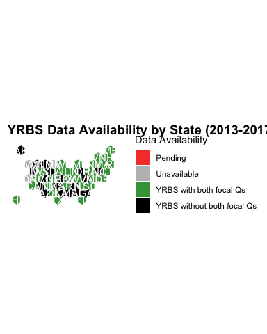
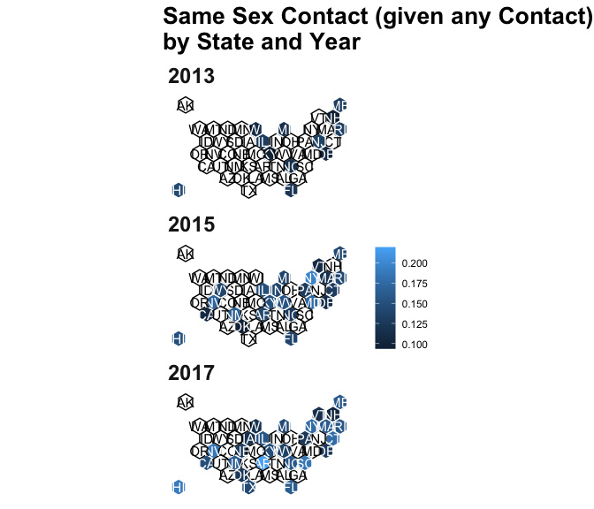
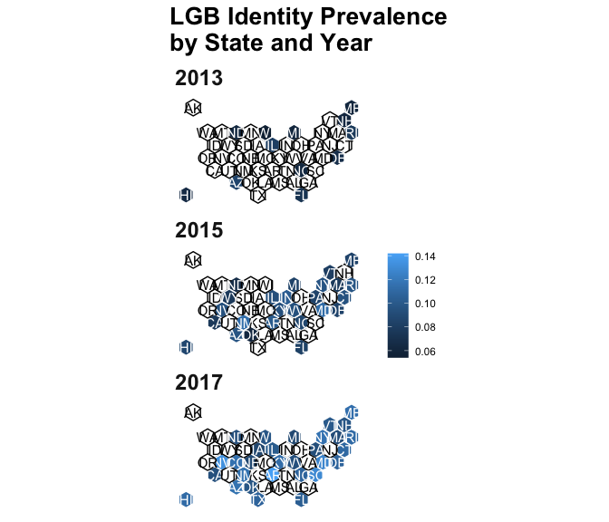
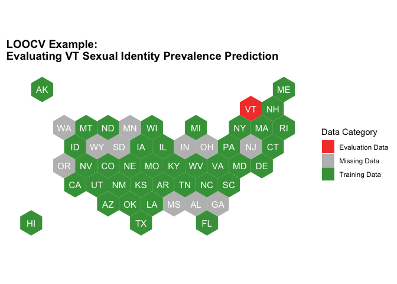
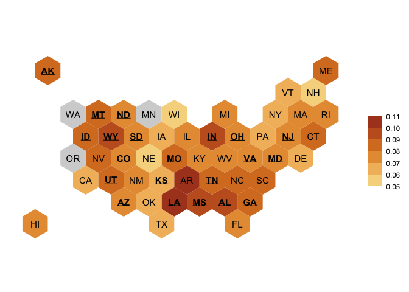
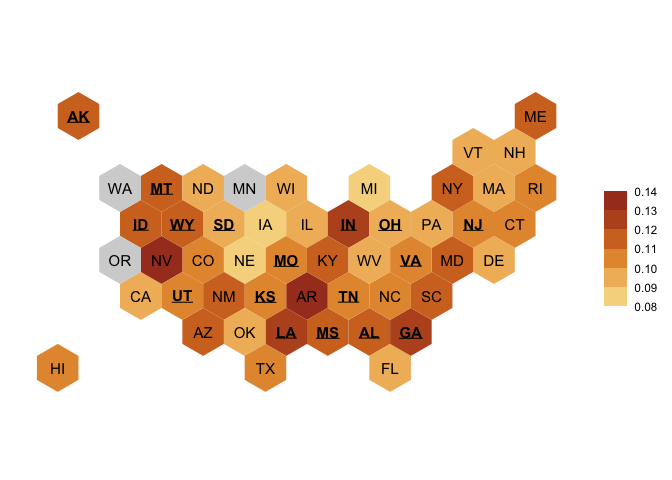
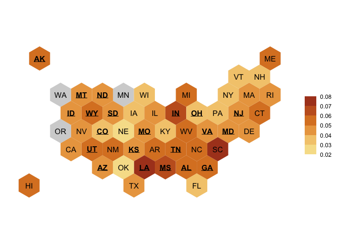

    library(data.table)
    library(knitr)
    public_w_states = fread('~/YRBS_predictions/data/combined_pred_data_all.csv')

Data availability by state and year

    # non null Qs
    q_cols = grep('^q', colnames(public_w_states), value = T)
    q_cols = c(q_cols, 'age','grade','race4','race7','sex','stheight','stweight')
    public_w_states[, non_null := Reduce(`+`, lapply(.SD,function(x) !is.na(x))), .SDcols = q_cols]
    public_w_states[, summary(non_null)]

    ##    Min. 1st Qu.  Median    Mean 3rd Qu.    Max. 
    ##    2.00   47.00   61.00   57.09   68.00   93.00

    state_year_summary = public_w_states[year>=2013, .(
      n_obs = .N,
      n_qs = max(non_null),
      lgb_id = max(ifelse(!is.na(q67),1,0)),
      samesex_contact = max(ifelse(!is.na(q66),1,0))
      ), by = .(sitecode,year)]
    kable(state_year_summary)

<table>
<thead>
<tr class="header">
<th style="text-align: left;">sitecode</th>
<th style="text-align: right;">year</th>
<th style="text-align: right;">n_obs</th>
<th style="text-align: right;">n_qs</th>
<th style="text-align: right;">lgb_id</th>
<th style="text-align: right;">samesex_contact</th>
</tr>
</thead>
<tbody>
<tr class="odd">
<td style="text-align: left;">AK</td>
<td style="text-align: right;">2013</td>
<td style="text-align: right;">1235</td>
<td style="text-align: right;">71</td>
<td style="text-align: right;">0</td>
<td style="text-align: right;">0</td>
</tr>
<tr class="even">
<td style="text-align: left;">AK</td>
<td style="text-align: right;">2015</td>
<td style="text-align: right;">1418</td>
<td style="text-align: right;">76</td>
<td style="text-align: right;">0</td>
<td style="text-align: right;">0</td>
</tr>
<tr class="odd">
<td style="text-align: left;">AK</td>
<td style="text-align: right;">2017</td>
<td style="text-align: right;">1332</td>
<td style="text-align: right;">83</td>
<td style="text-align: right;">0</td>
<td style="text-align: right;">0</td>
</tr>
<tr class="even">
<td style="text-align: left;">AL</td>
<td style="text-align: right;">2013</td>
<td style="text-align: right;">1574</td>
<td style="text-align: right;">76</td>
<td style="text-align: right;">0</td>
<td style="text-align: right;">0</td>
</tr>
<tr class="odd">
<td style="text-align: left;">AL</td>
<td style="text-align: right;">2015</td>
<td style="text-align: right;">1565</td>
<td style="text-align: right;">80</td>
<td style="text-align: right;">0</td>
<td style="text-align: right;">0</td>
</tr>
<tr class="even">
<td style="text-align: left;">AR</td>
<td style="text-align: right;">2013</td>
<td style="text-align: right;">1547</td>
<td style="text-align: right;">79</td>
<td style="text-align: right;">0</td>
<td style="text-align: right;">0</td>
</tr>
<tr class="odd">
<td style="text-align: left;">AR</td>
<td style="text-align: right;">2015</td>
<td style="text-align: right;">2880</td>
<td style="text-align: right;">84</td>
<td style="text-align: right;">1</td>
<td style="text-align: right;">1</td>
</tr>
<tr class="even">
<td style="text-align: left;">AR</td>
<td style="text-align: right;">2017</td>
<td style="text-align: right;">1682</td>
<td style="text-align: right;">92</td>
<td style="text-align: right;">1</td>
<td style="text-align: right;">1</td>
</tr>
<tr class="odd">
<td style="text-align: left;">AZ</td>
<td style="text-align: right;">2013</td>
<td style="text-align: right;">1623</td>
<td style="text-align: right;">65</td>
<td style="text-align: right;">1</td>
<td style="text-align: right;">0</td>
</tr>
<tr class="even">
<td style="text-align: left;">AZ</td>
<td style="text-align: right;">2015</td>
<td style="text-align: right;">2582</td>
<td style="text-align: right;">68</td>
<td style="text-align: right;">1</td>
<td style="text-align: right;">0</td>
</tr>
<tr class="odd">
<td style="text-align: left;">AZ</td>
<td style="text-align: right;">2017</td>
<td style="text-align: right;">2139</td>
<td style="text-align: right;">75</td>
<td style="text-align: right;">1</td>
<td style="text-align: right;">0</td>
</tr>
<tr class="even">
<td style="text-align: left;">CA</td>
<td style="text-align: right;">2015</td>
<td style="text-align: right;">1943</td>
<td style="text-align: right;">81</td>
<td style="text-align: right;">1</td>
<td style="text-align: right;">1</td>
</tr>
<tr class="odd">
<td style="text-align: left;">CA</td>
<td style="text-align: right;">2017</td>
<td style="text-align: right;">1778</td>
<td style="text-align: right;">85</td>
<td style="text-align: right;">1</td>
<td style="text-align: right;">1</td>
</tr>
<tr class="even">
<td style="text-align: left;">CO</td>
<td style="text-align: right;">2017</td>
<td style="text-align: right;">1493</td>
<td style="text-align: right;">62</td>
<td style="text-align: right;">1</td>
<td style="text-align: right;">0</td>
</tr>
<tr class="odd">
<td style="text-align: left;">CT</td>
<td style="text-align: right;">2017</td>
<td style="text-align: right;">2425</td>
<td style="text-align: right;">30</td>
<td style="text-align: right;">1</td>
<td style="text-align: right;">1</td>
</tr>
<tr class="even">
<td style="text-align: left;">CT</td>
<td style="text-align: right;">2015</td>
<td style="text-align: right;">2398</td>
<td style="text-align: right;">30</td>
<td style="text-align: right;">1</td>
<td style="text-align: right;">1</td>
</tr>
<tr class="odd">
<td style="text-align: left;">DE</td>
<td style="text-align: right;">2013</td>
<td style="text-align: right;">2756</td>
<td style="text-align: right;">78</td>
<td style="text-align: right;">1</td>
<td style="text-align: right;">1</td>
</tr>
<tr class="even">
<td style="text-align: left;">DE</td>
<td style="text-align: right;">2015</td>
<td style="text-align: right;">2777</td>
<td style="text-align: right;">82</td>
<td style="text-align: right;">1</td>
<td style="text-align: right;">1</td>
</tr>
<tr class="odd">
<td style="text-align: left;">DE</td>
<td style="text-align: right;">2017</td>
<td style="text-align: right;">2906</td>
<td style="text-align: right;">80</td>
<td style="text-align: right;">1</td>
<td style="text-align: right;">1</td>
</tr>
<tr class="even">
<td style="text-align: left;">FL</td>
<td style="text-align: right;">2013</td>
<td style="text-align: right;">6089</td>
<td style="text-align: right;">78</td>
<td style="text-align: right;">1</td>
<td style="text-align: right;">1</td>
</tr>
<tr class="odd">
<td style="text-align: left;">FL</td>
<td style="text-align: right;">2015</td>
<td style="text-align: right;">6359</td>
<td style="text-align: right;">76</td>
<td style="text-align: right;">1</td>
<td style="text-align: right;">1</td>
</tr>
<tr class="even">
<td style="text-align: left;">FL</td>
<td style="text-align: right;">2017</td>
<td style="text-align: right;">6171</td>
<td style="text-align: right;">80</td>
<td style="text-align: right;">1</td>
<td style="text-align: right;">1</td>
</tr>
<tr class="odd">
<td style="text-align: left;">GA</td>
<td style="text-align: right;">2013</td>
<td style="text-align: right;">1992</td>
<td style="text-align: right;">20</td>
<td style="text-align: right;">0</td>
<td style="text-align: right;">0</td>
</tr>
<tr class="even">
<td style="text-align: left;">HI</td>
<td style="text-align: right;">2013</td>
<td style="text-align: right;">4631</td>
<td style="text-align: right;">67</td>
<td style="text-align: right;">1</td>
<td style="text-align: right;">1</td>
</tr>
<tr class="odd">
<td style="text-align: left;">HI</td>
<td style="text-align: right;">2015</td>
<td style="text-align: right;">6089</td>
<td style="text-align: right;">68</td>
<td style="text-align: right;">1</td>
<td style="text-align: right;">1</td>
</tr>
<tr class="even">
<td style="text-align: left;">HI</td>
<td style="text-align: right;">2017</td>
<td style="text-align: right;">6031</td>
<td style="text-align: right;">72</td>
<td style="text-align: right;">1</td>
<td style="text-align: right;">1</td>
</tr>
<tr class="odd">
<td style="text-align: left;">IA</td>
<td style="text-align: right;">2017</td>
<td style="text-align: right;">1691</td>
<td style="text-align: right;">89</td>
<td style="text-align: right;">1</td>
<td style="text-align: right;">1</td>
</tr>
<tr class="even">
<td style="text-align: left;">ID</td>
<td style="text-align: right;">2013</td>
<td style="text-align: right;">1886</td>
<td style="text-align: right;">79</td>
<td style="text-align: right;">0</td>
<td style="text-align: right;">0</td>
</tr>
<tr class="odd">
<td style="text-align: left;">ID</td>
<td style="text-align: right;">2015</td>
<td style="text-align: right;">1760</td>
<td style="text-align: right;">83</td>
<td style="text-align: right;">0</td>
<td style="text-align: right;">0</td>
</tr>
<tr class="even">
<td style="text-align: left;">ID</td>
<td style="text-align: right;">2017</td>
<td style="text-align: right;">1818</td>
<td style="text-align: right;">87</td>
<td style="text-align: right;">0</td>
<td style="text-align: right;">0</td>
</tr>
<tr class="odd">
<td style="text-align: left;">IL</td>
<td style="text-align: right;">2013</td>
<td style="text-align: right;">3276</td>
<td style="text-align: right;">85</td>
<td style="text-align: right;">1</td>
<td style="text-align: right;">1</td>
</tr>
<tr class="even">
<td style="text-align: left;">IL</td>
<td style="text-align: right;">2015</td>
<td style="text-align: right;">3282</td>
<td style="text-align: right;">83</td>
<td style="text-align: right;">1</td>
<td style="text-align: right;">1</td>
</tr>
<tr class="odd">
<td style="text-align: left;">IL</td>
<td style="text-align: right;">2017</td>
<td style="text-align: right;">5010</td>
<td style="text-align: right;">88</td>
<td style="text-align: right;">1</td>
<td style="text-align: right;">1</td>
</tr>
<tr class="even">
<td style="text-align: left;">IN</td>
<td style="text-align: right;">2015</td>
<td style="text-align: right;">1912</td>
<td style="text-align: right;">35</td>
<td style="text-align: right;">1</td>
<td style="text-align: right;">1</td>
</tr>
<tr class="odd">
<td style="text-align: left;">KS</td>
<td style="text-align: right;">2013</td>
<td style="text-align: right;">1941</td>
<td style="text-align: right;">71</td>
<td style="text-align: right;">0</td>
<td style="text-align: right;">0</td>
</tr>
<tr class="even">
<td style="text-align: left;">KS</td>
<td style="text-align: right;">2017</td>
<td style="text-align: right;">2413</td>
<td style="text-align: right;">82</td>
<td style="text-align: right;">0</td>
<td style="text-align: right;">0</td>
</tr>
<tr class="odd">
<td style="text-align: left;">KY</td>
<td style="text-align: right;">2013</td>
<td style="text-align: right;">1626</td>
<td style="text-align: right;">75</td>
<td style="text-align: right;">0</td>
<td style="text-align: right;">1</td>
</tr>
<tr class="even">
<td style="text-align: left;">KY</td>
<td style="text-align: right;">2015</td>
<td style="text-align: right;">2577</td>
<td style="text-align: right;">82</td>
<td style="text-align: right;">1</td>
<td style="text-align: right;">1</td>
</tr>
<tr class="odd">
<td style="text-align: left;">KY</td>
<td style="text-align: right;">2017</td>
<td style="text-align: right;">1997</td>
<td style="text-align: right;">89</td>
<td style="text-align: right;">1</td>
<td style="text-align: right;">1</td>
</tr>
<tr class="even">
<td style="text-align: left;">LA</td>
<td style="text-align: right;">2013</td>
<td style="text-align: right;">1107</td>
<td style="text-align: right;">55</td>
<td style="text-align: right;">0</td>
<td style="text-align: right;">0</td>
</tr>
<tr class="odd">
<td style="text-align: left;">LA</td>
<td style="text-align: right;">2017</td>
<td style="text-align: right;">1273</td>
<td style="text-align: right;">80</td>
<td style="text-align: right;">0</td>
<td style="text-align: right;">0</td>
</tr>
<tr class="even">
<td style="text-align: left;">MA</td>
<td style="text-align: right;">2015</td>
<td style="text-align: right;">3120</td>
<td style="text-align: right;">73</td>
<td style="text-align: right;">1</td>
<td style="text-align: right;">1</td>
</tr>
<tr class="odd">
<td style="text-align: left;">MA</td>
<td style="text-align: right;">2017</td>
<td style="text-align: right;">3286</td>
<td style="text-align: right;">77</td>
<td style="text-align: right;">1</td>
<td style="text-align: right;">1</td>
</tr>
<tr class="even">
<td style="text-align: left;">MD</td>
<td style="text-align: right;">2017</td>
<td style="text-align: right;">51087</td>
<td style="text-align: right;">33</td>
<td style="text-align: right;">1</td>
<td style="text-align: right;">0</td>
</tr>
<tr class="odd">
<td style="text-align: left;">MD</td>
<td style="text-align: right;">2015</td>
<td style="text-align: right;">55596</td>
<td style="text-align: right;">33</td>
<td style="text-align: right;">1</td>
<td style="text-align: right;">1</td>
</tr>
<tr class="even">
<td style="text-align: left;">ME</td>
<td style="text-align: right;">2013</td>
<td style="text-align: right;">9017</td>
<td style="text-align: right;">57</td>
<td style="text-align: right;">1</td>
<td style="text-align: right;">1</td>
</tr>
<tr class="odd">
<td style="text-align: left;">ME</td>
<td style="text-align: right;">2015</td>
<td style="text-align: right;">9605</td>
<td style="text-align: right;">59</td>
<td style="text-align: right;">1</td>
<td style="text-align: right;">1</td>
</tr>
<tr class="even">
<td style="text-align: left;">ME</td>
<td style="text-align: right;">2017</td>
<td style="text-align: right;">9501</td>
<td style="text-align: right;">65</td>
<td style="text-align: right;">1</td>
<td style="text-align: right;">1</td>
</tr>
<tr class="odd">
<td style="text-align: left;">MI</td>
<td style="text-align: right;">2013</td>
<td style="text-align: right;">4266</td>
<td style="text-align: right;">79</td>
<td style="text-align: right;">1</td>
<td style="text-align: right;">1</td>
</tr>
<tr class="even">
<td style="text-align: left;">MI</td>
<td style="text-align: right;">2015</td>
<td style="text-align: right;">4816</td>
<td style="text-align: right;">82</td>
<td style="text-align: right;">1</td>
<td style="text-align: right;">1</td>
</tr>
<tr class="odd">
<td style="text-align: left;">MI</td>
<td style="text-align: right;">2017</td>
<td style="text-align: right;">1626</td>
<td style="text-align: right;">93</td>
<td style="text-align: right;">1</td>
<td style="text-align: right;">1</td>
</tr>
<tr class="even">
<td style="text-align: left;">MO</td>
<td style="text-align: right;">2013</td>
<td style="text-align: right;">1616</td>
<td style="text-align: right;">56</td>
<td style="text-align: right;">0</td>
<td style="text-align: right;">0</td>
</tr>
<tr class="odd">
<td style="text-align: left;">MO</td>
<td style="text-align: right;">2015</td>
<td style="text-align: right;">1502</td>
<td style="text-align: right;">61</td>
<td style="text-align: right;">0</td>
<td style="text-align: right;">0</td>
</tr>
<tr class="even">
<td style="text-align: left;">MO</td>
<td style="text-align: right;">2017</td>
<td style="text-align: right;">1864</td>
<td style="text-align: right;">69</td>
<td style="text-align: right;">0</td>
<td style="text-align: right;">0</td>
</tr>
<tr class="odd">
<td style="text-align: left;">MS</td>
<td style="text-align: right;">2013</td>
<td style="text-align: right;">1584</td>
<td style="text-align: right;">74</td>
<td style="text-align: right;">0</td>
<td style="text-align: right;">0</td>
</tr>
<tr class="even">
<td style="text-align: left;">MS</td>
<td style="text-align: right;">2015</td>
<td style="text-align: right;">2154</td>
<td style="text-align: right;">79</td>
<td style="text-align: right;">0</td>
<td style="text-align: right;">0</td>
</tr>
<tr class="odd">
<td style="text-align: left;">MT</td>
<td style="text-align: right;">2013</td>
<td style="text-align: right;">4889</td>
<td style="text-align: right;">83</td>
<td style="text-align: right;">0</td>
<td style="text-align: right;">0</td>
</tr>
<tr class="even">
<td style="text-align: left;">MT</td>
<td style="text-align: right;">2015</td>
<td style="text-align: right;">4486</td>
<td style="text-align: right;">83</td>
<td style="text-align: right;">0</td>
<td style="text-align: right;">0</td>
</tr>
<tr class="odd">
<td style="text-align: left;">MT</td>
<td style="text-align: right;">2017</td>
<td style="text-align: right;">4741</td>
<td style="text-align: right;">90</td>
<td style="text-align: right;">0</td>
<td style="text-align: right;">0</td>
</tr>
<tr class="even">
<td style="text-align: left;">NC</td>
<td style="text-align: right;">2013</td>
<td style="text-align: right;">1846</td>
<td style="text-align: right;">66</td>
<td style="text-align: right;">1</td>
<td style="text-align: right;">1</td>
</tr>
<tr class="odd">
<td style="text-align: left;">NC</td>
<td style="text-align: right;">2015</td>
<td style="text-align: right;">6178</td>
<td style="text-align: right;">71</td>
<td style="text-align: right;">1</td>
<td style="text-align: right;">1</td>
</tr>
<tr class="even">
<td style="text-align: left;">NC</td>
<td style="text-align: right;">2017</td>
<td style="text-align: right;">3151</td>
<td style="text-align: right;">78</td>
<td style="text-align: right;">1</td>
<td style="text-align: right;">1</td>
</tr>
<tr class="odd">
<td style="text-align: left;">ND</td>
<td style="text-align: right;">2013</td>
<td style="text-align: right;">1981</td>
<td style="text-align: right;">63</td>
<td style="text-align: right;">1</td>
<td style="text-align: right;">0</td>
</tr>
<tr class="even">
<td style="text-align: left;">ND</td>
<td style="text-align: right;">2015</td>
<td style="text-align: right;">2121</td>
<td style="text-align: right;">68</td>
<td style="text-align: right;">1</td>
<td style="text-align: right;">0</td>
</tr>
<tr class="odd">
<td style="text-align: left;">ND</td>
<td style="text-align: right;">2017</td>
<td style="text-align: right;">2142</td>
<td style="text-align: right;">73</td>
<td style="text-align: right;">1</td>
<td style="text-align: right;">0</td>
</tr>
<tr class="even">
<td style="text-align: left;">NE</td>
<td style="text-align: right;">2013</td>
<td style="text-align: right;">1885</td>
<td style="text-align: right;">78</td>
<td style="text-align: right;">0</td>
<td style="text-align: right;">0</td>
</tr>
<tr class="odd">
<td style="text-align: left;">NE</td>
<td style="text-align: right;">2015</td>
<td style="text-align: right;">1688</td>
<td style="text-align: right;">85</td>
<td style="text-align: right;">0</td>
<td style="text-align: right;">0</td>
</tr>
<tr class="even">
<td style="text-align: left;">NE</td>
<td style="text-align: right;">2017</td>
<td style="text-align: right;">1427</td>
<td style="text-align: right;">93</td>
<td style="text-align: right;">1</td>
<td style="text-align: right;">1</td>
</tr>
<tr class="odd">
<td style="text-align: left;">NH</td>
<td style="text-align: right;">2013</td>
<td style="text-align: right;">1634</td>
<td style="text-align: right;">60</td>
<td style="text-align: right;">1</td>
<td style="text-align: right;">1</td>
</tr>
<tr class="even">
<td style="text-align: left;">NH</td>
<td style="text-align: right;">2015</td>
<td style="text-align: right;">14837</td>
<td style="text-align: right;">56</td>
<td style="text-align: right;">0</td>
<td style="text-align: right;">0</td>
</tr>
<tr class="odd">
<td style="text-align: left;">NH</td>
<td style="text-align: right;">2017</td>
<td style="text-align: right;">12050</td>
<td style="text-align: right;">67</td>
<td style="text-align: right;">1</td>
<td style="text-align: right;">1</td>
</tr>
<tr class="even">
<td style="text-align: left;">NJ</td>
<td style="text-align: right;">2013</td>
<td style="text-align: right;">1701</td>
<td style="text-align: right;">74</td>
<td style="text-align: right;">0</td>
<td style="text-align: right;">1</td>
</tr>
<tr class="odd">
<td style="text-align: left;">NM</td>
<td style="text-align: right;">2017</td>
<td style="text-align: right;">5781</td>
<td style="text-align: right;">34</td>
<td style="text-align: right;">1</td>
<td style="text-align: right;">1</td>
</tr>
<tr class="even">
<td style="text-align: left;">NM</td>
<td style="text-align: right;">2015</td>
<td style="text-align: right;">8304</td>
<td style="text-align: right;">32</td>
<td style="text-align: right;">1</td>
<td style="text-align: right;">1</td>
</tr>
<tr class="odd">
<td style="text-align: left;">NV</td>
<td style="text-align: right;">2013</td>
<td style="text-align: right;">2133</td>
<td style="text-align: right;">75</td>
<td style="text-align: right;">0</td>
<td style="text-align: right;">0</td>
</tr>
<tr class="even">
<td style="text-align: left;">NV</td>
<td style="text-align: right;">2015</td>
<td style="text-align: right;">1452</td>
<td style="text-align: right;">81</td>
<td style="text-align: right;">1</td>
<td style="text-align: right;">1</td>
</tr>
<tr class="odd">
<td style="text-align: left;">NV</td>
<td style="text-align: right;">2017</td>
<td style="text-align: right;">1667</td>
<td style="text-align: right;">80</td>
<td style="text-align: right;">1</td>
<td style="text-align: right;">1</td>
</tr>
<tr class="even">
<td style="text-align: left;">NY</td>
<td style="text-align: right;">2013</td>
<td style="text-align: right;">10643</td>
<td style="text-align: right;">55</td>
<td style="text-align: right;">0</td>
<td style="text-align: right;">0</td>
</tr>
<tr class="odd">
<td style="text-align: left;">NY</td>
<td style="text-align: right;">2015</td>
<td style="text-align: right;">10834</td>
<td style="text-align: right;">61</td>
<td style="text-align: right;">1</td>
<td style="text-align: right;">1</td>
</tr>
<tr class="even">
<td style="text-align: left;">NY</td>
<td style="text-align: right;">2017</td>
<td style="text-align: right;">11411</td>
<td style="text-align: right;">63</td>
<td style="text-align: right;">1</td>
<td style="text-align: right;">1</td>
</tr>
<tr class="odd">
<td style="text-align: left;">OH</td>
<td style="text-align: right;">2013</td>
<td style="text-align: right;">1455</td>
<td style="text-align: right;">25</td>
<td style="text-align: right;">0</td>
<td style="text-align: right;">0</td>
</tr>
<tr class="even">
<td style="text-align: left;">OK</td>
<td style="text-align: right;">2013</td>
<td style="text-align: right;">1474</td>
<td style="text-align: right;">74</td>
<td style="text-align: right;">0</td>
<td style="text-align: right;">0</td>
</tr>
<tr class="odd">
<td style="text-align: left;">OK</td>
<td style="text-align: right;">2015</td>
<td style="text-align: right;">1611</td>
<td style="text-align: right;">81</td>
<td style="text-align: right;">1</td>
<td style="text-align: right;">1</td>
</tr>
<tr class="even">
<td style="text-align: left;">OK</td>
<td style="text-align: right;">2017</td>
<td style="text-align: right;">1649</td>
<td style="text-align: right;">89</td>
<td style="text-align: right;">1</td>
<td style="text-align: right;">1</td>
</tr>
<tr class="odd">
<td style="text-align: left;">PA</td>
<td style="text-align: right;">2015</td>
<td style="text-align: right;">2899</td>
<td style="text-align: right;">82</td>
<td style="text-align: right;">1</td>
<td style="text-align: right;">1</td>
</tr>
<tr class="even">
<td style="text-align: left;">PA</td>
<td style="text-align: right;">2017</td>
<td style="text-align: right;">3761</td>
<td style="text-align: right;">93</td>
<td style="text-align: right;">1</td>
<td style="text-align: right;">1</td>
</tr>
<tr class="odd">
<td style="text-align: left;">RI</td>
<td style="text-align: right;">2013</td>
<td style="text-align: right;">2453</td>
<td style="text-align: right;">70</td>
<td style="text-align: right;">1</td>
<td style="text-align: right;">1</td>
</tr>
<tr class="even">
<td style="text-align: left;">RI</td>
<td style="text-align: right;">2015</td>
<td style="text-align: right;">3462</td>
<td style="text-align: right;">71</td>
<td style="text-align: right;">1</td>
<td style="text-align: right;">1</td>
</tr>
<tr class="odd">
<td style="text-align: left;">RI</td>
<td style="text-align: right;">2017</td>
<td style="text-align: right;">2221</td>
<td style="text-align: right;">77</td>
<td style="text-align: right;">1</td>
<td style="text-align: right;">1</td>
</tr>
<tr class="even">
<td style="text-align: left;">SC</td>
<td style="text-align: right;">2013</td>
<td style="text-align: right;">1606</td>
<td style="text-align: right;">79</td>
<td style="text-align: right;">0</td>
<td style="text-align: right;">0</td>
</tr>
<tr class="odd">
<td style="text-align: left;">SC</td>
<td style="text-align: right;">2015</td>
<td style="text-align: right;">1358</td>
<td style="text-align: right;">84</td>
<td style="text-align: right;">0</td>
<td style="text-align: right;">0</td>
</tr>
<tr class="even">
<td style="text-align: left;">SC</td>
<td style="text-align: right;">2017</td>
<td style="text-align: right;">1501</td>
<td style="text-align: right;">90</td>
<td style="text-align: right;">1</td>
<td style="text-align: right;">1</td>
</tr>
<tr class="odd">
<td style="text-align: left;">SD</td>
<td style="text-align: right;">2013</td>
<td style="text-align: right;">1320</td>
<td style="text-align: right;">69</td>
<td style="text-align: right;">0</td>
<td style="text-align: right;">0</td>
</tr>
<tr class="even">
<td style="text-align: left;">SD</td>
<td style="text-align: right;">2015</td>
<td style="text-align: right;">1313</td>
<td style="text-align: right;">74</td>
<td style="text-align: right;">0</td>
<td style="text-align: right;">0</td>
</tr>
<tr class="odd">
<td style="text-align: left;">TN</td>
<td style="text-align: right;">2013</td>
<td style="text-align: right;">1904</td>
<td style="text-align: right;">79</td>
<td style="text-align: right;">0</td>
<td style="text-align: right;">0</td>
</tr>
<tr class="even">
<td style="text-align: left;">TN</td>
<td style="text-align: right;">2015</td>
<td style="text-align: right;">4138</td>
<td style="text-align: right;">53</td>
<td style="text-align: right;">0</td>
<td style="text-align: right;">0</td>
</tr>
<tr class="odd">
<td style="text-align: left;">TN</td>
<td style="text-align: right;">2017</td>
<td style="text-align: right;">2043</td>
<td style="text-align: right;">75</td>
<td style="text-align: right;">0</td>
<td style="text-align: right;">0</td>
</tr>
<tr class="even">
<td style="text-align: left;">TX</td>
<td style="text-align: right;">2017</td>
<td style="text-align: right;">2113</td>
<td style="text-align: right;">37</td>
<td style="text-align: right;">1</td>
<td style="text-align: right;">1</td>
</tr>
<tr class="odd">
<td style="text-align: left;">UT</td>
<td style="text-align: right;">2013</td>
<td style="text-align: right;">2195</td>
<td style="text-align: right;">74</td>
<td style="text-align: right;">0</td>
<td style="text-align: right;">0</td>
</tr>
<tr class="even">
<td style="text-align: left;">UT</td>
<td style="text-align: right;">2017</td>
<td style="text-align: right;">1848</td>
<td style="text-align: right;">83</td>
<td style="text-align: right;">0</td>
<td style="text-align: right;">0</td>
</tr>
<tr class="odd">
<td style="text-align: left;">VA</td>
<td style="text-align: right;">2013</td>
<td style="text-align: right;">6935</td>
<td style="text-align: right;">68</td>
<td style="text-align: right;">0</td>
<td style="text-align: right;">0</td>
</tr>
<tr class="even">
<td style="text-align: left;">VA</td>
<td style="text-align: right;">2015</td>
<td style="text-align: right;">5195</td>
<td style="text-align: right;">72</td>
<td style="text-align: right;">0</td>
<td style="text-align: right;">0</td>
</tr>
<tr class="odd">
<td style="text-align: left;">VA</td>
<td style="text-align: right;">2017</td>
<td style="text-align: right;">3697</td>
<td style="text-align: right;">68</td>
<td style="text-align: right;">0</td>
<td style="text-align: right;">0</td>
</tr>
<tr class="even">
<td style="text-align: left;">VT</td>
<td style="text-align: right;">2017</td>
<td style="text-align: right;">20653</td>
<td style="text-align: right;">30</td>
<td style="text-align: right;">1</td>
<td style="text-align: right;">1</td>
</tr>
<tr class="odd">
<td style="text-align: left;">VT</td>
<td style="text-align: right;">2015</td>
<td style="text-align: right;">21013</td>
<td style="text-align: right;">48</td>
<td style="text-align: right;">1</td>
<td style="text-align: right;">1</td>
</tr>
<tr class="even">
<td style="text-align: left;">WI</td>
<td style="text-align: right;">2013</td>
<td style="text-align: right;">2843</td>
<td style="text-align: right;">69</td>
<td style="text-align: right;">1</td>
<td style="text-align: right;">1</td>
</tr>
<tr class="odd">
<td style="text-align: left;">WI</td>
<td style="text-align: right;">2017</td>
<td style="text-align: right;">2067</td>
<td style="text-align: right;">81</td>
<td style="text-align: right;">1</td>
<td style="text-align: right;">1</td>
</tr>
<tr class="even">
<td style="text-align: left;">WV</td>
<td style="text-align: right;">2013</td>
<td style="text-align: right;">1793</td>
<td style="text-align: right;">74</td>
<td style="text-align: right;">0</td>
<td style="text-align: right;">0</td>
</tr>
<tr class="odd">
<td style="text-align: left;">WV</td>
<td style="text-align: right;">2015</td>
<td style="text-align: right;">1622</td>
<td style="text-align: right;">81</td>
<td style="text-align: right;">1</td>
<td style="text-align: right;">1</td>
</tr>
<tr class="even">
<td style="text-align: left;">WV</td>
<td style="text-align: right;">2017</td>
<td style="text-align: right;">1563</td>
<td style="text-align: right;">89</td>
<td style="text-align: right;">1</td>
<td style="text-align: right;">1</td>
</tr>
<tr class="odd">
<td style="text-align: left;">WY</td>
<td style="text-align: right;">2013</td>
<td style="text-align: right;">3015</td>
<td style="text-align: right;">74</td>
<td style="text-align: right;">0</td>
<td style="text-align: right;">0</td>
</tr>
<tr class="even">
<td style="text-align: left;">WY</td>
<td style="text-align: right;">2015</td>
<td style="text-align: right;">2424</td>
<td style="text-align: right;">81</td>
<td style="text-align: right;">1</td>
<td style="text-align: right;">1</td>
</tr>
</tbody>
</table>

    state_year_summary[is.na(n_obs), yrbs_availability_string := "-"]
    state_year_summary[!is.na(n_obs), yrbs_availability_string := paste0("N:", format(n_obs, big.mark=",", trim=T),". Q:", n_qs)]

    state_yrbs_data = dcast(state_year_summary, sitecode ~ year, value.var = "yrbs_availability_string",
          fill = "-")
    state_yrbs_data = state_yrbs_data[,.(sitecode,`2017`,`2015`,`2013`)]
    setnames(state_yrbs_data, c('sitecode', paste0("YRBS_",                                                colnames(state_yrbs_data)[2:ncol(state_yrbs_data)])))
    kable(state_yrbs_data)

<table>
<thead>
<tr class="header">
<th style="text-align: left;">sitecode</th>
<th style="text-align: left;">YRBS_2017</th>
<th style="text-align: left;">YRBS_2015</th>
<th style="text-align: left;">YRBS_2013</th>
</tr>
</thead>
<tbody>
<tr class="odd">
<td style="text-align: left;">AK</td>
<td style="text-align: left;">N:1,332. Q:83</td>
<td style="text-align: left;">N:1,418. Q:76</td>
<td style="text-align: left;">N:1,235. Q:71</td>
</tr>
<tr class="even">
<td style="text-align: left;">AL</td>
<td style="text-align: left;">-</td>
<td style="text-align: left;">N:1,565. Q:80</td>
<td style="text-align: left;">N:1,574. Q:76</td>
</tr>
<tr class="odd">
<td style="text-align: left;">AR</td>
<td style="text-align: left;">N:1,682. Q:92</td>
<td style="text-align: left;">N:2,880. Q:84</td>
<td style="text-align: left;">N:1,547. Q:79</td>
</tr>
<tr class="even">
<td style="text-align: left;">AZ</td>
<td style="text-align: left;">N:2,139. Q:75</td>
<td style="text-align: left;">N:2,582. Q:68</td>
<td style="text-align: left;">N:1,623. Q:65</td>
</tr>
<tr class="odd">
<td style="text-align: left;">CA</td>
<td style="text-align: left;">N:1,778. Q:85</td>
<td style="text-align: left;">N:1,943. Q:81</td>
<td style="text-align: left;">-</td>
</tr>
<tr class="even">
<td style="text-align: left;">CO</td>
<td style="text-align: left;">N:1,493. Q:62</td>
<td style="text-align: left;">-</td>
<td style="text-align: left;">-</td>
</tr>
<tr class="odd">
<td style="text-align: left;">CT</td>
<td style="text-align: left;">N:2,425. Q:30</td>
<td style="text-align: left;">N:2,398. Q:30</td>
<td style="text-align: left;">-</td>
</tr>
<tr class="even">
<td style="text-align: left;">DE</td>
<td style="text-align: left;">N:2,906. Q:80</td>
<td style="text-align: left;">N:2,777. Q:82</td>
<td style="text-align: left;">N:2,756. Q:78</td>
</tr>
<tr class="odd">
<td style="text-align: left;">FL</td>
<td style="text-align: left;">N:6,171. Q:80</td>
<td style="text-align: left;">N:6,359. Q:76</td>
<td style="text-align: left;">N:6,089. Q:78</td>
</tr>
<tr class="even">
<td style="text-align: left;">GA</td>
<td style="text-align: left;">-</td>
<td style="text-align: left;">-</td>
<td style="text-align: left;">N:1,992. Q:20</td>
</tr>
<tr class="odd">
<td style="text-align: left;">HI</td>
<td style="text-align: left;">N:6,031. Q:72</td>
<td style="text-align: left;">N:6,089. Q:68</td>
<td style="text-align: left;">N:4,631. Q:67</td>
</tr>
<tr class="even">
<td style="text-align: left;">IA</td>
<td style="text-align: left;">N:1,691. Q:89</td>
<td style="text-align: left;">-</td>
<td style="text-align: left;">-</td>
</tr>
<tr class="odd">
<td style="text-align: left;">ID</td>
<td style="text-align: left;">N:1,818. Q:87</td>
<td style="text-align: left;">N:1,760. Q:83</td>
<td style="text-align: left;">N:1,886. Q:79</td>
</tr>
<tr class="even">
<td style="text-align: left;">IL</td>
<td style="text-align: left;">N:5,010. Q:88</td>
<td style="text-align: left;">N:3,282. Q:83</td>
<td style="text-align: left;">N:3,276. Q:85</td>
</tr>
<tr class="odd">
<td style="text-align: left;">IN</td>
<td style="text-align: left;">-</td>
<td style="text-align: left;">N:1,912. Q:35</td>
<td style="text-align: left;">-</td>
</tr>
<tr class="even">
<td style="text-align: left;">KS</td>
<td style="text-align: left;">N:2,413. Q:82</td>
<td style="text-align: left;">-</td>
<td style="text-align: left;">N:1,941. Q:71</td>
</tr>
<tr class="odd">
<td style="text-align: left;">KY</td>
<td style="text-align: left;">N:1,997. Q:89</td>
<td style="text-align: left;">N:2,577. Q:82</td>
<td style="text-align: left;">N:1,626. Q:75</td>
</tr>
<tr class="even">
<td style="text-align: left;">LA</td>
<td style="text-align: left;">N:1,273. Q:80</td>
<td style="text-align: left;">-</td>
<td style="text-align: left;">N:1,107. Q:55</td>
</tr>
<tr class="odd">
<td style="text-align: left;">MA</td>
<td style="text-align: left;">N:3,286. Q:77</td>
<td style="text-align: left;">N:3,120. Q:73</td>
<td style="text-align: left;">-</td>
</tr>
<tr class="even">
<td style="text-align: left;">MD</td>
<td style="text-align: left;">N:51,087. Q:33</td>
<td style="text-align: left;">N:55,596. Q:33</td>
<td style="text-align: left;">-</td>
</tr>
<tr class="odd">
<td style="text-align: left;">ME</td>
<td style="text-align: left;">N:9,501. Q:65</td>
<td style="text-align: left;">N:9,605. Q:59</td>
<td style="text-align: left;">N:9,017. Q:57</td>
</tr>
<tr class="even">
<td style="text-align: left;">MI</td>
<td style="text-align: left;">N:1,626. Q:93</td>
<td style="text-align: left;">N:4,816. Q:82</td>
<td style="text-align: left;">N:4,266. Q:79</td>
</tr>
<tr class="odd">
<td style="text-align: left;">MO</td>
<td style="text-align: left;">N:1,864. Q:69</td>
<td style="text-align: left;">N:1,502. Q:61</td>
<td style="text-align: left;">N:1,616. Q:56</td>
</tr>
<tr class="even">
<td style="text-align: left;">MS</td>
<td style="text-align: left;">-</td>
<td style="text-align: left;">N:2,154. Q:79</td>
<td style="text-align: left;">N:1,584. Q:74</td>
</tr>
<tr class="odd">
<td style="text-align: left;">MT</td>
<td style="text-align: left;">N:4,741. Q:90</td>
<td style="text-align: left;">N:4,486. Q:83</td>
<td style="text-align: left;">N:4,889. Q:83</td>
</tr>
<tr class="even">
<td style="text-align: left;">NC</td>
<td style="text-align: left;">N:3,151. Q:78</td>
<td style="text-align: left;">N:6,178. Q:71</td>
<td style="text-align: left;">N:1,846. Q:66</td>
</tr>
<tr class="odd">
<td style="text-align: left;">ND</td>
<td style="text-align: left;">N:2,142. Q:73</td>
<td style="text-align: left;">N:2,121. Q:68</td>
<td style="text-align: left;">N:1,981. Q:63</td>
</tr>
<tr class="even">
<td style="text-align: left;">NE</td>
<td style="text-align: left;">N:1,427. Q:93</td>
<td style="text-align: left;">N:1,688. Q:85</td>
<td style="text-align: left;">N:1,885. Q:78</td>
</tr>
<tr class="odd">
<td style="text-align: left;">NH</td>
<td style="text-align: left;">N:12,050. Q:67</td>
<td style="text-align: left;">N:14,837. Q:56</td>
<td style="text-align: left;">N:1,634. Q:60</td>
</tr>
<tr class="even">
<td style="text-align: left;">NJ</td>
<td style="text-align: left;">-</td>
<td style="text-align: left;">-</td>
<td style="text-align: left;">N:1,701. Q:74</td>
</tr>
<tr class="odd">
<td style="text-align: left;">NM</td>
<td style="text-align: left;">N:5,781. Q:34</td>
<td style="text-align: left;">N:8,304. Q:32</td>
<td style="text-align: left;">-</td>
</tr>
<tr class="even">
<td style="text-align: left;">NV</td>
<td style="text-align: left;">N:1,667. Q:80</td>
<td style="text-align: left;">N:1,452. Q:81</td>
<td style="text-align: left;">N:2,133. Q:75</td>
</tr>
<tr class="odd">
<td style="text-align: left;">NY</td>
<td style="text-align: left;">N:11,411. Q:63</td>
<td style="text-align: left;">N:10,834. Q:61</td>
<td style="text-align: left;">N:10,643. Q:55</td>
</tr>
<tr class="even">
<td style="text-align: left;">OH</td>
<td style="text-align: left;">-</td>
<td style="text-align: left;">-</td>
<td style="text-align: left;">N:1,455. Q:25</td>
</tr>
<tr class="odd">
<td style="text-align: left;">OK</td>
<td style="text-align: left;">N:1,649. Q:89</td>
<td style="text-align: left;">N:1,611. Q:81</td>
<td style="text-align: left;">N:1,474. Q:74</td>
</tr>
<tr class="even">
<td style="text-align: left;">PA</td>
<td style="text-align: left;">N:3,761. Q:93</td>
<td style="text-align: left;">N:2,899. Q:82</td>
<td style="text-align: left;">-</td>
</tr>
<tr class="odd">
<td style="text-align: left;">RI</td>
<td style="text-align: left;">N:2,221. Q:77</td>
<td style="text-align: left;">N:3,462. Q:71</td>
<td style="text-align: left;">N:2,453. Q:70</td>
</tr>
<tr class="even">
<td style="text-align: left;">SC</td>
<td style="text-align: left;">N:1,501. Q:90</td>
<td style="text-align: left;">N:1,358. Q:84</td>
<td style="text-align: left;">N:1,606. Q:79</td>
</tr>
<tr class="odd">
<td style="text-align: left;">SD</td>
<td style="text-align: left;">-</td>
<td style="text-align: left;">N:1,313. Q:74</td>
<td style="text-align: left;">N:1,320. Q:69</td>
</tr>
<tr class="even">
<td style="text-align: left;">TN</td>
<td style="text-align: left;">N:2,043. Q:75</td>
<td style="text-align: left;">N:4,138. Q:53</td>
<td style="text-align: left;">N:1,904. Q:79</td>
</tr>
<tr class="odd">
<td style="text-align: left;">TX</td>
<td style="text-align: left;">N:2,113. Q:37</td>
<td style="text-align: left;">-</td>
<td style="text-align: left;">-</td>
</tr>
<tr class="even">
<td style="text-align: left;">UT</td>
<td style="text-align: left;">N:1,848. Q:83</td>
<td style="text-align: left;">-</td>
<td style="text-align: left;">N:2,195. Q:74</td>
</tr>
<tr class="odd">
<td style="text-align: left;">VA</td>
<td style="text-align: left;">N:3,697. Q:68</td>
<td style="text-align: left;">N:5,195. Q:72</td>
<td style="text-align: left;">N:6,935. Q:68</td>
</tr>
<tr class="even">
<td style="text-align: left;">VT</td>
<td style="text-align: left;">N:20,653. Q:30</td>
<td style="text-align: left;">N:21,013. Q:48</td>
<td style="text-align: left;">-</td>
</tr>
<tr class="odd">
<td style="text-align: left;">WI</td>
<td style="text-align: left;">N:2,067. Q:81</td>
<td style="text-align: left;">-</td>
<td style="text-align: left;">N:2,843. Q:69</td>
</tr>
<tr class="even">
<td style="text-align: left;">WV</td>
<td style="text-align: left;">N:1,563. Q:89</td>
<td style="text-align: left;">N:1,622. Q:81</td>
<td style="text-align: left;">N:1,793. Q:74</td>
</tr>
<tr class="odd">
<td style="text-align: left;">WY</td>
<td style="text-align: left;">-</td>
<td style="text-align: left;">N:2,424. Q:81</td>
<td style="text-align: left;">N:3,015. Q:74</td>
</tr>
</tbody>
</table>

    state_year_summary[,lgb_id_t := ifelse(lgb_id==1,"Y","-")]
    state_lgb_data = dcast(state_year_summary, sitecode ~ year, value.var = "lgb_id_t",
          fill = "-")
    state_lgb_data = state_lgb_data[,.(sitecode,`2017`,`2015`,`2013`)]
    setnames(state_lgb_data, c('sitecode', paste0("lgb_", colnames(state_lgb_data)[2:ncol(state_lgb_data)])))
    state_lgb_data

    ##     sitecode lgb_2017 lgb_2015 lgb_2013
    ##  1:       AK        -        -        -
    ##  2:       AL        -        -        -
    ##  3:       AR        Y        Y        -
    ##  4:       AZ        Y        Y        Y
    ##  5:       CA        Y        Y        -
    ##  6:       CO        Y        -        -
    ##  7:       CT        Y        Y        -
    ##  8:       DE        Y        Y        Y
    ##  9:       FL        Y        Y        Y
    ## 10:       GA        -        -        -
    ## 11:       HI        Y        Y        Y
    ## 12:       IA        Y        -        -
    ## 13:       ID        -        -        -
    ## 14:       IL        Y        Y        Y
    ## 15:       IN        -        Y        -
    ## 16:       KS        -        -        -
    ## 17:       KY        Y        Y        -
    ## 18:       LA        -        -        -
    ## 19:       MA        Y        Y        -
    ## 20:       MD        Y        Y        -
    ## 21:       ME        Y        Y        Y
    ## 22:       MI        Y        Y        Y
    ## 23:       MO        -        -        -
    ## 24:       MS        -        -        -
    ## 25:       MT        -        -        -
    ## 26:       NC        Y        Y        Y
    ## 27:       ND        Y        Y        Y
    ## 28:       NE        Y        -        -
    ## 29:       NH        Y        -        Y
    ## 30:       NJ        -        -        -
    ## 31:       NM        Y        Y        -
    ## 32:       NV        Y        Y        -
    ## 33:       NY        Y        Y        -
    ## 34:       OH        -        -        -
    ## 35:       OK        Y        Y        -
    ## 36:       PA        Y        Y        -
    ## 37:       RI        Y        Y        Y
    ## 38:       SC        Y        -        -
    ## 39:       SD        -        -        -
    ## 40:       TN        -        -        -
    ## 41:       TX        Y        -        -
    ## 42:       UT        -        -        -
    ## 43:       VA        -        -        -
    ## 44:       VT        Y        Y        -
    ## 45:       WI        Y        -        Y
    ## 46:       WV        Y        Y        -
    ## 47:       WY        -        Y        -
    ##     sitecode lgb_2017 lgb_2015 lgb_2013

    state_year_summary[,samesex_contact_t := ifelse(samesex_contact==1,"Y","-")]
    state_samesex_data = dcast(state_year_summary, sitecode ~ year, value.var = "samesex_contact_t",
          fill = "-")
    state_samesex_data = state_samesex_data[,.(sitecode,`2017`,`2015`,`2013`)]
    setnames(state_samesex_data, c('sitecode', paste0("samesex_", colnames(state_samesex_data)[2:ncol(state_samesex_data)])))
    kable(state_samesex_data)

<table>
<thead>
<tr class="header">
<th style="text-align: left;">sitecode</th>
<th style="text-align: left;">samesex_2017</th>
<th style="text-align: left;">samesex_2015</th>
<th style="text-align: left;">samesex_2013</th>
</tr>
</thead>
<tbody>
<tr class="odd">
<td style="text-align: left;">AK</td>
<td style="text-align: left;">-</td>
<td style="text-align: left;">-</td>
<td style="text-align: left;">-</td>
</tr>
<tr class="even">
<td style="text-align: left;">AL</td>
<td style="text-align: left;">-</td>
<td style="text-align: left;">-</td>
<td style="text-align: left;">-</td>
</tr>
<tr class="odd">
<td style="text-align: left;">AR</td>
<td style="text-align: left;">Y</td>
<td style="text-align: left;">Y</td>
<td style="text-align: left;">-</td>
</tr>
<tr class="even">
<td style="text-align: left;">AZ</td>
<td style="text-align: left;">-</td>
<td style="text-align: left;">-</td>
<td style="text-align: left;">-</td>
</tr>
<tr class="odd">
<td style="text-align: left;">CA</td>
<td style="text-align: left;">Y</td>
<td style="text-align: left;">Y</td>
<td style="text-align: left;">-</td>
</tr>
<tr class="even">
<td style="text-align: left;">CO</td>
<td style="text-align: left;">-</td>
<td style="text-align: left;">-</td>
<td style="text-align: left;">-</td>
</tr>
<tr class="odd">
<td style="text-align: left;">CT</td>
<td style="text-align: left;">Y</td>
<td style="text-align: left;">Y</td>
<td style="text-align: left;">-</td>
</tr>
<tr class="even">
<td style="text-align: left;">DE</td>
<td style="text-align: left;">Y</td>
<td style="text-align: left;">Y</td>
<td style="text-align: left;">Y</td>
</tr>
<tr class="odd">
<td style="text-align: left;">FL</td>
<td style="text-align: left;">Y</td>
<td style="text-align: left;">Y</td>
<td style="text-align: left;">Y</td>
</tr>
<tr class="even">
<td style="text-align: left;">GA</td>
<td style="text-align: left;">-</td>
<td style="text-align: left;">-</td>
<td style="text-align: left;">-</td>
</tr>
<tr class="odd">
<td style="text-align: left;">HI</td>
<td style="text-align: left;">Y</td>
<td style="text-align: left;">Y</td>
<td style="text-align: left;">Y</td>
</tr>
<tr class="even">
<td style="text-align: left;">IA</td>
<td style="text-align: left;">Y</td>
<td style="text-align: left;">-</td>
<td style="text-align: left;">-</td>
</tr>
<tr class="odd">
<td style="text-align: left;">ID</td>
<td style="text-align: left;">-</td>
<td style="text-align: left;">-</td>
<td style="text-align: left;">-</td>
</tr>
<tr class="even">
<td style="text-align: left;">IL</td>
<td style="text-align: left;">Y</td>
<td style="text-align: left;">Y</td>
<td style="text-align: left;">Y</td>
</tr>
<tr class="odd">
<td style="text-align: left;">IN</td>
<td style="text-align: left;">-</td>
<td style="text-align: left;">Y</td>
<td style="text-align: left;">-</td>
</tr>
<tr class="even">
<td style="text-align: left;">KS</td>
<td style="text-align: left;">-</td>
<td style="text-align: left;">-</td>
<td style="text-align: left;">-</td>
</tr>
<tr class="odd">
<td style="text-align: left;">KY</td>
<td style="text-align: left;">Y</td>
<td style="text-align: left;">Y</td>
<td style="text-align: left;">Y</td>
</tr>
<tr class="even">
<td style="text-align: left;">LA</td>
<td style="text-align: left;">-</td>
<td style="text-align: left;">-</td>
<td style="text-align: left;">-</td>
</tr>
<tr class="odd">
<td style="text-align: left;">MA</td>
<td style="text-align: left;">Y</td>
<td style="text-align: left;">Y</td>
<td style="text-align: left;">-</td>
</tr>
<tr class="even">
<td style="text-align: left;">MD</td>
<td style="text-align: left;">-</td>
<td style="text-align: left;">Y</td>
<td style="text-align: left;">-</td>
</tr>
<tr class="odd">
<td style="text-align: left;">ME</td>
<td style="text-align: left;">Y</td>
<td style="text-align: left;">Y</td>
<td style="text-align: left;">Y</td>
</tr>
<tr class="even">
<td style="text-align: left;">MI</td>
<td style="text-align: left;">Y</td>
<td style="text-align: left;">Y</td>
<td style="text-align: left;">Y</td>
</tr>
<tr class="odd">
<td style="text-align: left;">MO</td>
<td style="text-align: left;">-</td>
<td style="text-align: left;">-</td>
<td style="text-align: left;">-</td>
</tr>
<tr class="even">
<td style="text-align: left;">MS</td>
<td style="text-align: left;">-</td>
<td style="text-align: left;">-</td>
<td style="text-align: left;">-</td>
</tr>
<tr class="odd">
<td style="text-align: left;">MT</td>
<td style="text-align: left;">-</td>
<td style="text-align: left;">-</td>
<td style="text-align: left;">-</td>
</tr>
<tr class="even">
<td style="text-align: left;">NC</td>
<td style="text-align: left;">Y</td>
<td style="text-align: left;">Y</td>
<td style="text-align: left;">Y</td>
</tr>
<tr class="odd">
<td style="text-align: left;">ND</td>
<td style="text-align: left;">-</td>
<td style="text-align: left;">-</td>
<td style="text-align: left;">-</td>
</tr>
<tr class="even">
<td style="text-align: left;">NE</td>
<td style="text-align: left;">Y</td>
<td style="text-align: left;">-</td>
<td style="text-align: left;">-</td>
</tr>
<tr class="odd">
<td style="text-align: left;">NH</td>
<td style="text-align: left;">Y</td>
<td style="text-align: left;">-</td>
<td style="text-align: left;">Y</td>
</tr>
<tr class="even">
<td style="text-align: left;">NJ</td>
<td style="text-align: left;">-</td>
<td style="text-align: left;">-</td>
<td style="text-align: left;">Y</td>
</tr>
<tr class="odd">
<td style="text-align: left;">NM</td>
<td style="text-align: left;">Y</td>
<td style="text-align: left;">Y</td>
<td style="text-align: left;">-</td>
</tr>
<tr class="even">
<td style="text-align: left;">NV</td>
<td style="text-align: left;">Y</td>
<td style="text-align: left;">Y</td>
<td style="text-align: left;">-</td>
</tr>
<tr class="odd">
<td style="text-align: left;">NY</td>
<td style="text-align: left;">Y</td>
<td style="text-align: left;">Y</td>
<td style="text-align: left;">-</td>
</tr>
<tr class="even">
<td style="text-align: left;">OH</td>
<td style="text-align: left;">-</td>
<td style="text-align: left;">-</td>
<td style="text-align: left;">-</td>
</tr>
<tr class="odd">
<td style="text-align: left;">OK</td>
<td style="text-align: left;">Y</td>
<td style="text-align: left;">Y</td>
<td style="text-align: left;">-</td>
</tr>
<tr class="even">
<td style="text-align: left;">PA</td>
<td style="text-align: left;">Y</td>
<td style="text-align: left;">Y</td>
<td style="text-align: left;">-</td>
</tr>
<tr class="odd">
<td style="text-align: left;">RI</td>
<td style="text-align: left;">Y</td>
<td style="text-align: left;">Y</td>
<td style="text-align: left;">Y</td>
</tr>
<tr class="even">
<td style="text-align: left;">SC</td>
<td style="text-align: left;">Y</td>
<td style="text-align: left;">-</td>
<td style="text-align: left;">-</td>
</tr>
<tr class="odd">
<td style="text-align: left;">SD</td>
<td style="text-align: left;">-</td>
<td style="text-align: left;">-</td>
<td style="text-align: left;">-</td>
</tr>
<tr class="even">
<td style="text-align: left;">TN</td>
<td style="text-align: left;">-</td>
<td style="text-align: left;">-</td>
<td style="text-align: left;">-</td>
</tr>
<tr class="odd">
<td style="text-align: left;">TX</td>
<td style="text-align: left;">Y</td>
<td style="text-align: left;">-</td>
<td style="text-align: left;">-</td>
</tr>
<tr class="even">
<td style="text-align: left;">UT</td>
<td style="text-align: left;">-</td>
<td style="text-align: left;">-</td>
<td style="text-align: left;">-</td>
</tr>
<tr class="odd">
<td style="text-align: left;">VA</td>
<td style="text-align: left;">-</td>
<td style="text-align: left;">-</td>
<td style="text-align: left;">-</td>
</tr>
<tr class="even">
<td style="text-align: left;">VT</td>
<td style="text-align: left;">Y</td>
<td style="text-align: left;">Y</td>
<td style="text-align: left;">-</td>
</tr>
<tr class="odd">
<td style="text-align: left;">WI</td>
<td style="text-align: left;">Y</td>
<td style="text-align: left;">-</td>
<td style="text-align: left;">Y</td>
</tr>
<tr class="even">
<td style="text-align: left;">WV</td>
<td style="text-align: left;">Y</td>
<td style="text-align: left;">Y</td>
<td style="text-align: left;">-</td>
</tr>
<tr class="odd">
<td style="text-align: left;">WY</td>
<td style="text-align: left;">-</td>
<td style="text-align: left;">Y</td>
<td style="text-align: left;">-</td>
</tr>
</tbody>
</table>

    # Combine all state level summary stats
    site_regions_divisions = fread("~/YRBS_predictions/data/state_regions_divisions.csv")

    all_states_data = Reduce(function(a,b) merge(a,b,by='sitecode',all.x=T),
           list(state_yrbs_data, state_lgb_data, state_samesex_data),
           init = site_regions_divisions[sitecode!="DC",.(sitecode)])

    all_states_data[is.na(all_states_data)] = "-"

    fwrite(all_states_data, "~/YRBS_predictions/data/paper_tables/a1.csv")
    kable(all_states_data)

<table>
<colgroup>
<col style="width: 7%" />
<col style="width: 12%" />
<col style="width: 12%" />
<col style="width: 12%" />
<col style="width: 7%" />
<col style="width: 7%" />
<col style="width: 7%" />
<col style="width: 10%" />
<col style="width: 10%" />
<col style="width: 10%" />
</colgroup>
<thead>
<tr class="header">
<th style="text-align: left;">sitecode</th>
<th style="text-align: left;">YRBS_2017</th>
<th style="text-align: left;">YRBS_2015</th>
<th style="text-align: left;">YRBS_2013</th>
<th style="text-align: left;">lgb_2017</th>
<th style="text-align: left;">lgb_2015</th>
<th style="text-align: left;">lgb_2013</th>
<th style="text-align: left;">samesex_2017</th>
<th style="text-align: left;">samesex_2015</th>
<th style="text-align: left;">samesex_2013</th>
</tr>
</thead>
<tbody>
<tr class="odd">
<td style="text-align: left;">AK</td>
<td style="text-align: left;">N:1,332. Q:83</td>
<td style="text-align: left;">N:1,418. Q:76</td>
<td style="text-align: left;">N:1,235. Q:71</td>
<td style="text-align: left;">-</td>
<td style="text-align: left;">-</td>
<td style="text-align: left;">-</td>
<td style="text-align: left;">-</td>
<td style="text-align: left;">-</td>
<td style="text-align: left;">-</td>
</tr>
<tr class="even">
<td style="text-align: left;">AL</td>
<td style="text-align: left;">-</td>
<td style="text-align: left;">N:1,565. Q:80</td>
<td style="text-align: left;">N:1,574. Q:76</td>
<td style="text-align: left;">-</td>
<td style="text-align: left;">-</td>
<td style="text-align: left;">-</td>
<td style="text-align: left;">-</td>
<td style="text-align: left;">-</td>
<td style="text-align: left;">-</td>
</tr>
<tr class="odd">
<td style="text-align: left;">AR</td>
<td style="text-align: left;">N:1,682. Q:92</td>
<td style="text-align: left;">N:2,880. Q:84</td>
<td style="text-align: left;">N:1,547. Q:79</td>
<td style="text-align: left;">Y</td>
<td style="text-align: left;">Y</td>
<td style="text-align: left;">-</td>
<td style="text-align: left;">Y</td>
<td style="text-align: left;">Y</td>
<td style="text-align: left;">-</td>
</tr>
<tr class="even">
<td style="text-align: left;">AZ</td>
<td style="text-align: left;">N:2,139. Q:75</td>
<td style="text-align: left;">N:2,582. Q:68</td>
<td style="text-align: left;">N:1,623. Q:65</td>
<td style="text-align: left;">Y</td>
<td style="text-align: left;">Y</td>
<td style="text-align: left;">Y</td>
<td style="text-align: left;">-</td>
<td style="text-align: left;">-</td>
<td style="text-align: left;">-</td>
</tr>
<tr class="odd">
<td style="text-align: left;">CA</td>
<td style="text-align: left;">N:1,778. Q:85</td>
<td style="text-align: left;">N:1,943. Q:81</td>
<td style="text-align: left;">-</td>
<td style="text-align: left;">Y</td>
<td style="text-align: left;">Y</td>
<td style="text-align: left;">-</td>
<td style="text-align: left;">Y</td>
<td style="text-align: left;">Y</td>
<td style="text-align: left;">-</td>
</tr>
<tr class="even">
<td style="text-align: left;">CO</td>
<td style="text-align: left;">N:1,493. Q:62</td>
<td style="text-align: left;">-</td>
<td style="text-align: left;">-</td>
<td style="text-align: left;">Y</td>
<td style="text-align: left;">-</td>
<td style="text-align: left;">-</td>
<td style="text-align: left;">-</td>
<td style="text-align: left;">-</td>
<td style="text-align: left;">-</td>
</tr>
<tr class="odd">
<td style="text-align: left;">CT</td>
<td style="text-align: left;">N:2,425. Q:30</td>
<td style="text-align: left;">N:2,398. Q:30</td>
<td style="text-align: left;">-</td>
<td style="text-align: left;">Y</td>
<td style="text-align: left;">Y</td>
<td style="text-align: left;">-</td>
<td style="text-align: left;">Y</td>
<td style="text-align: left;">Y</td>
<td style="text-align: left;">-</td>
</tr>
<tr class="even">
<td style="text-align: left;">DE</td>
<td style="text-align: left;">N:2,906. Q:80</td>
<td style="text-align: left;">N:2,777. Q:82</td>
<td style="text-align: left;">N:2,756. Q:78</td>
<td style="text-align: left;">Y</td>
<td style="text-align: left;">Y</td>
<td style="text-align: left;">Y</td>
<td style="text-align: left;">Y</td>
<td style="text-align: left;">Y</td>
<td style="text-align: left;">Y</td>
</tr>
<tr class="odd">
<td style="text-align: left;">FL</td>
<td style="text-align: left;">N:6,171. Q:80</td>
<td style="text-align: left;">N:6,359. Q:76</td>
<td style="text-align: left;">N:6,089. Q:78</td>
<td style="text-align: left;">Y</td>
<td style="text-align: left;">Y</td>
<td style="text-align: left;">Y</td>
<td style="text-align: left;">Y</td>
<td style="text-align: left;">Y</td>
<td style="text-align: left;">Y</td>
</tr>
<tr class="even">
<td style="text-align: left;">GA</td>
<td style="text-align: left;">-</td>
<td style="text-align: left;">-</td>
<td style="text-align: left;">N:1,992. Q:20</td>
<td style="text-align: left;">-</td>
<td style="text-align: left;">-</td>
<td style="text-align: left;">-</td>
<td style="text-align: left;">-</td>
<td style="text-align: left;">-</td>
<td style="text-align: left;">-</td>
</tr>
<tr class="odd">
<td style="text-align: left;">HI</td>
<td style="text-align: left;">N:6,031. Q:72</td>
<td style="text-align: left;">N:6,089. Q:68</td>
<td style="text-align: left;">N:4,631. Q:67</td>
<td style="text-align: left;">Y</td>
<td style="text-align: left;">Y</td>
<td style="text-align: left;">Y</td>
<td style="text-align: left;">Y</td>
<td style="text-align: left;">Y</td>
<td style="text-align: left;">Y</td>
</tr>
<tr class="even">
<td style="text-align: left;">IA</td>
<td style="text-align: left;">N:1,691. Q:89</td>
<td style="text-align: left;">-</td>
<td style="text-align: left;">-</td>
<td style="text-align: left;">Y</td>
<td style="text-align: left;">-</td>
<td style="text-align: left;">-</td>
<td style="text-align: left;">Y</td>
<td style="text-align: left;">-</td>
<td style="text-align: left;">-</td>
</tr>
<tr class="odd">
<td style="text-align: left;">ID</td>
<td style="text-align: left;">N:1,818. Q:87</td>
<td style="text-align: left;">N:1,760. Q:83</td>
<td style="text-align: left;">N:1,886. Q:79</td>
<td style="text-align: left;">-</td>
<td style="text-align: left;">-</td>
<td style="text-align: left;">-</td>
<td style="text-align: left;">-</td>
<td style="text-align: left;">-</td>
<td style="text-align: left;">-</td>
</tr>
<tr class="even">
<td style="text-align: left;">IL</td>
<td style="text-align: left;">N:5,010. Q:88</td>
<td style="text-align: left;">N:3,282. Q:83</td>
<td style="text-align: left;">N:3,276. Q:85</td>
<td style="text-align: left;">Y</td>
<td style="text-align: left;">Y</td>
<td style="text-align: left;">Y</td>
<td style="text-align: left;">Y</td>
<td style="text-align: left;">Y</td>
<td style="text-align: left;">Y</td>
</tr>
<tr class="odd">
<td style="text-align: left;">IN</td>
<td style="text-align: left;">-</td>
<td style="text-align: left;">N:1,912. Q:35</td>
<td style="text-align: left;">-</td>
<td style="text-align: left;">-</td>
<td style="text-align: left;">Y</td>
<td style="text-align: left;">-</td>
<td style="text-align: left;">-</td>
<td style="text-align: left;">Y</td>
<td style="text-align: left;">-</td>
</tr>
<tr class="even">
<td style="text-align: left;">KS</td>
<td style="text-align: left;">N:2,413. Q:82</td>
<td style="text-align: left;">-</td>
<td style="text-align: left;">N:1,941. Q:71</td>
<td style="text-align: left;">-</td>
<td style="text-align: left;">-</td>
<td style="text-align: left;">-</td>
<td style="text-align: left;">-</td>
<td style="text-align: left;">-</td>
<td style="text-align: left;">-</td>
</tr>
<tr class="odd">
<td style="text-align: left;">KY</td>
<td style="text-align: left;">N:1,997. Q:89</td>
<td style="text-align: left;">N:2,577. Q:82</td>
<td style="text-align: left;">N:1,626. Q:75</td>
<td style="text-align: left;">Y</td>
<td style="text-align: left;">Y</td>
<td style="text-align: left;">-</td>
<td style="text-align: left;">Y</td>
<td style="text-align: left;">Y</td>
<td style="text-align: left;">Y</td>
</tr>
<tr class="even">
<td style="text-align: left;">LA</td>
<td style="text-align: left;">N:1,273. Q:80</td>
<td style="text-align: left;">-</td>
<td style="text-align: left;">N:1,107. Q:55</td>
<td style="text-align: left;">-</td>
<td style="text-align: left;">-</td>
<td style="text-align: left;">-</td>
<td style="text-align: left;">-</td>
<td style="text-align: left;">-</td>
<td style="text-align: left;">-</td>
</tr>
<tr class="odd">
<td style="text-align: left;">MA</td>
<td style="text-align: left;">N:3,286. Q:77</td>
<td style="text-align: left;">N:3,120. Q:73</td>
<td style="text-align: left;">-</td>
<td style="text-align: left;">Y</td>
<td style="text-align: left;">Y</td>
<td style="text-align: left;">-</td>
<td style="text-align: left;">Y</td>
<td style="text-align: left;">Y</td>
<td style="text-align: left;">-</td>
</tr>
<tr class="even">
<td style="text-align: left;">MD</td>
<td style="text-align: left;">N:51,087. Q:33</td>
<td style="text-align: left;">N:55,596. Q:33</td>
<td style="text-align: left;">-</td>
<td style="text-align: left;">Y</td>
<td style="text-align: left;">Y</td>
<td style="text-align: left;">-</td>
<td style="text-align: left;">-</td>
<td style="text-align: left;">Y</td>
<td style="text-align: left;">-</td>
</tr>
<tr class="odd">
<td style="text-align: left;">ME</td>
<td style="text-align: left;">N:9,501. Q:65</td>
<td style="text-align: left;">N:9,605. Q:59</td>
<td style="text-align: left;">N:9,017. Q:57</td>
<td style="text-align: left;">Y</td>
<td style="text-align: left;">Y</td>
<td style="text-align: left;">Y</td>
<td style="text-align: left;">Y</td>
<td style="text-align: left;">Y</td>
<td style="text-align: left;">Y</td>
</tr>
<tr class="even">
<td style="text-align: left;">MI</td>
<td style="text-align: left;">N:1,626. Q:93</td>
<td style="text-align: left;">N:4,816. Q:82</td>
<td style="text-align: left;">N:4,266. Q:79</td>
<td style="text-align: left;">Y</td>
<td style="text-align: left;">Y</td>
<td style="text-align: left;">Y</td>
<td style="text-align: left;">Y</td>
<td style="text-align: left;">Y</td>
<td style="text-align: left;">Y</td>
</tr>
<tr class="odd">
<td style="text-align: left;">MN</td>
<td style="text-align: left;">-</td>
<td style="text-align: left;">-</td>
<td style="text-align: left;">-</td>
<td style="text-align: left;">-</td>
<td style="text-align: left;">-</td>
<td style="text-align: left;">-</td>
<td style="text-align: left;">-</td>
<td style="text-align: left;">-</td>
<td style="text-align: left;">-</td>
</tr>
<tr class="even">
<td style="text-align: left;">MO</td>
<td style="text-align: left;">N:1,864. Q:69</td>
<td style="text-align: left;">N:1,502. Q:61</td>
<td style="text-align: left;">N:1,616. Q:56</td>
<td style="text-align: left;">-</td>
<td style="text-align: left;">-</td>
<td style="text-align: left;">-</td>
<td style="text-align: left;">-</td>
<td style="text-align: left;">-</td>
<td style="text-align: left;">-</td>
</tr>
<tr class="odd">
<td style="text-align: left;">MS</td>
<td style="text-align: left;">-</td>
<td style="text-align: left;">N:2,154. Q:79</td>
<td style="text-align: left;">N:1,584. Q:74</td>
<td style="text-align: left;">-</td>
<td style="text-align: left;">-</td>
<td style="text-align: left;">-</td>
<td style="text-align: left;">-</td>
<td style="text-align: left;">-</td>
<td style="text-align: left;">-</td>
</tr>
<tr class="even">
<td style="text-align: left;">MT</td>
<td style="text-align: left;">N:4,741. Q:90</td>
<td style="text-align: left;">N:4,486. Q:83</td>
<td style="text-align: left;">N:4,889. Q:83</td>
<td style="text-align: left;">-</td>
<td style="text-align: left;">-</td>
<td style="text-align: left;">-</td>
<td style="text-align: left;">-</td>
<td style="text-align: left;">-</td>
<td style="text-align: left;">-</td>
</tr>
<tr class="odd">
<td style="text-align: left;">NC</td>
<td style="text-align: left;">N:3,151. Q:78</td>
<td style="text-align: left;">N:6,178. Q:71</td>
<td style="text-align: left;">N:1,846. Q:66</td>
<td style="text-align: left;">Y</td>
<td style="text-align: left;">Y</td>
<td style="text-align: left;">Y</td>
<td style="text-align: left;">Y</td>
<td style="text-align: left;">Y</td>
<td style="text-align: left;">Y</td>
</tr>
<tr class="even">
<td style="text-align: left;">ND</td>
<td style="text-align: left;">N:2,142. Q:73</td>
<td style="text-align: left;">N:2,121. Q:68</td>
<td style="text-align: left;">N:1,981. Q:63</td>
<td style="text-align: left;">Y</td>
<td style="text-align: left;">Y</td>
<td style="text-align: left;">Y</td>
<td style="text-align: left;">-</td>
<td style="text-align: left;">-</td>
<td style="text-align: left;">-</td>
</tr>
<tr class="odd">
<td style="text-align: left;">NE</td>
<td style="text-align: left;">N:1,427. Q:93</td>
<td style="text-align: left;">N:1,688. Q:85</td>
<td style="text-align: left;">N:1,885. Q:78</td>
<td style="text-align: left;">Y</td>
<td style="text-align: left;">-</td>
<td style="text-align: left;">-</td>
<td style="text-align: left;">Y</td>
<td style="text-align: left;">-</td>
<td style="text-align: left;">-</td>
</tr>
<tr class="even">
<td style="text-align: left;">NH</td>
<td style="text-align: left;">N:12,050. Q:67</td>
<td style="text-align: left;">N:14,837. Q:56</td>
<td style="text-align: left;">N:1,634. Q:60</td>
<td style="text-align: left;">Y</td>
<td style="text-align: left;">-</td>
<td style="text-align: left;">Y</td>
<td style="text-align: left;">Y</td>
<td style="text-align: left;">-</td>
<td style="text-align: left;">Y</td>
</tr>
<tr class="odd">
<td style="text-align: left;">NJ</td>
<td style="text-align: left;">-</td>
<td style="text-align: left;">-</td>
<td style="text-align: left;">N:1,701. Q:74</td>
<td style="text-align: left;">-</td>
<td style="text-align: left;">-</td>
<td style="text-align: left;">-</td>
<td style="text-align: left;">-</td>
<td style="text-align: left;">-</td>
<td style="text-align: left;">Y</td>
</tr>
<tr class="even">
<td style="text-align: left;">NM</td>
<td style="text-align: left;">N:5,781. Q:34</td>
<td style="text-align: left;">N:8,304. Q:32</td>
<td style="text-align: left;">-</td>
<td style="text-align: left;">Y</td>
<td style="text-align: left;">Y</td>
<td style="text-align: left;">-</td>
<td style="text-align: left;">Y</td>
<td style="text-align: left;">Y</td>
<td style="text-align: left;">-</td>
</tr>
<tr class="odd">
<td style="text-align: left;">NV</td>
<td style="text-align: left;">N:1,667. Q:80</td>
<td style="text-align: left;">N:1,452. Q:81</td>
<td style="text-align: left;">N:2,133. Q:75</td>
<td style="text-align: left;">Y</td>
<td style="text-align: left;">Y</td>
<td style="text-align: left;">-</td>
<td style="text-align: left;">Y</td>
<td style="text-align: left;">Y</td>
<td style="text-align: left;">-</td>
</tr>
<tr class="even">
<td style="text-align: left;">NY</td>
<td style="text-align: left;">N:11,411. Q:63</td>
<td style="text-align: left;">N:10,834. Q:61</td>
<td style="text-align: left;">N:10,643. Q:55</td>
<td style="text-align: left;">Y</td>
<td style="text-align: left;">Y</td>
<td style="text-align: left;">-</td>
<td style="text-align: left;">Y</td>
<td style="text-align: left;">Y</td>
<td style="text-align: left;">-</td>
</tr>
<tr class="odd">
<td style="text-align: left;">OH</td>
<td style="text-align: left;">-</td>
<td style="text-align: left;">-</td>
<td style="text-align: left;">N:1,455. Q:25</td>
<td style="text-align: left;">-</td>
<td style="text-align: left;">-</td>
<td style="text-align: left;">-</td>
<td style="text-align: left;">-</td>
<td style="text-align: left;">-</td>
<td style="text-align: left;">-</td>
</tr>
<tr class="even">
<td style="text-align: left;">OK</td>
<td style="text-align: left;">N:1,649. Q:89</td>
<td style="text-align: left;">N:1,611. Q:81</td>
<td style="text-align: left;">N:1,474. Q:74</td>
<td style="text-align: left;">Y</td>
<td style="text-align: left;">Y</td>
<td style="text-align: left;">-</td>
<td style="text-align: left;">Y</td>
<td style="text-align: left;">Y</td>
<td style="text-align: left;">-</td>
</tr>
<tr class="odd">
<td style="text-align: left;">OR</td>
<td style="text-align: left;">-</td>
<td style="text-align: left;">-</td>
<td style="text-align: left;">-</td>
<td style="text-align: left;">-</td>
<td style="text-align: left;">-</td>
<td style="text-align: left;">-</td>
<td style="text-align: left;">-</td>
<td style="text-align: left;">-</td>
<td style="text-align: left;">-</td>
</tr>
<tr class="even">
<td style="text-align: left;">PA</td>
<td style="text-align: left;">N:3,761. Q:93</td>
<td style="text-align: left;">N:2,899. Q:82</td>
<td style="text-align: left;">-</td>
<td style="text-align: left;">Y</td>
<td style="text-align: left;">Y</td>
<td style="text-align: left;">-</td>
<td style="text-align: left;">Y</td>
<td style="text-align: left;">Y</td>
<td style="text-align: left;">-</td>
</tr>
<tr class="odd">
<td style="text-align: left;">RI</td>
<td style="text-align: left;">N:2,221. Q:77</td>
<td style="text-align: left;">N:3,462. Q:71</td>
<td style="text-align: left;">N:2,453. Q:70</td>
<td style="text-align: left;">Y</td>
<td style="text-align: left;">Y</td>
<td style="text-align: left;">Y</td>
<td style="text-align: left;">Y</td>
<td style="text-align: left;">Y</td>
<td style="text-align: left;">Y</td>
</tr>
<tr class="even">
<td style="text-align: left;">SC</td>
<td style="text-align: left;">N:1,501. Q:90</td>
<td style="text-align: left;">N:1,358. Q:84</td>
<td style="text-align: left;">N:1,606. Q:79</td>
<td style="text-align: left;">Y</td>
<td style="text-align: left;">-</td>
<td style="text-align: left;">-</td>
<td style="text-align: left;">Y</td>
<td style="text-align: left;">-</td>
<td style="text-align: left;">-</td>
</tr>
<tr class="odd">
<td style="text-align: left;">SD</td>
<td style="text-align: left;">-</td>
<td style="text-align: left;">N:1,313. Q:74</td>
<td style="text-align: left;">N:1,320. Q:69</td>
<td style="text-align: left;">-</td>
<td style="text-align: left;">-</td>
<td style="text-align: left;">-</td>
<td style="text-align: left;">-</td>
<td style="text-align: left;">-</td>
<td style="text-align: left;">-</td>
</tr>
<tr class="even">
<td style="text-align: left;">TN</td>
<td style="text-align: left;">N:2,043. Q:75</td>
<td style="text-align: left;">N:4,138. Q:53</td>
<td style="text-align: left;">N:1,904. Q:79</td>
<td style="text-align: left;">-</td>
<td style="text-align: left;">-</td>
<td style="text-align: left;">-</td>
<td style="text-align: left;">-</td>
<td style="text-align: left;">-</td>
<td style="text-align: left;">-</td>
</tr>
<tr class="odd">
<td style="text-align: left;">TX</td>
<td style="text-align: left;">N:2,113. Q:37</td>
<td style="text-align: left;">-</td>
<td style="text-align: left;">-</td>
<td style="text-align: left;">Y</td>
<td style="text-align: left;">-</td>
<td style="text-align: left;">-</td>
<td style="text-align: left;">Y</td>
<td style="text-align: left;">-</td>
<td style="text-align: left;">-</td>
</tr>
<tr class="even">
<td style="text-align: left;">UT</td>
<td style="text-align: left;">N:1,848. Q:83</td>
<td style="text-align: left;">-</td>
<td style="text-align: left;">N:2,195. Q:74</td>
<td style="text-align: left;">-</td>
<td style="text-align: left;">-</td>
<td style="text-align: left;">-</td>
<td style="text-align: left;">-</td>
<td style="text-align: left;">-</td>
<td style="text-align: left;">-</td>
</tr>
<tr class="odd">
<td style="text-align: left;">VA</td>
<td style="text-align: left;">N:3,697. Q:68</td>
<td style="text-align: left;">N:5,195. Q:72</td>
<td style="text-align: left;">N:6,935. Q:68</td>
<td style="text-align: left;">-</td>
<td style="text-align: left;">-</td>
<td style="text-align: left;">-</td>
<td style="text-align: left;">-</td>
<td style="text-align: left;">-</td>
<td style="text-align: left;">-</td>
</tr>
<tr class="even">
<td style="text-align: left;">VT</td>
<td style="text-align: left;">N:20,653. Q:30</td>
<td style="text-align: left;">N:21,013. Q:48</td>
<td style="text-align: left;">-</td>
<td style="text-align: left;">Y</td>
<td style="text-align: left;">Y</td>
<td style="text-align: left;">-</td>
<td style="text-align: left;">Y</td>
<td style="text-align: left;">Y</td>
<td style="text-align: left;">-</td>
</tr>
<tr class="odd">
<td style="text-align: left;">WA</td>
<td style="text-align: left;">-</td>
<td style="text-align: left;">-</td>
<td style="text-align: left;">-</td>
<td style="text-align: left;">-</td>
<td style="text-align: left;">-</td>
<td style="text-align: left;">-</td>
<td style="text-align: left;">-</td>
<td style="text-align: left;">-</td>
<td style="text-align: left;">-</td>
</tr>
<tr class="even">
<td style="text-align: left;">WI</td>
<td style="text-align: left;">N:2,067. Q:81</td>
<td style="text-align: left;">-</td>
<td style="text-align: left;">N:2,843. Q:69</td>
<td style="text-align: left;">Y</td>
<td style="text-align: left;">-</td>
<td style="text-align: left;">Y</td>
<td style="text-align: left;">Y</td>
<td style="text-align: left;">-</td>
<td style="text-align: left;">Y</td>
</tr>
<tr class="odd">
<td style="text-align: left;">WV</td>
<td style="text-align: left;">N:1,563. Q:89</td>
<td style="text-align: left;">N:1,622. Q:81</td>
<td style="text-align: left;">N:1,793. Q:74</td>
<td style="text-align: left;">Y</td>
<td style="text-align: left;">Y</td>
<td style="text-align: left;">-</td>
<td style="text-align: left;">Y</td>
<td style="text-align: left;">Y</td>
<td style="text-align: left;">-</td>
</tr>
<tr class="even">
<td style="text-align: left;">WY</td>
<td style="text-align: left;">-</td>
<td style="text-align: left;">N:2,424. Q:81</td>
<td style="text-align: left;">N:3,015. Q:74</td>
<td style="text-align: left;">-</td>
<td style="text-align: left;">Y</td>
<td style="text-align: left;">-</td>
<td style="text-align: left;">-</td>
<td style="text-align: left;">Y</td>
<td style="text-align: left;">-</td>
</tr>
</tbody>
</table>

# Table 1 Summary Stats

Data size

    public_w_states[, have_q67 := max(ifelse(!is.na(q67), 1, 0)), by = .(sitecode, year)]
    public_w_states[, have_q66 := max(ifelse(!is.na(q66) & !is.na(sex), 1, 0)), by = .(sitecode, year)]
    public_w_states[, latest_year := max(year), by = 'sitecode']
    public_w_states[, is_latest_year := (year==latest_year)]

    # Training data, LGB
    print(paste("N:",public_w_states[year>= 2013 & have_q67==1, .N]))

    ## [1] "N: 382251"

    print(paste("N states:",public_w_states[year>= 2013 & have_q67==1, uniqueN(sitecode)]))

    ## [1] "N states: 32"

    print(paste("N states 2017:", public_w_states[year== 2017 & have_q67==1, uniqueN(sitecode)]))

    ## [1] "N states 2017: 30"

    print(paste("N states 2015:", public_w_states[year== 2015 & have_q67==1, uniqueN(sitecode)]))

    ## [1] "N states 2015: 25"

    print(paste("N states 2013:", public_w_states[year== 2013 & have_q67==1, uniqueN(sitecode)]))

    ## [1] "N states 2013: 12"

    print(paste("N states w other focal Q in 2017:",public_w_states[year== 2017 & have_q67==1 & have_q66==1, uniqueN(sitecode)]))

    ## [1] "N states w other focal Q in 2017: 26"

    public_w_states[have_q67==1, Y_q67 := 0]
    public_w_states[q67 == 2, Y_q67 := 1]
    public_w_states[q67 == 3, Y_q67 := 1]

    per_state_metrics = public_w_states[year>= 2013 & have_q67==1,.(
      n_years = uniqueN(year),
      qs_with_answers = max(non_null),
      true_prev = mean(Y_q67)
      ), by = 'sitecode']

    kable(melt(per_state_metrics[, .(
      mean_n_years = mean(n_years),
      min_years = min(n_years),
      max_years = max(n_years),
      median_qs = quantile(qs_with_answers, 0.5),
      min_qs = min(qs_with_answers),
      max_qs = max(qs_with_answers),
      mean_prev = round(mean(true_prev*1E5)),
      sd_prev = round(sd(true_prev*1E5))
      )]))

    ## Warning in melt.data.table(per_state_metrics[, .(mean_n_years = mean(n_years), :
    ## id.vars and measure.vars are internally guessed when both are 'NULL'. All non-
    ## numeric/integer/logical type columns are considered id.vars, which in this case
    ## are columns []. Consider providing at least one of 'id' or 'measure' vars in
    ## future.

    ## Warning in melt.data.table(per_state_metrics[, .(mean_n_years = mean(n_years), :
    ## 'measure.vars' [mean_n_years, min_years, max_years, median_qs, ...] are not all
    ## of the same type. By order of hierarchy, the molten data value column will be of
    ## type 'double'. All measure variables not of type 'double' will be coerced too.
    ## Check DETAILS in ?melt.data.table for more on coercion.

<table>
<thead>
<tr class="header">
<th style="text-align: left;">variable</th>
<th style="text-align: right;">value</th>
</tr>
</thead>
<tbody>
<tr class="odd">
<td style="text-align: left;">mean_n_years</td>
<td style="text-align: right;">2.09375</td>
</tr>
<tr class="even">
<td style="text-align: left;">min_years</td>
<td style="text-align: right;">1.00000</td>
</tr>
<tr class="odd">
<td style="text-align: left;">max_years</td>
<td style="text-align: right;">3.00000</td>
</tr>
<tr class="even">
<td style="text-align: left;">median_qs</td>
<td style="text-align: right;">79.00000</td>
</tr>
<tr class="odd">
<td style="text-align: left;">min_qs</td>
<td style="text-align: right;">30.00000</td>
</tr>
<tr class="even">
<td style="text-align: left;">max_qs</td>
<td style="text-align: right;">93.00000</td>
</tr>
<tr class="odd">
<td style="text-align: left;">mean_prev</td>
<td style="text-align: right;">9375.00000</td>
</tr>
<tr class="even">
<td style="text-align: left;">sd_prev</td>
<td style="text-align: right;">1228.00000</td>
</tr>
</tbody>
</table>

    # Prediction data, LGB
    print(paste("N:",public_w_states[year>= 2013 & is_latest_year & (have_q67==0 | year<2017), .N]))

    ## [1] "N: 35545"

    print(paste("N states:",public_w_states[year>= 2013 & is_latest_year & (have_q67==0 | year<2017), uniqueN(sitecode)]))

    ## [1] "N states: 17"

    print(paste("N states 2017:", public_w_states[year== 2017 & is_latest_year & (have_q67==0 | year<2017), uniqueN(sitecode)]))

    ## [1] "N states 2017: 9"

    print(paste("N states 2015:", public_w_states[year== 2015 & is_latest_year & (have_q67==0 | year<2017), uniqueN(sitecode)]))

    ## [1] "N states 2015: 5"

    print(paste("N states 2013:", public_w_states[year== 2013 & is_latest_year & (have_q67==0 | year<2017), uniqueN(sitecode)]))

    ## [1] "N states 2013: 3"

    print(paste("N states w other focal Q in 2017:",public_w_states[year== 2017 & (have_q67==0 | year<2017) & have_q66==1, uniqueN(sitecode)]))

    ## [1] "N states w other focal Q in 2017: 0"

    per_state_metrics = public_w_states[year>= 2013 & is_latest_year & (have_q67==0 | year<2017),.(
      n_years = uniqueN(year),
      qs_with_answers = max(non_null),
      true_prev = mean(Y_q67)
      ), by = 'sitecode']

    kable(melt(per_state_metrics[, .(
      mean_n_years = mean(n_years),
      min_years = min(n_years),
      max_years = max(n_years),
      median_qs = quantile(qs_with_answers, 0.5),
      min_qs = min(qs_with_answers),
      max_qs = max(qs_with_answers),
      mean_prev = round(mean(true_prev*1E5)),
      sd_prev = round(sd(true_prev*1E5))
      )]))

    ## Warning in melt.data.table(per_state_metrics[, .(mean_n_years = mean(n_years), :
    ## id.vars and measure.vars are internally guessed when both are 'NULL'. All non-
    ## numeric/integer/logical type columns are considered id.vars, which in this case
    ## are columns []. Consider providing at least one of 'id' or 'measure' vars in
    ## future.

    ## Warning in melt.data.table(per_state_metrics[, .(mean_n_years = mean(n_years), :
    ## 'measure.vars' [mean_n_years, min_years, max_years, median_qs, ...] are not all
    ## of the same type. By order of hierarchy, the molten data value column will be of
    ## type 'double'. All measure variables not of type 'double' will be coerced too.
    ## Check DETAILS in ?melt.data.table for more on coercion.

<table>
<thead>
<tr class="header">
<th style="text-align: left;">variable</th>
<th style="text-align: right;">value</th>
</tr>
</thead>
<tbody>
<tr class="odd">
<td style="text-align: left;">mean_n_years</td>
<td style="text-align: right;">1</td>
</tr>
<tr class="even">
<td style="text-align: left;">min_years</td>
<td style="text-align: right;">1</td>
</tr>
<tr class="odd">
<td style="text-align: left;">max_years</td>
<td style="text-align: right;">1</td>
</tr>
<tr class="even">
<td style="text-align: left;">median_qs</td>
<td style="text-align: right;">79</td>
</tr>
<tr class="odd">
<td style="text-align: left;">min_qs</td>
<td style="text-align: right;">20</td>
</tr>
<tr class="even">
<td style="text-align: left;">max_qs</td>
<td style="text-align: right;">90</td>
</tr>
<tr class="odd">
<td style="text-align: left;">mean_prev</td>
<td style="text-align: right;">NA</td>
</tr>
<tr class="even">
<td style="text-align: left;">sd_prev</td>
<td style="text-align: right;">NA</td>
</tr>
</tbody>
</table>

    # Training data, Sex of Contacts
    print(paste("N:",public_w_states[year>= 2013 & have_q66==1, .N]))

    ## [1] "N: 320410"

    print(paste("N states:",public_w_states[year>= 2013 & have_q66==1, uniqueN(sitecode)]))

    ## [1] "N states: 30"

    print(paste("N states 2017:", public_w_states[year== 2017 & have_q66==1, uniqueN(sitecode)]))

    ## [1] "N states 2017: 26"

    print(paste("N states 2015:", public_w_states[year== 2015 & have_q66==1, uniqueN(sitecode)]))

    ## [1] "N states 2015: 23"

    print(paste("N states 2013:", public_w_states[year== 2013 & have_q66==1, uniqueN(sitecode)]))

    ## [1] "N states 2013: 12"

    print(paste("N states w other focal Q in 2017:",public_w_states[year== 2017 & have_q67==1 & have_q66==1, uniqueN(sitecode)]))

    ## [1] "N states w other focal Q in 2017: 26"

    public_w_states[have_q66==1, Y_q66 := 0]
    public_w_states[q66 == 4, Y_q66 := 1]
    public_w_states[sex == 1 & q66 == 2, Y_q66 := 1]
    public_w_states[sex == 2 & q66 == 3, Y_q66 := 1]

    per_state_metrics = public_w_states[year>= 2013 & have_q66==1,.(
      n_years = uniqueN(year),
      qs_with_answers = max(non_null),
      true_prev = mean(Y_q66)
      ), by = 'sitecode']

    kable(melt(per_state_metrics[, .(
      mean_n_years = mean(n_years),
      min_years = min(n_years),
      max_years = max(n_years),
      median_qs = quantile(qs_with_answers, 0.5),
      min_qs = min(qs_with_answers),
      max_qs = max(qs_with_answers),
      mean_prev = round(mean(true_prev*1E5)),
      sd_prev = round(sd(true_prev*1E5))
      )]))

    ## Warning in melt.data.table(per_state_metrics[, .(mean_n_years = mean(n_years), :
    ## id.vars and measure.vars are internally guessed when both are 'NULL'. All non-
    ## numeric/integer/logical type columns are considered id.vars, which in this case
    ## are columns []. Consider providing at least one of 'id' or 'measure' vars in
    ## future.

    ## Warning in melt.data.table(per_state_metrics[, .(mean_n_years = mean(n_years), :
    ## 'measure.vars' [mean_n_years, min_years, max_years, median_qs, ...] are not all
    ## of the same type. By order of hierarchy, the molten data value column will be of
    ## type 'double'. All measure variables not of type 'double' will be coerced too.
    ## Check DETAILS in ?melt.data.table for more on coercion.

<table>
<thead>
<tr class="header">
<th style="text-align: left;">variable</th>
<th style="text-align: right;">value</th>
</tr>
</thead>
<tbody>
<tr class="odd">
<td style="text-align: left;">mean_n_years</td>
<td style="text-align: right;">2.033333</td>
</tr>
<tr class="even">
<td style="text-align: left;">min_years</td>
<td style="text-align: right;">1.000000</td>
</tr>
<tr class="odd">
<td style="text-align: left;">max_years</td>
<td style="text-align: right;">3.000000</td>
</tr>
<tr class="even">
<td style="text-align: left;">median_qs</td>
<td style="text-align: right;">80.500000</td>
</tr>
<tr class="odd">
<td style="text-align: left;">min_qs</td>
<td style="text-align: right;">30.000000</td>
</tr>
<tr class="even">
<td style="text-align: left;">max_qs</td>
<td style="text-align: right;">93.000000</td>
</tr>
<tr class="odd">
<td style="text-align: left;">mean_prev</td>
<td style="text-align: right;">7079.000000</td>
</tr>
<tr class="even">
<td style="text-align: left;">sd_prev</td>
<td style="text-align: right;">957.000000</td>
</tr>
</tbody>
</table>

    # Prediction data, Sex of Contacts
    print(paste("N:",public_w_states[year>= 2013 & is_latest_year & (have_q66==0 | year<2017), .N]))

    ## [1] "N: 92406"

    print(paste("N states:",public_w_states[year>= 2013 & is_latest_year & (have_q66==0 | year<2017), uniqueN(sitecode)]))

    ## [1] "N states: 21"

    print(paste("N states 2017:", public_w_states[year== 2017 & is_latest_year & (have_q66==0 | year<2017), uniqueN(sitecode)]))

    ## [1] "N states 2017: 13"

    print(paste("N states 2015:", public_w_states[year== 2015 & is_latest_year & (have_q66==0 | year<2017), uniqueN(sitecode)]))

    ## [1] "N states 2015: 5"

    print(paste("N states 2013:", public_w_states[year== 2013 & is_latest_year & (have_q66==0 | year<2017), uniqueN(sitecode)]))

    ## [1] "N states 2013: 3"

    print(paste("N states w other focal Q in 2017:",public_w_states[year== 2017 & (have_q66==0 | year<2017) & have_q67==1, uniqueN(sitecode)]))

    ## [1] "N states w other focal Q in 2017: 4"

    per_state_metrics = public_w_states[year>= 2013 &is_latest_year & (have_q66==0 | year<2017),.(
      n_years = uniqueN(year),
      qs_with_answers = max(non_null),
      true_prev = mean(Y_q66)
      ), by = 'sitecode']

    kable(melt(per_state_metrics[, .(
      mean_n_years = mean(n_years),
      min_years = min(n_years),
      max_years = max(n_years),
      median_qs = quantile(qs_with_answers, 0.5),
      min_qs = min(qs_with_answers),
      max_qs = max(qs_with_answers),
      mean_prev = mean(true_prev),
      sd_prev = sd(true_prev)
      )]))

    ## Warning in melt.data.table(per_state_metrics[, .(mean_n_years = mean(n_years), :
    ## id.vars and measure.vars are internally guessed when both are 'NULL'. All non-
    ## numeric/integer/logical type columns are considered id.vars, which in this case
    ## are columns []. Consider providing at least one of 'id' or 'measure' vars in
    ## future.

    ## Warning in melt.data.table(per_state_metrics[, .(mean_n_years = mean(n_years), :
    ## 'measure.vars' [mean_n_years, min_years, max_years, median_qs, ...] are not all
    ## of the same type. By order of hierarchy, the molten data value column will be of
    ## type 'double'. All measure variables not of type 'double' will be coerced too.
    ## Check DETAILS in ?melt.data.table for more on coercion.

<table>
<thead>
<tr class="header">
<th style="text-align: left;">variable</th>
<th style="text-align: right;">value</th>
</tr>
</thead>
<tbody>
<tr class="odd">
<td style="text-align: left;">mean_n_years</td>
<td style="text-align: right;">1</td>
</tr>
<tr class="even">
<td style="text-align: left;">min_years</td>
<td style="text-align: right;">1</td>
</tr>
<tr class="odd">
<td style="text-align: left;">max_years</td>
<td style="text-align: right;">1</td>
</tr>
<tr class="even">
<td style="text-align: left;">median_qs</td>
<td style="text-align: right;">75</td>
</tr>
<tr class="odd">
<td style="text-align: left;">min_qs</td>
<td style="text-align: right;">20</td>
</tr>
<tr class="even">
<td style="text-align: left;">max_qs</td>
<td style="text-align: right;">90</td>
</tr>
<tr class="odd">
<td style="text-align: left;">mean_prev</td>
<td style="text-align: right;">NA</td>
</tr>
<tr class="even">
<td style="text-align: left;">sd_prev</td>
<td style="text-align: right;">NA</td>
</tr>
</tbody>
</table>

    # Both training and prediction, LGB Identity

    training_states = public_w_states[(year>= 2013 & have_q67==1), unique(sitecode)]
    prediction_states = public_w_states[year>= 2013 & is_latest_year & (have_q67==0 | year<2017), unique(sitecode)]
    intersect(training_states, prediction_states)

    ## [1] "IN" "WY"

    # Both training and prediction, Sex of Contacts

    training_states = public_w_states[(year>= 2013 & have_q66==1), unique(sitecode)]
    prediction_states = public_w_states[year>= 2013 & is_latest_year & (have_q66==0 | year<2017), unique(sitecode)]
    intersect(training_states, prediction_states)

    ## [1] "IN" "MD" "NJ" "WY"

    # Training data, Sex of Contacts (males)
    print(paste("N:",public_w_states[year>= 2013 & have_q66==1 & sex == 2, .N]))

    ## [1] "N: 156405"

    print(paste("N states:",public_w_states[year>= 2013 & have_q66==1 & sex == 2, uniqueN(sitecode)]))

    ## [1] "N states: 30"

    print(paste("N states 2017:", public_w_states[year== 2017 & have_q66==1 & sex == 2, uniqueN(sitecode)]))

    ## [1] "N states 2017: 26"

    print(paste("N states 2015:", public_w_states[year== 2015 & have_q66==1 & sex == 2, uniqueN(sitecode)]))

    ## [1] "N states 2015: 23"

    print(paste("N states 2013:", public_w_states[year== 2013 & have_q66==1 & sex == 2, uniqueN(sitecode)]))

    ## [1] "N states 2013: 12"

    print(paste("N states w other focal Q in 2017:",public_w_states[year== 2017 & have_q67==1 & have_q66==1 & sex == 2, uniqueN(sitecode)]))

    ## [1] "N states w other focal Q in 2017: 26"

    public_w_states[have_q66==1, Y_q66 := 0]
    public_w_states[q66 == 4, Y_q66 := 1]
    public_w_states[sex == 1 & q66 == 2, Y_q66 := 1]
    public_w_states[sex == 2 & q66 == 3, Y_q66 := 1]

    per_state_metrics = public_w_states[year>= 2013 & have_q66==1 & sex == 2,.(
      n_years = uniqueN(year),
      qs_with_answers = max(non_null),
      true_prev = mean(Y_q66)
      ), by = 'sitecode']

    kable(melt(per_state_metrics[, .(
      mean_n_years = mean(n_years),
      min_years = min(n_years),
      max_years = max(n_years),
      median_qs = quantile(qs_with_answers, 0.5),
      min_qs = min(qs_with_answers),
      max_qs = max(qs_with_answers),
      mean_prev = round(mean(true_prev*1E5)),
      sd_prev = round(sd(true_prev*1E5))
      )]))

    ## Warning in melt.data.table(per_state_metrics[, .(mean_n_years = mean(n_years), :
    ## id.vars and measure.vars are internally guessed when both are 'NULL'. All non-
    ## numeric/integer/logical type columns are considered id.vars, which in this case
    ## are columns []. Consider providing at least one of 'id' or 'measure' vars in
    ## future.

    ## Warning in melt.data.table(per_state_metrics[, .(mean_n_years = mean(n_years), :
    ## 'measure.vars' [mean_n_years, min_years, max_years, median_qs, ...] are not all
    ## of the same type. By order of hierarchy, the molten data value column will be of
    ## type 'double'. All measure variables not of type 'double' will be coerced too.
    ## Check DETAILS in ?melt.data.table for more on coercion.

<table>
<thead>
<tr class="header">
<th style="text-align: left;">variable</th>
<th style="text-align: right;">value</th>
</tr>
</thead>
<tbody>
<tr class="odd">
<td style="text-align: left;">mean_n_years</td>
<td style="text-align: right;">2.033333</td>
</tr>
<tr class="even">
<td style="text-align: left;">min_years</td>
<td style="text-align: right;">1.000000</td>
</tr>
<tr class="odd">
<td style="text-align: left;">max_years</td>
<td style="text-align: right;">3.000000</td>
</tr>
<tr class="even">
<td style="text-align: left;">median_qs</td>
<td style="text-align: right;">80.500000</td>
</tr>
<tr class="odd">
<td style="text-align: left;">min_qs</td>
<td style="text-align: right;">30.000000</td>
</tr>
<tr class="even">
<td style="text-align: left;">max_qs</td>
<td style="text-align: right;">93.000000</td>
</tr>
<tr class="odd">
<td style="text-align: left;">mean_prev</td>
<td style="text-align: right;">4478.000000</td>
</tr>
<tr class="even">
<td style="text-align: left;">sd_prev</td>
<td style="text-align: right;">906.000000</td>
</tr>
</tbody>
</table>

    # Prediction data, Sex of Contacts (males)
    print(paste("N:",public_w_states[year>= 2013 & is_latest_year & (have_q66==0 | year<2017) & sex == 2, .N]))

    ## [1] "N: 45143"

    print(paste("N states:",public_w_states[year>= 2013 & is_latest_year & (have_q66==0 | year<2017) & sex == 2, uniqueN(sitecode)]))

    ## [1] "N states: 21"

    print(paste("N states 2017:", public_w_states[year== 2017 & is_latest_year & (have_q66==0 | year<2017) & sex == 2, uniqueN(sitecode)]))

    ## [1] "N states 2017: 13"

    print(paste("N states 2015:", public_w_states[year== 2015 & is_latest_year & (have_q66==0 | year<2017) & sex == 2, uniqueN(sitecode)]))

    ## [1] "N states 2015: 5"

    print(paste("N states 2013:", public_w_states[year== 2013 & is_latest_year & (have_q66==0 | year<2017) & sex == 2, uniqueN(sitecode)]))

    ## [1] "N states 2013: 3"

    print(paste("N states w other focal Q in 2017:",public_w_states[year== 2017 & (have_q66==0 | year<2017) & have_q67==1 & sex == 2, uniqueN(sitecode)]))

    ## [1] "N states w other focal Q in 2017: 4"

    per_state_metrics = public_w_states[year>= 2013 &is_latest_year & (have_q66==0 | year<2017) & sex == 2,.(
      n_years = uniqueN(year),
      qs_with_answers = max(non_null),
      true_prev = mean(Y_q66)
      ), by = 'sitecode']

    kable(melt(per_state_metrics[, .(
      mean_n_years = mean(n_years),
      min_years = min(n_years),
      max_years = max(n_years),
      median_qs = quantile(qs_with_answers, 0.5),
      min_qs = min(qs_with_answers),
      max_qs = max(qs_with_answers),
      mean_prev = mean(true_prev),
      sd_prev = sd(true_prev)
      )]))

    ## Warning in melt.data.table(per_state_metrics[, .(mean_n_years = mean(n_years), :
    ## id.vars and measure.vars are internally guessed when both are 'NULL'. All non-
    ## numeric/integer/logical type columns are considered id.vars, which in this case
    ## are columns []. Consider providing at least one of 'id' or 'measure' vars in
    ## future.

    ## Warning in melt.data.table(per_state_metrics[, .(mean_n_years = mean(n_years), :
    ## 'measure.vars' [mean_n_years, min_years, max_years, median_qs, ...] are not all
    ## of the same type. By order of hierarchy, the molten data value column will be of
    ## type 'double'. All measure variables not of type 'double' will be coerced too.
    ## Check DETAILS in ?melt.data.table for more on coercion.

<table>
<thead>
<tr class="header">
<th style="text-align: left;">variable</th>
<th style="text-align: right;">value</th>
</tr>
</thead>
<tbody>
<tr class="odd">
<td style="text-align: left;">mean_n_years</td>
<td style="text-align: right;">1</td>
</tr>
<tr class="even">
<td style="text-align: left;">min_years</td>
<td style="text-align: right;">1</td>
</tr>
<tr class="odd">
<td style="text-align: left;">max_years</td>
<td style="text-align: right;">1</td>
</tr>
<tr class="even">
<td style="text-align: left;">median_qs</td>
<td style="text-align: right;">75</td>
</tr>
<tr class="odd">
<td style="text-align: left;">min_qs</td>
<td style="text-align: right;">20</td>
</tr>
<tr class="even">
<td style="text-align: left;">max_qs</td>
<td style="text-align: right;">90</td>
</tr>
<tr class="odd">
<td style="text-align: left;">mean_prev</td>
<td style="text-align: right;">NA</td>
</tr>
<tr class="even">
<td style="text-align: left;">sd_prev</td>
<td style="text-align: right;">NA</td>
</tr>
</tbody>
</table>

# Maps of states and data availability

<https://rud.is/b/2015/05/15/u-s-drought-monitoring-with-hexbin-state-maps-in-r/>

    library(rgdal)
    library(rgeos)
    library(ggplot2)
    library(readr)
    library(tidyr)
    library(dplyr)
    library(grid)
    library(maptools)

    state_years_w_data = public_w_states[year>=2013, .(
      any_yrbs_data = 1,
      any_q66_data = max(ifelse(!is.na(q66),1,0)),
      any_q67_data = max(ifelse(!is.na(q67),1,0)),
      last_yrbs_year = max(year)
      ), by = .(sitecode)]

    state_years_w_data[, data_availability := "YRBS without both focal Qs"]
    state_years_w_data[last_yrbs_year == 2017, data_availability := "YRBS without both focal Qs"]
    state_years_w_data[any_q66_data==1, 
                       data_availability := "YRBS without both focal Qs"]
    state_years_w_data[any_q67_data==1, 
                       data_availability := "YRBS without both focal Qs"]
    state_years_w_data[any_q66_data*any_q67_data==1, 
                       data_availability := "YRBS with both focal Qs"]

    # Custom values
    state_years_w_data = rbind(
      state_years_w_data[,.(sitecode, data_availability)],
      data.table(sitecode = c("GA", "MA", "IN", "OH"), 
                 data_availability = rep("Pending",4)))

    us <- readOGR("~/YRBS_predictions/data/us_states_hexgrid.geojson")

    ## OGR data source with driver: GeoJSON 
    ## Source: "/Users/johannes/YRBS_predictions/data/us_states_hexgrid.geojson", layer: "us_states_hexgrid"
    ## with 51 features
    ## It has 7 fields

    centers <- cbind.data.frame(data.frame(gCentroid(us, byid=TRUE), id=us@data$iso3166_2))
    us_map <- as.data.table(fortify(us, region="iso3166_2"))

    us_map_w_data_inds = merge(us_map, state_years_w_data, by.x='id', by.y='sitecode', all.x=TRUE)
    us_map_w_data_inds[is.na(data_availability), data_availability := "Unavailable"]

    ggplot() +
      geom_map(data=us_map[id!="DC"], map=us_map, aes(x=long, y=lat, map_id=id), color="white", size=0.5) +
      geom_map(data=us_map_w_data_inds[id!="DC"], map=us_map, aes(fill=data_availability, map_id=id)) +
      geom_text(data=centers, aes(label=id, x=x, y=y), color="white", size=4) + coord_map() + theme_minimal() +
      labs(x=NULL, y=NULL, title="YRBS Data Availability by State (2013-2017)") + 
      theme(plot.title=element_text(face="bold", hjust=0, size=14)) + 
      theme(panel.border=element_blank()) + 
      theme(panel.grid=element_blank()) + 
      theme(axis.ticks=element_blank()) +
      theme(strip.background=element_blank()) + 
      theme(axis.text=element_blank()) + 
      scale_fill_manual(values=c("#F44336", "gray", "#43A047", "black", "#00ACC1", "#AB47BC")) +
      labs(fill="Data Availability")

    ## Warning: Ignoring unknown aesthetics: x, y

State Prevalences by Q, year

    same_sex_contact_by_state_year = public_w_states[
      q66 %in% c(2,3,4),
      .(prev = weighted.mean(
        ifelse(q66 == 4 | (sex == 1 & q66 == 2) | (sex == 2 & q66 == 3), 1, 0),
        weight, na.rm = T)), 
      by = c('sitecode','year')]

    same_sex_contact_by_state_year

    ##     sitecode year       prev
    ##  1:       AR 2015 0.14228634
    ##  2:       AR 2017 0.21950757
    ##  3:       CA 2015 0.10725788
    ##  4:       CA 2017 0.14937434
    ##  5:       CT 2017 0.17721368
    ##  6:       CT 2015 0.12888691
    ##  7:       DE 2003 0.05793296
    ##  8:       DE 2005 0.06047851
    ##  9:       DE 2007 0.06233589
    ## 10:       DE 2009 0.09497061
    ## 11:       DE 2011 0.07304762
    ## 12:       DE 2013 0.10702562
    ## 13:       DE 2015 0.11280427
    ## 14:       DE 2017 0.12875984
    ## 15:       FL 2011 0.11985715
    ## 16:       FL 2013 0.12202679
    ## 17:       FL 2015 0.13957666
    ## 18:       FL 2017 0.16196516
    ## 19:       HI 2011 0.12323440
    ## 20:       HI 2013 0.14375526
    ## 21:       HI 2015 0.15024512
    ## 22:       HI 2017 0.18957845
    ## 23:       IA 2017 0.11867975
    ## 24:       IL 2009 0.08124716
    ## 25:       IL 2011 0.10543143
    ## 26:       IL 2013 0.12958779
    ## 27:       IL 2015 0.14887318
    ## 28:       IL 2017 0.15640235
    ## 29:       IN 2015 0.14133870
    ## 30:       KY 2013 0.09608807
    ## 31:       KY 2015 0.15298554
    ## 32:       KY 2017 0.14988247
    ## 33:       MA 2015 0.11860381
    ## 34:       MA 2017 0.16447297
    ## 35:       MD 2015 0.17537389
    ## 36:       ME 1997 0.05966194
    ## 37:       ME 2001 0.07462746
    ## 38:       ME 2003 0.10108550
    ## 39:       ME 2005 0.08799414
    ## 40:       ME 2007 0.11648068
    ## 41:       ME 2013 0.13120306
    ## 42:       ME 2015 0.14329237
    ## 43:       ME 2017 0.16019984
    ## 44:       MI 2011 0.10704071
    ## 45:       MI 2013 0.11514286
    ## 46:       MI 2015 0.13793133
    ## 47:       MI 2017 0.14643443
    ## 48:       NC 2013 0.11626946
    ## 49:       NC 2015 0.12868893
    ## 50:       NC 2017 0.16032096
    ## 51:       ND 2011 0.07872495
    ## 52:       NE 2017 0.13015578
    ## 53:       NH 2009 0.08549624
    ## 54:       NH 2011 0.09507613
    ## 55:       NH 2013 0.09365278
    ## 56:       NH 2017 0.10480497
    ## 57:       NJ 2013 0.13467621
    ## 58:       NM 2017 0.16468893
    ## 59:       NM 2015 0.16514657
    ## 60:       NV 2015 0.17095244
    ## 61:       NV 2017 0.18759447
    ## 62:       NY 2015 0.19637591
    ## 63:       NY 2017 0.17697832
    ## 64:       OK 2015 0.09553884
    ## 65:       OK 2017 0.12340217
    ## 66:       PA 2015 0.12844520
    ## 67:       PA 2017 0.12507053
    ## 68:       RI 2007 0.13232239
    ## 69:       RI 2009 0.10738097
    ## 70:       RI 2011 0.13508557
    ## 71:       RI 2013 0.13380664
    ## 72:       RI 2015 0.14331141
    ## 73:       RI 2017 0.15667031
    ## 74:       SC 2017 0.18582001
    ## 75:       TX 2017 0.14333417
    ## 76:       VT 2017 0.11600406
    ## 77:       VT 2015 0.10823098
    ## 78:       WI 2007 0.08445389
    ## 79:       WI 2009 0.09931626
    ## 80:       WI 2011 0.10521081
    ## 81:       WI 2013 0.11133384
    ## 82:       WI 2017 0.11897044
    ## 83:       WV 2015 0.15477515
    ## 84:       WV 2017 0.13338664
    ## 85:       WY 2015 0.14046550
    ##     sitecode year       prev

    # grid of state-years to plot
    state_years = as.data.table(expand.grid(id = us_map[id!="DC",unique(id)], year = public_w_states[year >= 2013,unique(year)]))
    state_years = merge(us_map, state_years, by='id', allow.cartesian=T)

    us_map_w_data_q66 = merge(state_years, same_sex_contact_by_state_year, by.x=c('year','id'), by.y=c('year','sitecode'),
                              allow.cartesian=T, all.x=TRUE)

    us_map_w_data_q66[,prev_missing := is.na(prev)]
    center_q66 = merge(as.data.table(centers), unique(us_map_w_data_q66[,.(year,id,prev_missing)]),
                       by=c('id'))

    ggplot() +
      geom_map(data=us_map_w_data_q66[id!="DC"], map=us_map, aes(x=long, y=lat, map_id=id), color="white", size=0.5) +
      geom_map(data=us_map_w_data_q66[id!="DC"], map=us_map, aes(fill=prev, color=!prev_missing, map_id=id)) +
      geom_text(data=center_q66, aes(label=id, x=x, y=y, color=!prev_missing), size=4) + coord_map() + theme_bw() +
      labs(x=NULL, y=NULL, title="Same Sex Contact (given any Contact)\nby State and Year") + 
      theme(plot.title=element_text(face="bold", hjust=0, size=20)) + 
      theme(panel.border=element_blank()) + 
      theme(panel.grid=element_blank()) + 
      theme(axis.ticks=element_blank()) +
      theme(strip.background=element_blank()) + 
      theme(axis.text=element_blank()) + 
      facet_wrap(~year, ncol = 1) +
      theme(strip.text=element_text(face="bold", hjust=0, size=18)) +
      scale_fill_gradient(na.value="white") +
      scale_colour_manual(values = c("white", "black"), breaks = c(TRUE, FALSE)) +
      guides(color=FALSE) +
      theme(legend.title = element_blank())

    ## Warning: Ignoring unknown aesthetics: x, y

    ## Warning: `guides(<scale> = FALSE)` is deprecated. Please use `guides(<scale> =
    ## "none")` instead.

    minority_identity_by_state_year = public_w_states[
      !is.na(q67),
      .(prev = weighted.mean(
        ifelse(q67 %in% c(2,3), 1, 0),
        weight, na.rm = T)), 
      by = c('sitecode','year')]

    us_map_w_data_q67 = merge(state_years, minority_identity_by_state_year, by.x=c('year','id'), by.y=c('year','sitecode'),
                              allow.cartesian=T, all.x=TRUE)

    us_map_w_data_q67[,prev_missing := is.na(prev)]
    center_q67 = merge(as.data.table(centers), unique(us_map_w_data_q67[,.(year,id,prev_missing)]),
                       by=c('id'))

    ggplot() +
      geom_map(data=us_map_w_data_q67[id!="DC"], map=us_map, aes(x=long, y=lat, map_id=id), color="white", size=0.5) +
      geom_map(data=us_map_w_data_q67[id!="DC"], map=us_map, aes(fill=prev, color=!prev_missing, map_id=id)) +
      geom_text(data=center_q67, aes(label=id, x=x, y=y, color=!prev_missing), size=4) + coord_map() + theme_bw() +
      labs(x=NULL, y=NULL, title="LGB Identity Prevalence\nby State and Year") + 
      theme(plot.title=element_text(face="bold", hjust=0, size=20)) + 
      theme(panel.border=element_blank()) + 
      theme(panel.grid=element_blank()) + 
      theme(axis.ticks=element_blank()) +
      theme(strip.background=element_blank()) + 
      theme(axis.text=element_blank()) + 
      facet_wrap(~year, ncol = 1) +
      theme(strip.text=element_text(face="bold", hjust=0, size=18)) +
      scale_fill_gradient(na.value="white") +
      scale_colour_manual(values = c("white", "black"), breaks = c(TRUE, FALSE)) +
      guides(color=FALSE) +
      theme(legend.title = element_blank())

    ## Warning: Ignoring unknown aesthetics: x, y

    ## Warning: `guides(<scale> = FALSE)` is deprecated. Please use `guides(<scale> =
    ## "none")` instead.

Example LOOCV

    loocv_state_years_w_data = public_w_states[year==2017, .(
      any_q67_data = max(ifelse(!is.na(q67),1,0))
      ), by = .(sitecode)]

    loocv_state_years_w_data[, category := "Training Data"]
    loocv_state_years_w_data[sitecode == "VT", category := "Evaluation Data"]
    loocv_map_data = merge(us_map, loocv_state_years_w_data, by.x='id', by.y='sitecode', all.x=T)
    loocv_map_data[is.na(category), category := "Missing Data"]

    ggplot() +
      geom_map(data=us_map[id!="DC"], map=us_map, aes(x=long, y=lat, map_id=id), color="white", size=0.5) +
      geom_map(data=loocv_map_data[id!="DC"], map=us_map, aes(fill=category, map_id=id)) +
      geom_text(data=centers, aes(label=id, x=x, y=y), color="white", size=4) + coord_map() + theme_minimal() +
      labs(x=NULL, y=NULL, title="LOOCV Example:\nEvaluating VT Sexual Identity Prevalence Prediction") + 
      theme(plot.title=element_text(face="bold", hjust=0, size=14)) + 
      theme(panel.border=element_blank()) + 
      theme(panel.grid=element_blank()) + 
      theme(axis.ticks=element_blank()) +
      theme(strip.background=element_blank()) + 
      theme(axis.text=element_blank()) + 
      scale_fill_manual(values=c("#F44336", "gray", "#43A047", "black", "#00ACC1", "#AB47BC")) +
      labs(fill="Data Category")

    ## Warning: Ignoring unknown aesthetics: x, y

Map prevalences

    q66_preds = fread('~/YRBS_predictions/data/map_preds_q66.csv')

    q66_preds_map_data = merge(us_map, q66_preds[,.(State, map_value)], by.x='id', by.y='State', all.x=T, allow.cartesian=T)

    q66_preds_center_data = merge(as.data.table(centers)[id!="DC"], q66_preds[,.(State, obs_prev)], by.x='id', by.y='State', all.x=T)
    q66_preds_center_data[, real_or_pred := ifelse(obs_prev==1, "plain", "bold.italic")]
    q66_preds_center_data[is.na(obs_prev), real_or_pred := "plain"]

    q66_preds_center_data[,map_label:=id]
    q66_preds_center_data[obs_prev==0,map_label:=paste0("bold(underline(",id,"))")]

    p = ggplot() +
      geom_map(data=us_map[id!="DC"], map=us_map, aes(x=long, y=lat, map_id=id), color="white", size=0.5) +
      geom_map(data=q66_preds_map_data[id!="DC"], map=us_map, aes(fill=map_value, map_id=id)) +
      geom_text(data=q66_preds_center_data, aes(label=map_label, x=x, y=y), size=4, parse = TRUE) + coord_map() + theme_minimal() +
      labs(x=NULL, y=NULL, title=NULL) + #"Estimated Prevalences of Same-Sex Contact") + 
      theme(plot.title=element_text(face="bold", hjust=0, size=14)) + 
      theme(panel.border=element_blank()) + 
      theme(panel.grid=element_blank()) + 
      theme(axis.ticks=element_blank()) +
      theme(strip.background=element_blank()) + 
      theme(axis.text=element_blank()) +
      labs(fill="") + 
      scale_color_manual(na.value="white", values = c("red", "green")) +
      scale_fill_stepsn(colours = c("#f7e39c", "#f0b460", "#df882a", "#c45f24", "#a23620"), oob = scales::squish, show.limits=T, n.breaks=5, na.value="lightgray")

    ## Warning: Ignoring unknown aesthetics: x, y

    ggsave(file="~/YRBS_predictions/figures/q66_map.svg", plot=p, width=8, height=4)

    p

    q67_preds = fread('~/YRBS_predictions/data/map_preds_q67.csv')

    q67_preds_map_data = merge(us_map, q67_preds[,.(State, map_value)], by.x='id', by.y='State', all.x=T, allow.cartesian=T)

    q67_preds_center_data = merge(as.data.table(centers)[id!="DC"], q67_preds[,.(State, obs_prev)], by.x='id', by.y='State', all.x=T)
    q67_preds_center_data[, real_or_pred := ifelse(obs_prev==1, "plain", "bold.italic")]
    q67_preds_center_data[is.na(obs_prev), real_or_pred := "plain"]
    q67_preds_center_data[,map_label:=id]
    q67_preds_center_data[obs_prev==0,map_label:=paste0("bold(underline(",id,"))")]

    p = ggplot() +
      geom_map(data=us_map[id!="DC"], map=us_map, aes(x=long, y=lat, map_id=id), color="white", size=0.5) +
      geom_map(data=q67_preds_map_data[id!="DC"], map=us_map, aes(fill=map_value, map_id=id)) +
      geom_text(data=q67_preds_center_data, aes(label=map_label, x=x, y=y), size=4,parse=TRUE) + coord_map() + theme_minimal() +
      labs(x=NULL, y=NULL, title=NULL) + #"Estimated Prevalences of LGB Identity") + 
      theme(plot.title=element_text(face="bold", hjust=0, size=14)) + 
      theme(panel.border=element_blank()) + 
      theme(panel.grid=element_blank()) + 
      theme(axis.ticks=element_blank()) +
      theme(strip.background=element_blank()) + 
      theme(axis.text=element_blank()) +
      labs(fill="") + 
      scale_color_manual(na.value="white", values = c("red", "green")) +
      scale_fill_stepsn(colours = c("#f7e39c", "#f0b460", "#df882a", "#c45f24", "#a23620"),
                        oob = scales::squish, show.limits=T, n.breaks=5, na.value="lightgray")

    ## Warning: Ignoring unknown aesthetics: x, y

    ggsave(file="~/YRBS_predictions/figures/q67_map.svg", plot=p, width=8, height=4)

    p

    q66_preds = fread('~/YRBS_predictions/data/map_preds_q66_male.csv')

    q66_preds_map_data = merge(us_map, q66_preds[,.(State, map_value)], by.x='id', by.y='State', all.x=T, allow.cartesian=T)

    q66_preds_center_data = merge(as.data.table(centers)[id!="DC"], q66_preds[,.(State, obs_prev)], by.x='id', by.y='State', all.x=T)
    q66_preds_center_data[, real_or_pred := ifelse(obs_prev==1, "plain", "bold.italic")]
    q66_preds_center_data[is.na(obs_prev), real_or_pred := "plain"]

    q66_preds_center_data[,map_label:=id]
    q66_preds_center_data[obs_prev==0,map_label:=paste0("bold(underline(",id,"))")]

    p = ggplot() +
      geom_map(data=us_map[id!="DC"], map=us_map, aes(x=long, y=lat, map_id=id), color="white", size=0.5) +
      geom_map(data=q66_preds_map_data[id!="DC"], map=us_map, aes(fill=map_value, map_id=id)) +
      geom_text(data=q66_preds_center_data, aes(label=map_label, x=x, y=y), size=4, parse = TRUE) + coord_map() + theme_minimal() +
      labs(x=NULL, y=NULL, title=NULL) + # "Estimated Prevalences of Same-Sex Contact among Male Respondents") + 
      theme(plot.title=element_text(face="bold", hjust=0, size=14)) + 
      theme(panel.border=element_blank()) + 
      theme(panel.grid=element_blank()) + 
      theme(axis.ticks=element_blank()) +
      theme(strip.background=element_blank()) + 
      theme(axis.text=element_blank()) +
      labs(fill="") + 
      scale_color_manual(na.value="white", values = c("red", "green")) +
      scale_fill_stepsn(colours = c("#f7e39c", "#f0b460", "#df882a", "#c45f24", "#a23620"), oob = scales::squish, show.limits=T, n.breaks=5, na.value="lightgray")

    ## Warning: Ignoring unknown aesthetics: x, y

    ggsave(file="~/YRBS_predictions/figures/q66_male_map.svg", plot=p, width=8, height=4)

    p

